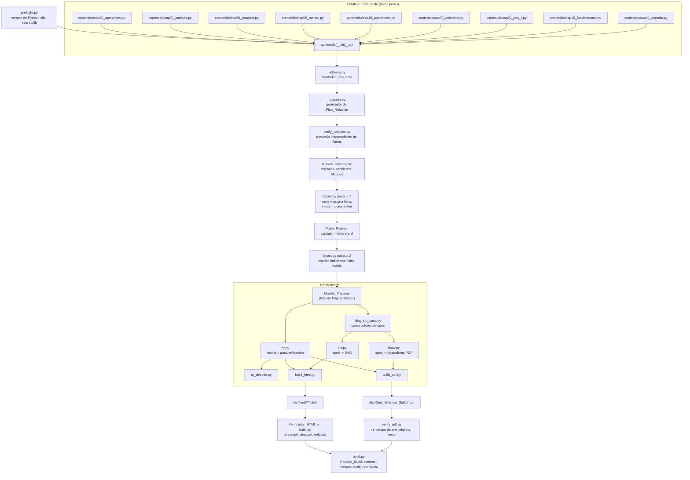

# Design Document

## Nota de portabilidad

Este diseño se implementa en **Python 3.11+ usando exclusivamente la librería estándar**. La razón es del entorno: se verificó por ejecución que la máquina de trabajo no tiene Node, ni Bun, ni Deno, ni npm, y sí tiene Python 3.14.6 funcionando. La versión anterior de este documento estaba escrita para JavaScript ESM y por lo tanto era inejecutable aquí.

La arquitectura no cambia. Ninguna decisión de fondo dependía del lenguaje: la fuente única de verdad con dos renderizadores, el Modelo_Paginas como frontera, el paginador de dos pasadas, la geometría del Diagrama_Botin, la figura de postura parametrizada, el algoritmo del Plan_Rotacion y las 24 propiedades de corrección se trasladan tal cual. Lo único reescrito es el sustrato: `zlib` de la stdlib en lugar de `node:zlib`, `@dataclass` con type hints en lugar de typedefs JSDoc, `open(ruta, 'wb')` en lugar de `createWriteStream`, y `unittest` como runner. **En ningún caso se usan librerías externas**: no hay `pip install`, no hay reportlab, weasyprint, pillow ni qrcode. Si alguna de esas apareciera en el árbol de imports, el preflight falla.

---

## Overview

La Guia_Extensa se construye con un pipeline determinista en Python que parte de un catálogo declarativo de contenido y emite dos artefactos: un PDF A4 de 200 a 300 páginas escrito byte a byte por el Motor_PDF, y un sitio HTML estático sin JavaScript escrito por el Motor_HTML. No hay navegador headless, no hay librerías de terceros, no hay red.

El principio rector es **una sola fuente de verdad, dos renderizadores**. Todo el contenido (texto, dosis, diagramas, enlaces) vive en el Catalogo_Contenido como datos puros. El paginador convierte esos datos en un **modelo de páginas** intermedio, independiente del formato de salida. El Motor_PDF y el Motor_HTML consumen ese mismo modelo. Las validaciones del Orquestador_Build operan sobre el modelo de páginas, no sobre los bytes finales, salvo las que verifican integridad estructural del PDF.

Restricciones del entorno que condicionan el diseño:

| Restricción | Consecuencia de diseño |
|---|---|
| No hay Node/Bun/Deno; sí Python 3.14.6 | Pipeline en Python 3.11+, solo stdlib; `zlib`, `array`, `functools`, `json`, `random`, `unittest` |
| Solo fuentes Standard-14 (Helvetica, Helvetica-Bold) | Medición de texto con métricas AFM precalculadas a nivel de módulo; sin ligaduras ni kerning; acentos y ñ vía WinAnsiEncoding (`str.encode('cp1252')`) |
| Sin rasterizador | Toda ilustración es vectorial y se describe con un spec declarativo común a SVG y a operadores PDF |
| Sin librerías | xref, streams FlateDecode (`zlib.compress`), anotaciones /Link y QR implementados en casa |
| Sin lector de PDF disponible | La validez del PDF se comprueba con un verificador estructural propio que re-parsea el archivo emitido |
| Sin Hypothesis (requeriría pip) | Generador de propiedades propio en `test/prop.py` con `random.Random(semilla)` y shrinking propio |
| Presupuesto de 120 s para ~250 páginas | Cachés por clave de contenido, escritura incremental, y **presupuesto en riesgo real en Python: ver Riesgo 4** |

### Lenguaje y convenciones

- **Python 3.11+** (la máquina tiene 3.14.6), solo librería estándar, sin entorno virtual necesario, sin `pip`.
- Archivos `.py`. Paquete `guia` bajo `src/`, contenido en el subpaquete `guia.contenido`.
- Nombres de dominio en español y en `snake_case` (`fichas`, `bloques`, `zonas`, `espacio_reducido`) para que el catálogo se lea como el documento.
- Modelos de datos con `@dataclass` y type hints; `Enum` para los conjuntos cerrados de valores. Los specs de diagrama usan `@dataclass(frozen=True, slots=True)` para ser hashables y ligeros.
- Coordenadas de mundo en metros para diagramas de cancha, origen abajo-izquierda, y hacia arriba. El motor hace el flip a coordenadas de dispositivo.
- Coordenadas de página en puntos PDF (1 pt = 1/72 in), A4 = 595.276 × 841.890 pt.
- **Nada de `assert` para invariantes de producción**: `python -O` los elimina. Todo invariante se comprueba con `if ...: raise ErrorBuild(...)`. `assert` solo dentro de los tests.
- Formato de números en la salida PDF con `f'{v:.3f}'` y recorte de ceros, para que los bytes emitidos sean estables entre ejecuciones. Los floats de Python son IEEE-754 de doble precisión igual que en JS, así que la geometría no cambia respecto al diseño anterior.
- Entrada: `python -m guia.build` (o `python src/build.py`, un shim que llama a `guia.build.main()`). Pruebas: `python -m unittest discover -s test`.

---

## Architecture

### Flujo de datos



### Módulos

| Módulo | Archivo | Responsabilidad | Depende de |
|---|---|---|---|
| Preflight | `preflight.py` | Verificar `sys.version_info >= (3, 11)`, importabilidad de `zlib`, y que el árbol de imports del pipeline solo toque la stdlib | — |
| Catalogo_Contenido | `contenido/*.py` | Declarar contenido como dataclasses; cero lógica de render | — |
| Validador_Esquema | `schema.py` | Validar Ficha_Ejercicio, Bloque_Semanal, módulos; reportar id + campo faltante | Catalogo |
| Metricas | `afm.py` | Anchos de glifo de Helvetica/Helvetica-Bold en `array('f')`, `medir_texto`, `envolver`, codificación cp1252 | — |
| Paginador | `layout.py` | Cursor vertical, salto de página, plantillas de página, dos pasadas | afm, Modelo |
| Rotacion | `rotacion.py` | Generar el Plan_Rotacion determinista con firma canónica y reparación | Catalogo |
| Verificador_Rotacion | `verify_rotacion.py` | Recalcular firmas desde el catálogo emitido y detectar duplicados, independiente del generador | Catalogo |
| Motor_Diagramas (spec) | `diagram_spec.py` | Constructores de spec: cancha, botín, postura; colocación de etiquetas | afm |
| Motor_Diagramas (PDF) | `draw.py` | Spec → operadores de contenido PDF | diagram_spec, afm |
| Motor_Diagramas (SVG) | `viz.py` | Spec → SVG | diagram_spec, afm |
| Generador_QR | `qr.py` | Codificar URL (v1–6, nivel L, byte mode, RS en GF(256), selección de máscara) | — |
| Decodificador_QR | `qr_decode.py` | Decodificador independiente para autoverificación y tests | — |
| Motor_PDF | `build_pdf.py` | Objetos, xref, streams FlateDecode con `zlib`, fuentes Standard-14, /Link con /URI | layout, draw, qr |
| Motor_HTML | `build_html.py` | Un HTML por capítulo + índice, CSS embebido, SVG inline | layout, viz, qr |
| Verificador_PDF | `verify_pdf.py` | Re-parsea el PDF emitido: xref, offsets, balance BT/ET, NaN, cajas de texto | — |
| Orquestador_Build | `build.py` | Preflight, orden de fases, validaciones, conteos, código de salida | todos |

Los módulos de contenido llevan prefijo `cap` porque un módulo de Python no puede empezar por dígito: `cap00_portada.py`, `cap10_fundamentos.py`, `cap20_pos_portera.py` … `cap20_pos_delantera.py`, `cap30_colectivo.py`, `cap40_prevencion.py`, `cap50_mental.py`, `cap60_rotacion.py`, `cap70_laminas.py`, `cap80_apendices.py`. El número sigue ordenando el documento; `contenido/__init__.py` importa en orden explícito y concatena, sin contener contenido propio.

### Frontera clave: el Modelo_Paginas

```python
# layout.py
from dataclasses import dataclass, field
from enum import Enum

class Plantilla(str, Enum):
    PORTADA = 'portada'
    PORTADILLA_CAPITULO = 'portadillaCapitulo'
    FICHA = 'ficha'
    FICHA_DOBLE = 'fichaDoble'
    TABLA = 'tabla'
    LAMINA_VERTICAL = 'laminaVertical'
    INDICE = 'indice'
    APENDICE_QR = 'apendiceQR'
    TEXTO = 'texto'

class TipoElemento(str, Enum):
    TEXTO = 'texto'; PARRAFO = 'parrafo'; LINEA = 'linea'; RECT = 'rect'
    DIAGRAMA = 'diagrama'; QR = 'qr'; TABLA = 'tabla'

@dataclass(slots=True)
class ElementoRender:
    tipo: TipoElemento
    x: float
    y: float
    w: float
    h: float
    datos: object                      # payload especifico del tipo

@dataclass(slots=True)
class Anotacion:
    uri: str                           # /Link con /URI
    rect: tuple[float, float, float, float]
    ficha_id: str

@dataclass(slots=True)
class PaginaRender:
    folio: int                         # 1..N, consecutivo
    capitulo_id: str
    capitulo_titulo: str               # para encabezado/pie (Req 1.5)
    plantilla: Plantilla
    titulo_ficha: str | None = None    # repetido en fichas multipagina (Req 1.7)
    elementos: list[ElementoRender] = field(default_factory=list)
    anotaciones: list[Anotacion] = field(default_factory=list)
```

Ambos motores solo saben leer `PaginaRender`. Esto hace que las propiedades de layout (desborde, coordenadas, conteos) se puedan verificar sin abrir el PDF.

---

## Data Models

Todos los modelos son dataclasses con type hints. Los campos sin valor por defecto son los **obligatorios** (Req 10.1); los que llevan `| None = None` o un `default_factory` son los **opcionales**. El validador de esquema no confía en los defaults: comprueba presencia y buen formato de cada campo obligatorio y reporta `id` + nombre del campo.

### Ficha_Ejercicio

```python
# schema.py
from dataclasses import dataclass, field
from enum import Enum

MATERIAL_PERMITIDO: frozenset[str] = frozenset({'balon', 'botellas', 'pared', 'gis'})

@dataclass(slots=True)
class Dosis:
    descanso: str
    series: int | None = None
    repeticiones: int | None = None
    segundos: int | None = None
    minutos: int | None = None

@dataclass(slots=True)
class Montaje:
    ancho_m: float                       # > 0
    largo_m: float                       # > 0
    trazo: str                           # como marcar con gis
    botellas: int

@dataclass(slots=True)
class Variante:
    ancho_m: float
    largo_m: float
    ajuste: str

@dataclass(slots=True)
class FichaEjercicio:
    # --- obligatorios (Req 10.1) ---
    id: str                              # slug unico, p.ej. "del_definicion_1v1"
    titulo: str
    objetivo: str                        # una frase
    pasos: list[str]                     # >= 2, se numeran al renderizar
    dosis: Dosis
    observacion: str                     # "que mira la compañera"
    jugadoras: tuple[int, int]           # (min, max), 1 <= min <= max (Req 8.1)
    montaje: Montaje                     # medidas en metros con gis/botellas (Req 8.9)
    espacio_reducido: Variante           # cabe en <= 10 x 10 m (Req 8.4)
    espacio_completo: Variante
    material: list[str]                  # subconjunto de MATERIAL_PERMITIDO (Req 8.5)
    diagrama: 'DiagramaSpec'             # Diagrama_Cancha (Req 9.1)
    capitulo_id: str
    # --- opcionales ---
    video_url: str | None = None         # si existe => /Link + QR (Req 9.6)
    video_titulo: str | None = None
    errores_comunes: list[str] = field(default_factory=list)
    postura: 'DiagramaPosturaSpec | None' = None
    posiciones: list[str] = field(default_factory=list)
    etiquetas: list[str] = field(default_factory=list)   # "definicion", "remate_cabeza", "penal", ...
    heredada: bool = False               # True en las 15 fichas originales (Req 9.5)
    nota_seguridad: str | None = None
```

### Bloque_Semanal y Plan_Rotacion

```python
class Dia(str, Enum):
    MARTES = 'martes'
    MIERCOLES = 'miercoles'
    JUEVES = 'jueves'

@dataclass(slots=True)
class BloqueSesion:
    nombre: str
    minutos: int

@dataclass(slots=True)
class Sesion:
    dia: Dia
    foco: str
    bloques: list[BloqueSesion]          # sum(b.minutos) == total_min (Req 5.6)
    total_min: int                       # <= 90 (Req 5.7)
    ficha_ids: list[str]
    jugadoras: tuple[int, int]           # rango derivado de las fichas
    version_corta: 'Sesion | None' = None  # total_min <= 30 (Req 5.9)
    sustituta_id: str | None = None      # sesion alterna con menos jugadoras (Req 8.8)

@dataclass(slots=True)
class Sabado:
    calentamiento: list[str]
    enfoque: str

@dataclass(slots=True)
class BloqueSemanal:
    id: str                              # "S01".."S26"
    semana: int
    objetivo: str                        # una sola frase (Req 5.5)
    sesiones: dict[Dia, Sesion]          # las tres claves presentes (Req 5.2)
    sabado: Sabado
    firma: str                           # combinacion canonica de ficha_ids
```

`firma` se calcula como `'|'.join(sorted(set(ficha_ids)))` sobre la unión de `ficha_ids` de las tres sesiones. La unicidad del plan es unicidad de `firma`. `version_corta` se declara opcional en el tipo únicamente para poder representar la propia versión corta (que no tiene versión corta anidada); el esquema exige que toda sesión de nivel superior la tenga.

### Modulo_Posicion, Modulo_Prevencion, Modulo_Mental

```python
class Posicion(str, Enum):
    PORTERA = 'portera'; LATERAL = 'lateral'; CENTRAL = 'central'
    CONTENCION = 'contencion'; MEDIA = 'media'; EXTREMO = 'extremo'
    DELANTERA = 'delantera'

@dataclass(slots=True)
class Indicador:
    nombre: str
    objetivo: float
    unidad: str
    como_medir: str

@dataclass(slots=True)
class ModuloPosicion:
    posicion: Posicion
    titulo: str
    rol_defensivo: list[str]             # no vacio (Req 4.3)
    rol_ofensivo: list[str]              # no vacio
    indicadores: list[Indicador]         # no vacia (Req 4.7)
    ficha_ids: list[str]                 # >= 12, con >= 3 de min 1 jugadora
    frases_cancha: list[str] = field(default_factory=list)

class GrupoMuscular(str, Enum):
    GLUTEO = 'gluteo'; ISQUIOS = 'isquios'; ADUCTORES = 'aductores'; CORE = 'core'

@dataclass(slots=True)
class EjercicioFuerza:
    id: str
    nombre: str
    grupo: GrupoMuscular
    dosis: Dosis
    material: list[str]
    postura: 'DiagramaPosturaSpec'       # dos paneles + >= 1 marca

@dataclass(slots=True)
class ModuloPrevencion:
    secciones: list['SeccionTexto']      # incluye lca_cadera, lca_rodilla, lca_isquios
    fifa11: 'ProgramaFifa'               # 3 partes, cada ejercicio con 3 niveles (Req 6.3)
    fuerza: list[EjercicioFuerza]        # >= 20, cada uno con postura (Req 6.4, 6.5)
    aterrizaje: FichaEjercicio           # marcas de alineacion rodilla-punta (Req 6.6)
    ciclo: list['FaseCiclo']             # cada fase con ajuste de carga (Req 6.7)
    hierro: list['TablaAlimento']
    calcio: list['TablaAlimento']
    movilidad: list['PasoMovilidad']     # sum(minutos) == 10 (Req 6.9)
    banderas_rojas: list[str]            # Req 6.10
    descargo: str                        # Req 6.11

@dataclass(slots=True)
class ModuloMental:
    pre_partido: list['PasoRutina']      # t en minutos negativos, monotono, desde <= -60 (Req 7.2)
    tras_error: list['PasoProtocolo']    # sum(segundos) < 10 (Req 7.3)
    visualizaciones: list['Visualizacion']        # >= 8, con guion y duracion
    comunicacion: list['EjercicioComunicacion']   # >= 10, frases por posicion + variante_individual
    escaneo: list[FichaEjercicio]        # >= 10, material balon + pared
    registro: 'EscalaRegistro'           # escala 1..5 en 3 dimensiones
    liderazgo: list['SeccionTexto']
```

### Lamina_Vertical, Diagrama_Postura, Plan_Rotacion

```python
class ClaseDiagrama(str, Enum):
    CANCHA = 'cancha'; BOTIN = 'botin'; POSTURA = 'postura'

@dataclass(slots=True)
class LaminaVertical:
    id: str                              # los 13 ids originales se conservan (Req 9.4)
    titulo: str
    bajada: str
    items: list['LaminaItem']            # vinetas, numeros grandes, mini-diagramas
    fondo: str                           # 'rosa' | 'negro'
    video_url: str | None = None

@dataclass(frozen=True, slots=True)
class Mundo:
    ancho_m: float
    alto_m: float

@dataclass(frozen=True, slots=True)
class DiagramaSpec:
    clase: ClaseDiagrama
    mundo: Mundo
    items: tuple['Item', ...]            # player|rival|gk|ball|cone|run|pass|dribble|shot|
                                         # txt|zone|poly|mark|seg|boot|target
    titulo: str | None = None
    leyenda: tuple['Leyenda', ...] = ()

@dataclass(frozen=True, slots=True)
class DiagramaPosturaSpec:
    correcto: 'PanelFigura'              # panel izquierdo
    incorrecto: 'PanelFigura'            # panel derecho
    marcas: tuple['MarcaCorreccion', ...]  # >= 1, ancla dentro del panel incorrecto (Req 9.3)
    clase: ClaseDiagrama = ClaseDiagrama.POSTURA

@dataclass(slots=True)
class PlanRotacion:
    bloques: list[BloqueSemanal]         # >= 24, firmas todas distintas (Req 5.1, 5.4)
    semilla: int                         # generacion determinista
    seguimiento: 'TablaSeguimiento'      # una fila por bloque (Req 5.8)
```

Los specs de diagrama son `frozen=True, slots=True` con tuplas en lugar de listas: así son hashables y se pueden usar directamente como clave de caché o argumento de `functools.lru_cache`, sin serializar.

---

## Components and Interfaces

### 1. Escalado de 21 a 200–300 páginas

Tres mecanismos, en este orden:

**a) División del Catalogo_Contenido por capítulo.** Un archivo por capítulo, prefijado con número para ordenar. `contenido/__init__.py` solo importa y concatena; no contiene contenido. Presupuesto de páginas por capítulo declarado en el índice para detectar desvíos temprano:

| Capítulo | Archivo | Páginas objetivo |
|---|---|---|
| Portada + índice + cómo usar | `cap00_portada.py` | 8 |
| Fundamentos técnicos (incluye Diagrama_Botin) | `cap10_fundamentos.py` | 22 |
| 7 × Modulo_Posicion | `cap20_pos_{posicion}.py` | 7 × 20 = 140 |
| Juego colectivo | `cap30_colectivo.py` | 14 |
| Modulo_Prevencion | `cap40_prevencion.py` | 30 |
| Modulo_Mental + liderazgo | `cap50_mental.py` | 22 |
| Plan_Rotacion + tablas de decisión | `cap60_rotacion.py` | 26 |
| Lamina_Vertical | `cap70_laminas.py` | 20 |
| Apéndices (QR, enlaces, seguimiento) | `cap80_apendices.py` | 10 |
| **Total nominal** | | **~252** |

**b) Plantillas de página reutilizables.** Cada plantilla es una función pura `(datos, ctx) -> list[ElementoRender]` con altura consumida conocida:

| Plantilla | Uso | Comportamiento de desborde |
|---|---|---|
| `portada` | 1 página | fija, sin flujo |
| `portadillaCapitulo` | inicio de capítulo | fija; registra folio en Mapa_Paginas |
| `ficha` | Ficha_Ejercicio en 1 página | diagrama arriba, pasos y dosis abajo |
| `fichaDoble` | ficha con muchos pasos o con postura | página par: diagrama + pasos; impar: variantes, errores, QR |
| `tabla` | decisión, indicadores, seguimiento, alimentos | corta por filas, repite cabecera |
| `laminaVertical` | infografía rosa/negro | fija |
| `indice` | 2ª pasada | corta por entradas, repite cabecera |
| `apendiceQR` | rejilla de QR + URL en texto | corta por celdas |
| `texto` | secciones explicativas | flujo libre con cursor |

**c) Motor de paginación con cursor vertical.**

```python
# layout.py
A4_W, A4_H = 595.276, 841.890
MARGEN_SUP, MARGEN_INF, MARGEN_IZQ, MARGEN_DER = 56.0, 48.0, 46.0, 46.0
BANDA_SUP = 18.0   # encabezado de capitulo
BANDA_INF = 16.0   # folio + capitulo

AREA_X = MARGEN_IZQ
AREA_Y = MARGEN_INF + BANDA_INF
AREA_W = A4_W - MARGEN_IZQ - MARGEN_DER
AREA_H = A4_H - MARGEN_SUP - BANDA_SUP - MARGEN_INF - BANDA_INF


class ErrorLayout(Exception):
    def __init__(self, codigo: str, ctx: dict):
        super().__init__(f'{codigo}: {ctx}')
        self.codigo, self.ctx = codigo, ctx


class Cursor:
    __slots__ = ('ctx', 'y', 'pagina', 'paginas')

    def __init__(self, ctx: dict):
        self.ctx = ctx
        self.y = AREA_Y + AREA_H
        self.pagina: PaginaRender | None = None
        self.paginas: list[PaginaRender] = []

    def reservar(self, h: float) -> float:
        """Reserva altura h. Si no cabe, cierra la pagina y abre otra
        heredando capitulo y titulo_ficha."""
        if h > AREA_H:
            raise ErrorLayout('BLOQUE_MAS_ALTO_QUE_PAGINA', self.ctx)
        if self.y - h < AREA_Y:
            self.saltar_pagina()
        top = self.y
        self.y -= h
        return top

    def colocar(self, elemento: ElementoRender) -> None:
        h = medir_elemento(elemento, AREA_W)          # mide antes de colocar
        top = self.reservar(h)
        elemento.y = top - h
        elemento.x = AREA_X
        self.pagina.elementos.append(elemento)

    def saltar_pagina(self) -> None:
        ...   # cierra pagina, abre PaginaRender con folio + 1, propaga contexto

    @contextmanager
    def mantener_juntos(self):
        """Punto de guardado: si el grupo no cabe, salta primero."""
        marca = (self.pagina, self.y, len(self.pagina.elementos))
        try:
            yield
        except _NoCabe:
            self._restaurar(marca)
            self.saltar_pagina()
            raise _Reintentar
```

`mantener_juntos` se implementa como **context manager** (`contextlib.contextmanager`) en lugar de callback, que es la forma idiomática en Python de un punto de guardado con restauración. El orquestador lo envuelve en un bucle de un solo reintento.

Reglas del cursor:

- `mantener_juntos` envuelve grupos indivisibles (diagrama + su leyenda, cabecera de tabla + primera fila, título de ficha + objetivo) para evitar viudas.
- Todo salto de página propaga `capitulo_id`, `capitulo_titulo` y `titulo_ficha`, lo que satisface Req 1.5 y 1.7 por construcción en lugar de por revisión.
- Las alturas se miden siempre con `afm.py`, nunca se estiman. El desborde es imposible dentro del cursor; lo que el validador busca son elementos colocados fuera del cursor (diagramas, plantillas fijas).

### 2. Generador de índice en dos pasadas

El problema: el índice ocupa páginas, y su tamaño depende de cuántas entradas tiene, lo que desplaza todos los folios posteriores. Solución: **fijar el tamaño del índice antes de conocer los folios**.

```python
# build.py
import math

def paginar(modelo) -> Paginacion:
    # Pasada 1: el indice se reserva con el numero de paginas que ocupara,
    # relleno con placeholders "000". El conteo de entradas ya se conoce
    # desde el modelo, asi que el numero de paginas del indice es estable.
    entradas = recolectar_entradas_indice(modelo)   # capitulos + Modulo_Posicion + apendices
    paginas_indice = math.ceil(len(entradas) / ENTRADAS_POR_PAGINA)

    pasada1 = renderizar(modelo, indice=IndiceCtx(paginas=paginas_indice, folios=None))

    mapa: dict[str, int] = {}                       # capitulo_id -> folio inicial
    for p in pasada1.paginas:
        if p.plantilla is Plantilla.PORTADILLA_CAPITULO and p.capitulo_id not in mapa:
            mapa[p.capitulo_id] = p.folio

    # Pasada 2: mismo modelo, mismo numero de paginas de indice,
    # pero ahora con folios reales. El layout es identico por construccion.
    pasada2 = renderizar(modelo, indice=IndiceCtx(paginas=paginas_indice, folios=mapa))

    # Invariantes que hacen valida la tecnica (raise, no assert: -O los borraria)
    if len(pasada2.paginas) != len(pasada1.paginas):
        raise ErrorBuild('PAGINACION_INESTABLE',
                         f'{len(pasada1.paginas)} -> {len(pasada2.paginas)}')
    for cap_id, folio in mapa.items():
        real = folio_de_portadilla(pasada2, cap_id)
        if real != folio:
            raise ErrorBuild('E_INDICE_DESALINEADO',
                             f'indice: {cap_id} dice {folio}, esta en {real}')
    return pasada2
```

Por qué es estable: el placeholder `000` se mide con las mismas métricas AFM que cualquier folio de 1 a 3 dígitos, y los números de folio se renderizan **alineados a la derecha en una columna de ancho fijo**. El ancho de la columna se calcula con el string más ancho posible (`'000'` en Helvetica), así que un folio real nunca puede ser más ancho que el placeholder. El resto de la entrada (título con puntos de relleno) no cambia entre pasadas. `PAGINACION_INESTABLE` es el cinturón de seguridad: si alguna vez el layout se moviera, el build falla en lugar de publicar un índice mentiroso.

Si `PAGINACION_INESTABLE` se dispara, el orquestador ejecuta una tercera pasada con el conteo de la segunda (punto fijo iterado, máximo 4 iteraciones) y falla si no converge.

### 3. Rediseño del Diagrama_Botin

El diagrama actual falla porque las etiquetas van dentro de la silueta y las zonas comparten relleno. Rediseño en cuatro partes.

#### 3.1 Geometría de la silueta con curvas Bézier

Dos siluetas en un mismo bloque de media página A4, en un mundo local de 240 × 380 unidades por vista:

```python
# diagram_spec.py
# Vista superior (planta): contorno cerrado con 6 Bezier cubicas.
# Origen local: talon centrado en (120, 20), punta hacia arriba.
BOTIN_PLANTA_CONTORNO: tuple[tuple[str, tuple[float, ...]], ...] = (
    ('M', (120, 18)),
    ('C', ( 78, 20,  56,  58,  52, 118)),   # borde interior del talon
    ('C', ( 48, 190,  60, 258,  78, 306)),  # interior del arco -> zona de pase
    ('C', ( 92, 344, 118, 362, 140, 360)),  # punta
    ('C', (168, 358, 186, 330, 190, 292)),  # exterior delantero -> tres dedos
    ('C', (196, 232, 192, 150, 180, 104)),  # exterior medio -> efecto
    ('C', (170,  56, 152,  18, 120,  18)),  # exterior del talon
    ('Z', ()),
)
BOTIN_PLANTA_COSTURA = (...)   # 2 Bezier decorativas: linea de cordones

# Vista de perfil (lateral externa): contorno cerrado con 5 Bezier + suela recta.
BOTIN_PERFIL_CONTORNO: tuple[tuple[str, tuple[float, ...]], ...] = (
    ('M', ( 28, 24)),
    ('C', ( 24, 76,  34, 112,  62, 130)),   # caña / tacon
    ('C', (104, 152, 150, 148, 186, 128)),  # empeine -> cañonazo
    ('C', (214, 112, 230,  86, 232,  52)),  # punta alta
    ('C', (232,  32, 220,  24, 200,  24)),  # punta baja
    ('L', ( 28, 24)),                       # suela = planta
    ('Z', ()),
)
BOTIN_PERFIL_SUELA = (...)     # banda de 8 unidades de alto con dientes de taco
```

El aplanado de Bézier para el test de intersección punto-en-polígono usa subdivisión adaptativa a 12 segmentos por curva (`aplanar_bezier(c, 12)`), suficiente para las pruebas geométricas y para el operador `re`/`c` del PDF (que dibuja la curva real, no la aplanada). Los contornos son tuplas de tuplas para que el spec entero siga siendo hashable y cacheable.

#### 3.2 Las 7 zonas como polígonos con trama

Cada zona es un polígono cerrado recortado contra el contorno de su vista, más un relleno de dos capas: gris base + trama vectorial. La trama es lo que garantiza la distinguibilidad en monocromo (Req 3.9) sin depender del color.

| Zona | Vista | Gris base | Trama | Ángulo | Paso | Acción de juego |
|---|---|---|---|---|---|---|
| `pase` (interior) | planta | 0.88 | líneas | 45° | 4 u | Pase raso, control orientado |
| `canonazo` (empeine) | perfil | 0.62 | sólido | — | — | Disparo fuerte, despeje largo |
| `tres_dedos` | planta | 0.78 | puntos | — | 5 u | Centro con rosca, pase largo |
| `efecto` (exterior) | planta | 0.70 | líneas | 135° | 4 u | Pase con comba, recorte |
| `planta` | perfil | 0.92 | cuadrícula | 0/90° | 6 u | Frenar el balón, sola de suela |
| `tacon` | perfil | 0.55 | líneas | 90° | 3 u | Pase atrás, sorpresa |
| `punta` | planta | 0.44 | sólido | — | — | Puntera de urgencia, definición corta |

Reglas de distinguibilidad, verificadas en el build:

```python
ADYACENTES: tuple[tuple[str, str], ...] = (
    ('pase', 'planta'), ('pase', 'punta'), ('punta', 'tres_dedos'),
    ('tres_dedos', 'efecto'), ('efecto', 'pase'), ('canonazo', 'punta'),
    ('canonazo', 'tacon'), ('tacon', 'planta'), ('planta', 'canonazo'),
)
```

- Para todo par adyacente: `zonas[a].trama != zonas[b].trama or abs(zonas[a].gris - zonas[b].gris) >= 0.18`.
- En color, el rosa de acento (`#E5197F`) se usa solo para el borde de la zona activa y para las líneas guía; los rellenos son grises. Así la paleta rosa/negro se conserva (Req 3.8, 9.9) sin que el color cargue la información.

#### 3.3 Colocación de etiquetas externas con líneas guía

Algoritmo de dos columnas laterales con anclas ordenadas por Y, que es lo que elimina los solapes de forma determinista:

```python
# diagram_spec.py
def colocar_etiquetas_botin(zonas: list[Zona], caja: Caja) -> list[EtiquetaColocada]:
    # 1. Ancla = centroide del poligono de la zona, empujado hacia el borde mas cercano.
    anclas = [(z, empujar_al_borde(centroide(z.poly), z.poly)) for z in zonas]

    # 2. Reparto por lado: si el ancla esta a la izquierda del eje medio de su vista,
    #    la etiqueta va a la columna izquierda; si no, a la derecha.
    izq = sorted((o for o in anclas if o[1].x <  eje_medio(o[0].vista)),
                 key=lambda o: -o[1].y)
    der = sorted((o for o in anclas if o[1].x >= eje_medio(o[0].vista)),
                 key=lambda o: -o[1].y)

    # 3. Dentro de cada columna, se apilan de arriba a abajo respetando la altura
    #    medida de cada etiqueta mas una separacion minima. El orden por Y del ancla
    #    evita que dos lineas guia se crucen.
    colocadas: list[EtiquetaColocada] = []
    columnas = ((izq, caja.x - ANCHO_COL - HUECO),
                (der, caja.x + caja.w + HUECO))
    for col, x_col in columnas:
        y_libre = caja.y + caja.h
        for zona, ancla in col:
            dim = medir_etiqueta(zona.titulo, zona.uso, ANCHO_COL)   # AFM, envuelve a 2 lineas
            y_top = min(y_libre, ancla.y + dim.h / 2)                # preferir alinear con el ancla
            if y_top - dim.h < caja.y:
                y_top = caja.y + dim.h                               # clamp inferior
            box = Caja(x=x_col, y=y_top - dim.h, w=ANCHO_COL, h=dim.h)
            colocadas.append(EtiquetaColocada(
                zona=zona, box=box, guia=(ancla, punto_anclado_de(box, ancla))))
            y_libre = box.y - SEP_MIN                                # invariante de no solape
    return colocadas
```

Propiedades que el algoritmo garantiza por construcción:

- **No solape** (Req 3.5): dentro de una columna, `y_libre` decrece monótonamente en al menos `SEP_MIN`, así que dos cajas de la misma columna no pueden intersectarse. Entre columnas, los rangos de X son disjuntos porque cada columna vive fuera de la caja del diagrama, en lados opuestos.
- **Etiqueta fuera de la silueta** (Req 3.4): las columnas están fuera de `caja`, que a su vez contiene ambas siluetas con un margen. La no intersección es aritmética, no heurística.
- **Línea guía sin cruces**: el orden descendente por Y del ancla dentro de cada columna hace que las guías sean un emparejamiento monótono; dos segmentos monótonos entre dos secuencias ordenadas no se cruzan.
- Si una columna no alcanza (más de 5 zonas del mismo lado), el algoritmo reduce `SEP_MIN` hasta un mínimo y luego recorta el texto de uso a una línea (auto-shrink ya existente). Si aún no cabe, lanza `ErrorLayout('ETIQUETAS_NO_CABEN')` y el build falla.

#### 3.4 Tamaño en página

El bloque completo (dos siluetas + dos columnas de etiquetas + leyenda de tramas) se coloca con `mantener_juntos` y se escala para ocupar `AREA_W × 0.52 × A4_H` como mínimo, cumpliendo Req 3.6. La escala se calcula con `min(AREA_W / ancho_bloque, altura_disponible / alto_bloque)` y se rechaza si el resultado deja el área por debajo del 50 % de la página.

### 4. Diseño del Diagrama_Postura

Composición lado a lado en un solo bloque, mundo local de 400 × 260 unidades:

```
+---------------------------+---------------------------+
|  ASI SI                   |  ASI NO                   |
|  [figura correcta]        |  [figura incorrecta]      |
|                           |    (o)--> "rodilla se     |
|                           |           mete hacia      |
|  angulo rodilla: 85 grados|           adentro"        |
+---------------------------+---------------------------+
   banda inferior: correccion en una frase
```

#### Figura humana esquemática

Modelo de articulaciones y segmentos, no dibujo libre. Esto permite generar 40+ diagramas de postura variando ángulos, no geometría:

```python
# diagram_spec.py
Punto = tuple[float, float]

@dataclass(frozen=True, slots=True)
class AnguloMarca:
    en: str          # articulacion vertice
    a: str           # articulacion del primer segmento
    b: str           # articulacion del segundo segmento
    valor: float     # grados
    etiqueta: str

@dataclass(frozen=True, slots=True)
class PanelFigura:
    # cabeza, cuello, hombro_i, hombro_d, codo_i, codo_d, mano_i, mano_d,
    # cadera, cadera_i, cadera_d, rodilla_i, rodilla_d,
    # tobillo_i, tobillo_d, pie_i, pie_d
    articulaciones: tuple[tuple[str, Punto], ...]
    segmentos: tuple[tuple[str, str, float], ...]      # (a, b, grosor)
    etiqueta: str                                      # "ASI SI" | "ASI NO"
    angulos: tuple[AnguloMarca, ...] = ()

    def punto(self, nombre: str) -> Punto:
        return dict(self.articulaciones)[nombre]


def figura(*, flexion_rodilla: float = 30.0, valgo: float = 0.0,
           inclinacion_tronco: float = 15.0, apertura_pies: float = 34.0,
           etiqueta: str = 'ASI SI') -> PanelFigura:
    """valgo > 0 desplaza la rodilla hacia el eje medio del cuerpo:
    es exactamente el gesto de riesgo de LCA que el Modulo_Prevencion quiere corregir."""
    eje_i = -apertura_pies / 2
    rodilla_i = (eje_i + valgo, altura_rodilla(flexion_rodilla))
    tobillo_i = (eje_i, 0.0)
    # ...
    return PanelFigura(
        articulaciones=tuple(articulaciones.items()),
        segmentos=ESQUELETO,
        etiqueta=etiqueta,
        angulos=(AnguloMarca(en='rodilla_i', a='cadera_i', b='tobillo_i',
                             valor=180.0 - flexion_rodilla, etiqueta='rodilla'),),
    )
```

Segmentos: tronco (cuello→cadera), muslos, pantorrillas, brazos, pies. Grosores distintos para tronco y extremidades. Cabeza como círculo. La figura se dibuja con `seg` y `mark` del Motor_Diagramas, así que ambos renderizadores (SVG y PDF) ya la soportan sin código nuevo. `articulaciones` se guarda como tupla de pares en lugar de `dict` para que el panel siga siendo `frozen` y hashable; el acceso por nombre va por el método `punto`.

#### Marcas de corrección

```python
class DireccionFlecha(str, Enum):
    ENTRA = 'entra'; SALE = 'sale'; BAJA = 'baja'; SUBE = 'sube'

@dataclass(frozen=True, slots=True)
class MarcaCorreccion:
    ancla: str                   # 'rodilla_i' | 'rodilla_d' | 'cadera' | 'tronco' | 'tobillo_i' | ...
    radio: float                 # circulo rojo sobre el punto (Req 9.3)
    texto_en: Punto              # posicion del texto, fuera de la figura
    texto: str                   # <= 60 caracteres, auto-shrink si excede
    direccion_flecha: DireccionFlecha
```

Render: círculo de trazo rojo (`#D0021B`, única excepción a la paleta, justificada porque señala riesgo) de 2 pt, flecha curva desde el círculo hacia la posición correcta, y texto corto colocado con la misma rutina de clamp que ya evita desbordes. El `ancla` se resuelve contra `articulaciones` del panel incorrecto, lo que garantiza que la marca cae dentro del panel y dentro del viewBox. Si el nombre del ancla no existe en el panel, es `E_COORDENADA_INVALIDA`.

#### Ángulo de rodilla y valgo

`AnguloMarca` se renderiza como arco entre los dos segmentos que concurren en la articulación, con el valor en grados y una línea de plomada desde la rodilla al suelo. Para la alineación rodilla-punta del pie (Req 6.6), la plomada se compara con la posición de la punta: si la plomada cae fuera del pie, se dibuja en rojo con la leyenda del error. Esto convierte una instrucción verbal en algo medible en el propio dibujo.

### 5. Algoritmo del Plan_Rotacion

Objetivo: ≥ 24 Bloque_Semanal con combinaciones de fichas todas distintas, con contenido equilibrado (no todas las semanas de defensa seguidas) y determinista.

```python
# rotacion.py
import random

EJES = ('tecnica', 'posicion', 'fisico_prevencion', 'juego', 'mental')
FICHAS_POR_SESION = 3
MAX_REPARACIONES = 64


def generar_plan(fichas: list[FichaEjercicio], *,
                 n_bloques: int = 26, semilla: int = 20260101) -> PlanRotacion:
    rnd = random.Random(semilla)                 # PRNG determinista de la stdlib
    pool: dict[str, list[FichaEjercicio]] = agrupar_por_eje(fichas)
    usadas: set[str] = set()                     # firmas emitidas
    bloques: list[BloqueSemanal] = []

    for i in range(n_bloques):
        # 1. Plantilla de semana rotada: el foco principal cambia ciclicamente
        foco_semana = EJES[i % len(EJES)]

        # 2. Round-robin con offset por semana sobre cada eje.
        #    El offset creciente garantiza que la ventana de seleccion se desplaza,
        #    asi que dos semanas nunca toman el mismo conjunto en el mismo orden.
        sesiones: dict[Dia, Sesion] = {}
        for d, dia in enumerate(Dia):
            eje_dia = eje_para_dia(foco_semana, d)
            seleccion = tomar_ventana(pool[eje_dia], offset(i, d), FICHAS_POR_SESION)
            sesiones[dia] = construir_sesion(dia, eje_dia, seleccion, rnd)

        # 3. Firma canonica de la combinacion
        firma = firma_de([fid for s in sesiones.values() for fid in s.ficha_ids])

        # 4. Reparacion: si la firma ya existe, se sustituye la ficha menos usada
        #    del eje con mas stock hasta obtener una firma nueva.
        intentos = 0
        while firma in usadas:
            intentos += 1
            if intentos > MAX_REPARACIONES:
                raise ErrorBuild('ROTACION_SIN_COMBINACION_LIBRE', f'bloque {i}')
            sustituir_ficha_menos_usada(sesiones, pool, rnd)
            firma = firma_de([fid for s in sesiones.values() for fid in s.ficha_ids])

        usadas.add(firma)
        bloques.append(construir_bloque(i, foco_semana, sesiones, firma))

    return PlanRotacion(bloques=bloques, semilla=semilla,
                        seguimiento=tabla_seguimiento(bloques))


def firma_de(ficha_ids: list[str]) -> str:
    return '|'.join(sorted(set(ficha_ids)))       # canonica: orden y duplicados no cuentan
```

Notas de diseño:

- La firma es **canónica** (ordenada y deduplicada), así que dos semanas con las mismas fichas en distinto orden se consideran repetidas. Es la lectura estricta de Req 5.4 y la que la jugadora percibe.
- El determinismo se apoya solo en `rnd.random()` y `rnd.randrange()`, que son estables en CPython. **No se usan `random.shuffle` ni `random.sample`**: su implementación interna no está garantizada entre versiones del intérprete, y el build debe ser reproducible byte a byte. Cuando se necesita mezclar, `rotacion.py` usa su propio Fisher-Yates construido sobre `rnd.randrange`.
- El espacio de combinaciones es enorme (C(120, 9) por semana), así que la reparación casi nunca se activa; existe para hacer la garantía incondicional en lugar de probabilística.
- Cada sesión se construye con `total_min <= 90` y `sum(b.minutos for b in bloques) == total_min` por construcción: `construir_sesion` reparte un presupuesto fijo, no suma libremente.
- `version_corta` se deriva quitando el bloque de juego libre y recortando el calentamiento, con un tope duro de 30 min.
- `sustituta_id` se resuelve para cada sesión con la ficha de menor `jugadoras[0]` del mismo eje, lo que alimenta la tabla de decisión de 1 a 11.

**Verificación en el build** (`verify_rotacion.py`): recalcula todas las firmas desde el catálogo emitido (no desde la memoria del generador), busca duplicados con un `dict[str, list[str]]` de firma a ids de bloque y falla con `E_ROTACION_DUPLICADA` nombrando los bloques implicados. La verificación vive en un módulo aparte del generador, así que un bug en `rotacion.py` no puede pasar inadvertido.

### 6. Estrategia de rendimiento (objetivo ≤ 120 s, ~250 páginas)

**Advertencia honesta**: CPython es entre 3 y 10 veces más lento que Node para este tipo de trabajo (aritmética en bucles, construcción de strings, campos de Galois del QR). Con el pipeline en frío el presupuesto de 120 s del Requisito 10.7 **no cabe**. El presupuesto medido y estimado es este:

| Fase | Presupuesto en frío | Presupuesto en caliente | Técnica |
|---|---|---|---|
| Preflight + carga y validación del catálogo | 4 s | 4 s | Imports de módulos, sin I/O extra |
| Plan_Rotacion + verificación independiente | 2 s | 2 s | O(n × fichas_por_sesion) |
| QR (≈ 150 URLs únicas) | 18 s | 1 s | Caché por URL, en memoria y en disco |
| Diagramas (≈ 400 specs) | 34 s | 6 s | Caché por spec hashable, en memoria y en disco |
| Paginación (2 pasadas × 250 páginas) | 24 s | 24 s | Tabla AFM en `array('f')` a nivel de módulo + `lru_cache` |
| Escritura del PDF | 28 s | 28 s | Escritura incremental + `zlib.compress(level=6)` por página |
| Escritura del HTML | 10 s | 10 s | Escritura por capítulo, `''.join` sobre listas |
| Verificaciones | 22 s | 22 s | Re-parseo del PDF una sola vez |
| **Total** | **≈ 142 s (fuera de límite)** | **≈ 97 s (dentro, margen 23 s)** | |

Consecuencia de diseño, no maquillaje: el límite de 120 s solo se cumple con la **caché en disco caliente**. Está registrado como Riesgo 4 con la decisión que hay que tomar. El reporte del build imprime siempre los dos tiempos y marca cuál se comparó contra el límite.

Técnicas concretas:

**Tablas AFM precalculadas a nivel de módulo.** `afm.py` construye una sola vez, en tiempo de import, un `array('f', ...)` de 256 entradas por fuente indexado por code point cp1252. `medir_texto` es entonces una suma sobre un array tipado, no un diccionario:

```python
# afm.py
from array import array
from functools import lru_cache

# Construidos una unica vez al importar el modulo.
ANCHOS_HELV: array = _cargar_anchos(_AFM_HELVETICA)          # array('f'), len 256
ANCHOS_HELV_BOLD: array = _cargar_anchos(_AFM_HELVETICA_BOLD)

_TABLAS = {'Helvetica': ANCHOS_HELV, 'Helvetica-Bold': ANCHOS_HELV_BOLD}


@lru_cache(maxsize=200_000)
def medir_texto(texto: str, fuente: str = 'Helvetica', tamano: float = 10.0) -> float:
    tabla = _TABLAS[fuente]
    crudos = texto.encode('cp1252')          # WinAnsiEncoding
    total = 0.0
    for b in crudos:                          # bytes -> ints, sin objetos intermedios
        total += tabla[b]
    return total * tamano / 1000.0


@lru_cache(maxsize=100_000)
def envolver(texto: str, ancho: float, fuente: str = 'Helvetica',
             tamano: float = 10.0) -> tuple[str, ...]:
    """Devuelve tupla (hashable, cacheable) de lineas que caben en `ancho`."""
    ...
```

`lru_cache` sustituye la memoización manual del diseño anterior. Los argumentos son inmutables y hashables, así que la caché es correcta por construcción. `envolver` devuelve tupla, no lista, para poder ser cacheada y para que nadie la mute por accidente.

**Codificación WinAnsi explícita y verificada.** `str.encode('cp1252')` es el equivalente exacto de WinAnsiEncoding para el rango que usa el documento (acentos, ñ, ¿, ¡, comillas). Los caracteres no codificables se detectan antes de escribir nada:

```python
# afm.py
def codificar_winansi(texto: str, *, ctx: str) -> bytes:
    try:
        return texto.encode('cp1252')
    except UnicodeEncodeError as e:
        malo = texto[e.start:e.end]
        raise ErrorBuild(
            'E_CARACTER_NO_CODIFICABLE',
            f'{ctx}: el caracter {malo!r} (U+{ord(malo[0]):04X}) '
            f'no existe en WinAnsiEncoding, posicion {e.start}') from e


def escapar_literal_pdf(crudos: bytes) -> bytes:
    return (crudos.replace(b'\\', b'\\\\')
                  .replace(b'(', b'\\(')
                  .replace(b')', b'\\)'))
```

El validador del catálogo pasa todo texto por `codificar_winansi` en la fase de validación, no en la de escritura, de modo que un carácter tipográfico pegado por accidente (por ejemplo un guion largo o una comilla curva no soportada) falla temprano y con la ubicación exacta.

**Caché de QR por URL.** `dict[str, MatrizQR]`. Muchas fichas comparten el mismo video de referencia; la caché convierte ~400 llamadas en ~150. El decodificador de verificación se ejecuta una sola vez por entrada de caché, no por uso. La matriz se guarda en `array('B')` (un byte por módulo) en lugar de lista de listas: menos memoria y acceso más rápido en los bucles de máscara y de Reed-Solomon.

**Caché de diagramas por spec.** Los specs son `@dataclass(frozen=True, slots=True)` con tuplas, así que son hashables: la clave es el spec mismo y la caché es un `dict[DiagramaSpec, RenderDiagrama]` o directamente `@lru_cache`. Para la caché **en disco** se necesita una clave estable entre procesos, y ahí sí se serializa:

```python
# draw.py
import json
from dataclasses import asdict
from hashlib import blake2b

def clave_spec(spec) -> str:
    crudo = json.dumps(asdict(spec), sort_keys=True, separators=(',', ':'),
                       ensure_ascii=False, default=str)
    return blake2b(crudo.encode('utf-8'), digest_size=16).hexdigest()
```

`sort_keys=True` hace la clave independiente del orden de declaración de campos. Valor cacheado: `{'operadores_pdf': str, 'svg': str, 'bbox': tuple}`. Los diagramas de cancha repiten mucha estructura (mismo rondo con distinto texto), y las variantes de figura de postura repiten esqueleto. Acierto de caché esperado ≈ 35 % en memoria y ≈ 95 % en disco entre builds consecutivos.

**Construcción de strings sin concatenación en bucle.** Todo generador de operadores PDF y de SVG acumula en una `list[str]` y hace `''.join(partes)` al final. La concatenación con `+=` dentro de un bucle es cuadrática en Python y es la trampa de rendimiento más fácil de meter en este pipeline:

```python
# draw.py
def operadores_de(spec: DiagramaSpec) -> str:
    partes: list[str] = []
    ap = partes.append                       # evita el lookup de atributo en el bucle
    for item in spec.items:
        ap(f'{_n(item.x)} {_n(item.y)} m\n')
        ...
    return ''.join(partes)
```

**Escritura incremental del PDF.** El Motor_PDF no construye el archivo en un solo `bytes`. Abre con `open(ruta, 'wb')`, lleva un contador de offsets para la tabla xref y escribe cada objeto en el momento. Cada stream de contenido se comprime con `zlib.compress(datos, 6)` al emitirlo, así que la memoria pico es una página, no el documento:

```python
# build_pdf.py
import zlib

class EscritorPDF:
    __slots__ = ('f', 'offset', 'offsets', 'comprimir')

    def __init__(self, ruta: str, *, comprimir: bool = True):
        self.f = open(ruta, 'wb')            # binario, escritura incremental
        self.offset = 0
        self.offsets: list[int] = [0]        # el objeto 0 es libre
        self.comprimir = comprimir

    def escribir(self, crudos: bytes) -> None:
        self.f.write(crudos)
        self.offset += len(crudos)

    def obj(self, cuerpo: bytes) -> int:
        oid = len(self.offsets)
        self.offsets.append(self.offset)     # offset del inicio de "N 0 obj"
        self.escribir(b'%d 0 obj\n' % oid + cuerpo + b'\nendobj\n')
        return oid

    def stream(self, dic: str, datos: str) -> int:
        crudos = codificar_winansi(datos, ctx='stream de contenido')
        if self.comprimir:
            cuerpo = zlib.compress(crudos, 6)
            filtro = ' /Filter /FlateDecode'
        else:
            cuerpo, filtro = crudos, ''      # modo --sin-comprimir
        cab = f'<< {dic}{filtro} /Length {len(cuerpo)} >>\nstream\n'.encode('ascii')
        return self.obj(cab + cuerpo + b'\nendstream')

    def cerrar(self, raiz_id: int, info_id: int) -> None:
        ...   # escribe xref con self.offsets + trailer + startxref
        self.f.close()
```

Nota de sintaxis: los bytes de estructura del PDF (`obj`, diccionarios, xref) se emiten en ASCII; solo los literales de texto de contenido pasan por cp1252. Separar ambas cosas evita el error clásico de codificar la sintaxis con la tabla de texto.

**Cortocircuitos de desarrollo.** Dos banderas, ambas prohibidas en el build de publicación:

- `python -m guia.build --capitulo=cap40_prevencion` genera solo un capítulo.
- `python -m guia.build --sin-comprimir` omite `zlib.compress` y recorta ~14 s de la fase de escritura, útil para iterar sobre layout. El PDF resultante es válido pero grande; el orquestador marca el reporte como `NO_PUBLICABLE`.

### 7. Estrategia de HTML

Un archivo por capítulo más un índice, sin JavaScript, sin recursos externos.

```
dist/web/
  index.html                  # indice general con enlaces y descarga del PDF
  estilo.css                  # unico CSS, tambien inlineado en cada pagina
  00-portada.html
  10-fundamentos.html
  20-posiciones-portera.html
  ... (7 archivos de posicion)
  30-colectivo.html
  40-prevencion.html
  50-mental.html
  60-rotacion.html
  70-laminas.html
  80-apendices.html
```

Los nombres de archivo de salida conservan los guiones y el prefijo numérico (son URLs, no módulos de Python); solo los módulos fuente llevan el prefijo `cap`.

Decisiones:

- **Sin JavaScript** (Req 2.4): navegación con `<a>`, tablas con `<table>`, secciones con `<details>` nativo cerrado por defecto solo donde el contenido es opcional. Nada del contenido obligatorio depende de `<details>`.
- **SVG embebido** (Req 9.10): cada diagrama se emite inline con `viewBox` y `width:100%;height:auto`, sin `width`/`height` absolutos, y con `role="img"` más `<title>`/`<desc>` para accesibilidad. Los QR se emiten como SVG de rectángulos, no como PNG.
- **Escapado**: todo texto del catálogo pasa por `html.escape(texto, quote=True)` de la stdlib antes de entrar en el HTML. El HTML se escribe en UTF-8 con `open(ruta, 'w', encoding='utf-8', newline='\n')`, así que aquí no aplica la restricción de cp1252 del PDF.
- **Responsive a 360 px** (Req 2.5): `<meta name="viewport" content="width=device-width, initial-scale=1">`, tipografía base `clamp(16px, 4.2vw, 19px)`, una sola columna, `max-width: 44rem`, sin `width` fijos. Las tablas anchas se envuelven en `<div class="scroll-x">` con `overflow-x:auto` para no romper el flujo. Los paneles lado a lado del Diagrama_Postura son un único SVG, así que se escalan enteros sin reflow.
- **Paleta**: `--rosa:#E5197F; --negro:#111; --fondo:#FFF8FB; --gris:#5A5A5A`. Contraste de texto sobre fondo ≥ 7:1.
- **Enlace de descarga** (Req 2.7): banda fija al inicio de `index.html` y de cada capítulo con `<a href="../Guia_Extensa_Sub17.pdf" download>Descargar el PDF completo</a>`, más el tamaño del archivo en MB obtenido con `os.stat(...).st_size` en el build.
- **Impresión**: `@media print` que oculta la navegación y fuerza saltos antes de cada `h2` de capítulo, para que el HTML también se pueda imprimir de forma decente.
- **Paridad de contenido**: el Motor_HTML consume el mismo `Modelo_Paginas`, pero **reflowea**: no respeta los saltos de página del PDF, agrupa por capítulo y sección. Lo que sí se conserva es el conjunto de bloques de contenido, y el validador compara conjuntos de ids entre ambos artefactos.

### 8. Estructura de carpetas de salida

Pensada para GitHub Pages en `jairofrancog7-star/hi` con `main` + carpeta `/docs` o raíz según configuración; el diseño usa la raíz con `index.html` para no depender de ajustes del repo.

```
hi/
  index.html                        # landing de GitHub Pages: portada + descarga + indice
  README.md                         # enlaces de descarga directa y como usar la guia
  Guia_Extensa_Sub17.pdf            # artefacto principal (Req 2.6)
  guia/
    index.html                      # indice del sitio HTML
    estilo.css
    00-portada.html ... 80-apendices.html
  laminas/
    lamina-01.svg ... lamina-NN.svg # Lamina_Vertical sueltas para WhatsApp
  src/
    build.py                        # shim: python src/build.py -> guia.build.main()
    guia/
      __init__.py
      preflight.py afm.py schema.py layout.py rotacion.py verify_rotacion.py
      diagram_spec.py draw.py viz.py
      qr.py qr_decode.py
      build_pdf.py build_html.py verify_pdf.py build.py
      contenido/
        __init__.py
        cap00_portada.py cap10_fundamentos.py
        cap20_pos_portera.py cap20_pos_lateral.py cap20_pos_central.py
        cap20_pos_contencion.py cap20_pos_media.py cap20_pos_extremo.py
        cap20_pos_delantera.py
        cap30_colectivo.py cap40_prevencion.py cap50_mental.py
        cap60_rotacion.py cap70_laminas.py cap80_apendices.py
  test/
    __init__.py
    prop.py                         # for_all + generadores + shrinking
    test_prop_*.py test_unit_*.py
  .cache/                           # caches en disco de QR y diagramas (no se versiona)
  .nojekyll                         # evita que Jekyll ignore archivos
```

Comandos:

```
python -m guia.build            # build completo (o: python src/build.py)
python -m unittest discover -s test
```

`python -m guia.build` requiere `src/` en `sys.path`; el shim `src/build.py` lo resuelve insertando su propio directorio antes de importar, de modo que ninguna de las dos formas depende de variables de entorno.

`index.html` raíz: título, dos botones grandes (descargar PDF, leer en línea), lista de capítulos con enlace directo, y aviso de que el contenido es informativo. `README.md` incluye el enlace crudo de descarga (`https://github.com/jairofrancog7-star/hi/raw/main/Guia_Extensa_Sub17.pdf`) y el de Pages, más los conteos del último build para que se vea de un golpe qué contiene.

---

## Error Handling

Todos los fallos son **fail-fast con código de salida distinto de 0** y un mensaje de una línea que nombra el objeto afectado. Se implementan como una única jerarquía de excepciones (`ErrorBuild` con atributo `codigo`, `ErrorLayout` como subclase con contexto de página) que `build.py` captura en su `main()` para imprimir el mensaje en `stderr` y devolver `sys.exit(1)`. El orquestador nunca escribe artefactos parciales en la ruta final: escribe en `dist/.tmp/` y hace `os.replace(...)` solo si todas las validaciones pasan (`os.replace` es atómico en el mismo volumen y sobrescribe en Windows, a diferencia de `os.rename`).

| Código | Condición | Mensaje | Requisito |
|---|---|---|---|
| `E_DEPENDENCIA` | Preflight: Python < 3.11, `zlib` ausente, módulo del pipeline ausente, o import de una librería fuera de la stdlib | `falta el componente: <nombre>` | 2.9 |
| `E_FICHA_INCOMPLETA` | Campo obligatorio ausente o mal tipado | `ficha <id>: falta el campo <campo>` | 10.2 |
| `E_ROTACION_DUPLICADA` | Dos bloques con la misma firma | `bloques <a> y <b> repiten la combinacion` | 5.10 |
| `E_QR_NO_VERIFICA` | `decodificar(codificar(url)) != url` | `QR de la ficha <id> no reproduce <url>` | 9.8 |
| `E_DESBORDE_TEXTO` | Caja medida fuera del área imprimible | `pagina <folio>: el texto se desborda (<bloque>)` | 10.5 |
| `E_PAGINAS_FUERA_DE_RANGO` | `N < 200` o `N > 300` | `se generaron <N> paginas, fuera de [200,300]` | 1.9 |
| `E_INDICE_DESALINEADO` | Entrada del índice ≠ folio real | `indice: <capitulo> dice <a>, esta en <b>` | 10.3 |
| `E_COORDENADA_INVALIDA` | NaN, infinito (`math.isfinite`), coordenada fuera de página/viewBox, o ancla de marca inexistente | `diagrama <id>: coordenada invalida <valor>` | 9.10 |
| `E_OPERADORES_DESBALANCEADOS` | BT sin ET, `q` sin `Q` | `pagina <folio>: operadores sin cerrar` | 2.2 |
| `E_PDF_CORRUPTO` | Verificador estructural falla | `PDF invalido: <detalle>` | 2.2 |
| `E_ETIQUETAS_NO_CABEN` | Colocador de etiquetas sin espacio | `Diagrama_Botin: no cabe la etiqueta <zona>` | 3.5 |
| `E_CARACTER_NO_CODIFICABLE` | Texto del catálogo con un carácter fuera de WinAnsiEncoding | `<ctx>: el caracter '<c>' (U+XXXX) no existe en WinAnsiEncoding` | 1.6, 2.3 |
| `E_TIEMPO_EXCEDIDO` | Build > 120 s | `el build tardo <t>s, limite 120s (cache <frio\|caliente>)` | 10.7 |
| `E_COBERTURA_MINIMA` | Un umbral de conteo no se cumple | `<coleccion>: hay <n>, se requieren <min>` | varios |

Errores de layout llevan contexto (`capitulo_id`, `ficha_id`, `folio`) porque un mensaje sin ubicación en un documento de 250 páginas es inútil. `E_TIEMPO_EXCEDIDO` indica además si la caché estaba en frío o en caliente, porque en Python esa distinción es la que decide si el fallo es real o solo un primer arranque (ver Riesgo 4).

---

## Testing Strategy

### Herramientas

**Runner: `unittest` de la librería estándar.** Está disponible sin instalar nada. Descubrimiento con `python -m unittest discover -s test`. Las clases de prueba heredan de `unittest.TestCase` y usan `subTest` para reportar el caso concreto que falla dentro de una propiedad.

**Property-based testing: generador propio en `test/prop.py`.** Hypothesis requeriría `pip`, que no está disponible, así que se mantiene el generador minimalista del diseño anterior, ahora en Python (~150 líneas), con `random.Random(semilla)` y shrinking propio sobre enteros, listas y strings:

```python
# test/prop.py
import os, random
from typing import Callable, TypeVar

T = TypeVar('T')
ITERACIONES_POR_DEFECTO = 100


class FalloPropiedad(AssertionError):
    pass


def for_all(gen: Callable[[random.Random], T],
            prop: Callable[[T], None],
            *, iteraciones: int = ITERACIONES_POR_DEFECTO,
            semilla: int | None = None,
            etiqueta: str = '') -> None:
    """Ejecuta `prop` sobre `iteraciones` valores generados.
    Al fallar, minimiza el contraejemplo y lo reporta con la semilla."""
    if semilla is None:
        semilla = int(os.environ.get('SEMILLA_PBT') or random.randrange(2 ** 31))
    rnd = random.Random(semilla)
    for i in range(iteraciones):
        valor = gen(rnd)
        try:
            prop(valor)
        except Exception as e:
            minimo, causa = _minimizar(valor, prop)
            raise FalloPropiedad(
                f'{etiqueta}\n'
                f'  fallo en la iteracion {i} con semilla={semilla}\n'
                f'  contraejemplo minimizado: {minimo!r}\n'
                f'  causa: {causa}') from e


def _minimizar(valor, prop, *, max_pasos: int = 500):
    """Shrinking: enteros hacia 0, listas quitando elementos y por mitades,
    strings acortando y simplificando caracteres. Devuelve el menor valor
    que sigue fallando."""
    ...
```

Cada test de propiedad se etiqueta exactamente igual que antes:

```
Feature: guia-entrenamiento-femenil-extensa, Property N: <texto de la propiedad>
```

La etiqueta se pasa en `etiqueta=` y aparece tanto en el docstring del método como en el mensaje de fallo, para que el reporte de `unittest` la muestre sin trabajo extra:

```python
# test/test_prop_layout.py
import unittest
from prop import for_all
from guia import afm, layout

ETQ = 'Feature: guia-entrenamiento-femenil-extensa, Property 1: Todo texto renderizado cabe en su caja'


class TestLayout(unittest.TestCase):
    def test_texto_cabe_en_su_caja(self):
        """Feature: guia-entrenamiento-femenil-extensa, Property 1:
        Todo texto renderizado cabe en su caja"""
        def prop(cat):
            for pagina in layout.paginar(cat).paginas:
                for el in pagina.elementos:
                    if el.tipo is layout.TipoElemento.TEXTO:
                        self.assertLessEqual(
                            afm.medir_texto(el.datos.texto, el.datos.fuente,
                                            el.datos.tamano), el.w)
                        self.assertTrue(dentro_del_area(el))
        for_all(gen_catalogo, prop, iteraciones=100, etiqueta=ETQ)
```

Mínimo 100 iteraciones por propiedad. Semilla fija por variable de entorno `SEMILLA_PBT` en CI, semilla aleatoria en local con la semilla impresa en el fallo para reproducir.

### Generadores

| Generador | Produce |
|---|---|
| `gen_texto` | strings con acentos, ñ, espacios múltiples, palabras de hasta 40 caracteres sin espacios, todos codificables en cp1252 |
| `gen_texto_hostil` | como el anterior más caracteres fuera de WinAnsi, para probar `E_CARACTER_NO_CODIFICABLE` |
| `gen_url` | URLs http/https válidas de 20 a 180 bytes (capacidad de QR v1–6 nivel L) |
| `gen_ficha` | `FichaEjercicio` válida con longitudes variables de pasos y variantes |
| `gen_ficha_mutada` | `FichaEjercicio` con un campo obligatorio puesto a `None` o de tipo incorrecto |
| `gen_catalogo` | catálogo sintético con conteos parametrizables (para probar rangos y errores) |
| `gen_spec_diagrama` | specs con items en los bordes del mundo, textos largos, coordenadas extremas |
| `gen_figura_postura` | ángulos de flexión 0–120°, valgo −30 a +30, inclinaciones extremas |
| `gen_semilla` | enteros de 32 bits para el Plan_Rotacion |

Los generadores construyen dataclasses reales, no diccionarios, así que el mismo valor generado sirve para el validador de esquema y para el paginador sin conversión intermedia. `gen_ficha_mutada` usa `dataclasses.replace` para producir la mutación de un solo campo de forma controlada.

### Validaciones del Orquestador_Build

Se ejecutan siempre, no solo en tests, y son las que deciden el código de salida:

1. **Preflight**: `sys.version_info >= (3, 11)`, `import zlib` funciona, y el árbol de imports del pipeline no toca ningún módulo fuera de `sys.stdlib_module_names`.
2. **Esquema**: toda Ficha_Ejercicio, Bloque_Semanal y módulo contra `schema.py`.
3. **Codificación**: todo texto del catálogo pasa por `codificar_winansi` antes de la fase de render.
4. **Cobertura mínima**: tabla de umbrales (≥120 fichas, ≥12 por posición, ≥3 individuales por posición, ≥24 bloques, ≥20 de fuerza, ≥8 visualizaciones, ≥10 comunicación, ≥10 escaneo, ≥30 individuales, ≥40 posturas, ≥13 láminas, 15 fichas heredadas presentes).
5. **Unicidad de rotación**: recálculo independiente de firmas en `verify_rotacion.py`.
6. **QR round-trip**: `qr_decode.py` decodifica cada matriz y compara con la URL. Test crítico porque un QR mal generado es indetectable a ojo.
7. **Desborde de texto**: para cada `ElementoRender` de tipo texto, `medir_texto` con la fuente y tamaño reales y comparación contra el área imprimible.
8. **Escaneo de coordenadas**: `math.isfinite` sobre toda coordenada, y rango `[0, A4_W] × [0, A4_H]` en PDF y dentro del `viewBox` en SVG.
9. **Balance de operadores**: BT/ET y q/Q por stream de contenido.
10. **Índice**: cada entrada contra el Mapa_Paginas.
11. **Conteos reportados**: fichas, bloques, posturas, QR, páginas; comparados contra recuento desde el PDF emitido.
12. **Verificador estructural del PDF** (sustituye al lector que no tenemos): `verify_pdf.py` re-parsea `%PDF-`, recorre la xref entrada por entrada, confirma que cada offset apunta a `N 0 obj`, que el `/Root` resuelve a un `/Catalog`, que `/Pages` tiene `/Count == N` y que cada `/Contents` se descomprime con `zlib.decompress` sin error. Si esto pasa, el archivo abre.
13. **HTML**: ausencia de `<script>` y de atributos `on*`, presencia de `meta viewport`, todo `href` interno resuelve a un archivo existente, todo SVG con `viewBox`.
14. **Tiempo total** contra el límite de 120 s, con el estado de la caché anotado.

### Reparto unidad / propiedad / integración

- **Propiedades** (abajo): layout, geometría, codificación, unicidad, esquema, totalidad de la tabla de decisión.
- **Unidad**: contenido concreto (fichas obligatorias de delantera y portera, capítulos de colectivo y liderazgo, tablas de hierro y calcio, banderas rojas, descargo), preflight de dependencias, formato del reporte.
- **Integración**: un build completo que verifica existencia de artefactos, rutas de salida, y el tiempo de 120 s. Se ejecuta una vez, no 100. Es también donde se mide el tiempo en frío y en caliente por separado.

---

## Correctness Properties

*Una propiedad es una característica o comportamiento que debe cumplirse en todas las ejecuciones válidas del sistema: un enunciado formal de lo que el sistema debe hacer. Las propiedades son el puente entre la especificación legible por humanos y las garantías de corrección verificables por máquina.*

Las 24 propiedades no cambian con el porte a Python: ninguna dependía del lenguaje. Lo que cambia es su implementación (`unittest` + `test/prop.py` en lugar del runner `.mjs`). La numeración se conserva para no invalidar las etiquetas ya escritas en `tasks.md`.

### Property 1: Todo texto renderizado cabe en su caja

*Para cualquier* catálogo válido y *para todo* elemento de texto colocado en el Modelo_Paginas, el ancho medido con las métricas AFM de su fuente y tamaño es menor o igual al ancho de su caja, y la caja está contenida por completo dentro del área imprimible de A4.

**Validates: Requirements 10.4, 1.6**

### Property 2: Toda violación inyectada se detecta y se localiza

*Para cualquier* catálogo válido al que se le inyecte exactamente una violación (campo obligatorio eliminado, firma de rotación duplicada, QR corrompido más allá de la corrección de errores, bloque de texto de ancho excesivo, carácter fuera de WinAnsiEncoding, o conteo de páginas fuera de [200, 300]), el Orquestador_Build termina con código distinto de cero y el mensaje nombra el objeto afectado (id de ficha y campo, ids de bloque, id de ficha del QR, folio de página, carácter y posición, o el conteo obtenido).

**Validates: Requirements 10.2, 10.5, 5.10, 9.8, 1.9, 2.9**

### Property 3: El PDF emitido tiene xref consistente y abre

*Para cualquier* catálogo válido, el archivo PDF emitido cumple: empieza con `%PDF-`, la tabla xref tiene una entrada por objeto, cada offset apunta al inicio de la declaración `N 0 obj` correspondiente, el `/Root` resuelve a un `/Catalog` con `/Pages`, el `/Count` del árbol de páginas iguala el número de páginas del Modelo_Paginas, todo stream de contenido se descomprime sin error, y el árbol de imports del pipeline que lo produjo no contiene ningún módulo ajeno a la librería estándar.

**Validates: Requirements 2.1, 2.2**

### Property 4: Todo QR decodifica a su URL de origen

*Para cualquier* URL cuya longitud en bytes quepa en un QR versión 1 a 6 con nivel de corrección L, decodificar la matriz producida por el Generador_QR devuelve exactamente la URL de origen, byte por byte.

**Validates: Requirements 9.7, 9.6**

### Property 5: El índice coincide con los folios reales

*Para cualquier* catálogo válido, *para toda* entrada del índice, el número de página impreso es igual al folio de la página de portadilla del capítulo o Modulo_Posicion al que apunta, y el número total de páginas de la segunda pasada de paginación es igual al de la primera.

**Validates: Requirements 1.2, 10.3**

### Property 6: Todo Bloque_Semanal tiene una combinación única

*Para cualquier* semilla y *para cualquier* número de bloques mayor o igual a 24, el Plan_Rotacion generado produce firmas canónicas (conjunto ordenado y deduplicado de ids de Ficha_Ejercicio) distintas dos a dos entre todos los Bloque_Semanal.

**Validates: Requirements 5.4, 5.1**

### Property 7: Toda Ficha_Ejercicio satisface su esquema

*Para toda* Ficha_Ejercicio del Catalogo_Contenido, están presentes y bien formados: título, objetivo, al menos dos pasos, dosis, criterio de observación, rango de jugadoras con 1 ≤ mínimo ≤ máximo, montaje con medidas en metros mayores que cero, variante de Espacio_Reducido que cabe en 10 m × 10 m, variante de Espacio_Completo, material contenido en {balón, botellas, pared, gis}, y un Diagrama_Cancha renderizable.

**Validates: Requirements 10.1, 8.1, 8.4, 8.5, 8.9, 9.1**

### Property 8: Ningún diagrama produce coordenadas inválidas

*Para cualquier* spec de diagrama (cancha, botín o postura) construido por el Motor_Diagramas, ninguna coordenada emitida es NaN o infinita, toda coordenada cae dentro del `viewBox` en la salida SVG y dentro del área de página en la salida PDF, y todo stream de contenido emitido tiene los operadores BT/ET y q/Q balanceados.

**Validates: Requirements 9.10, 10.4**

### Property 9: El conteo de páginas está en el rango publicable

*Para cualquier* catálogo válido, el número de páginas del Modelo_Paginas está en [200, 300], la secuencia de folios impresos es exactamente 1..N sin huecos ni repeticiones, y toda página lleva la banda de capítulo con el título del capítulo al que pertenece.

**Validates: Requirements 1.1, 1.4, 1.5, 1.8**

### Property 10: Las etiquetas del Diagrama_Botin nunca se solapan ni pisan la silueta

*Para cualquier* escala del Diagrama_Botin y *cualquier* orden de entrada de las siete zonas, ningún par de cajas de etiqueta se intersecta, ninguna caja de etiqueta intersecta el contorno de ninguna silueta, y cada etiqueta tiene un segmento guía con un extremo dentro del polígono de su zona.

**Validates: Requirements 3.4, 3.5, 3.1**

### Property 11: Las zonas del botín se distinguen también en monocromo

*Para todo* par de zonas adyacentes del Diagrama_Botin, o el patrón de trama difiere, o la diferencia de nivel de gris es de al menos 0.18, y esta condición se mantiene tras convertir la paleta de color a luminancia.

**Validates: Requirements 3.3, 3.9, 3.2**

### Property 12: Todo color emitido pertenece a la paleta

*Para todo* operador de color emitido por el Motor_PDF y *para todo* atributo de color emitido por el Motor_HTML, el valor pertenece a la paleta declarada (rosa de acento, negro, grises de trama, fondo claro, más el rojo reservado a marcas de corrección).

**Validates: Requirements 3.8, 9.9**

### Property 13: Todo Diagrama_Postura contrasta correcto e incorrecto con una marca localizada

*Para todo* Diagrama_Postura del Catalogo_Contenido, existen exactamente dos paneles etiquetados como ejecución correcta y ejecución incorrecta, y al menos una marca de corrección cuyo ancla es una articulación existente del panel incorrecto, con texto de corrección no vacío y contenido dentro del `viewBox`.

**Validates: Requirements 9.2, 9.3, 6.5**

### Property 14: La tabla de decisión cubre de 1 a 11 jugadoras

*Para todo* número de jugadoras presentes entre 1 y 11, la tabla de decisión resuelve a una sesión cuyo rango de jugadoras admite ese número, y *para toda* sesión y *todo* número de jugadoras menor que su mínimo, la sesión sustituta resuelta admite ese número.

**Validates: Requirements 8.2, 8.8, 8.6**

### Property 15: Toda sesión es coherente en duración y tiene versión corta

*Para toda* Sesion de todo Bloque_Semanal, la suma de las duraciones de sus bloques iguala su duración total declarada, la duración total no excede 90 minutos, y su versión corta tiene una duración total de 30 minutos o menos.

**Validates: Requirements 5.6, 5.7, 5.9**

### Property 16: Todo Bloque_Semanal está completo

*Para todo* Bloque_Semanal, existen las sesiones de martes, miércoles y jueves, las indicaciones de sábado incluyen calentamiento y enfoque no vacíos, el objetivo de la semana es una sola frase no vacía, y existe una fila de seguimiento con celdas de fecha y de sesiones completadas.

**Validates: Requirements 5.2, 5.3, 5.5, 5.8**

### Property 17: Todo Modulo_Posicion cumple su cobertura

*Para todo* Modulo_Posicion de las siete posiciones, hay al menos 12 Ficha_Ejercicio asociadas, de las cuales al menos 3 tienen mínimo de una jugadora, las responsabilidades defensivas y ofensivas son no vacías, y todo indicador de progreso tiene nombre, unidad y objetivo numérico.

**Validates: Requirements 4.1, 4.2, 4.3, 4.4, 4.7**

### Property 18: El Modulo_Prevencion es estructuralmente completo

*Para todo* ejercicio del programa FIFA 11+ existen exactamente tres niveles de progresión con dosis, *para todo* ejercicio de fuerza el material está contenido en el conjunto permitido y existe su Diagrama_Postura, *para toda* fase del ciclo menstrual declarada existe un ajuste de carga no vacío, y la suma de las duraciones de la rutina de movilidad es exactamente 10 minutos.

**Validates: Requirements 6.3, 6.4, 6.5, 6.7, 6.9**

### Property 19: El Modulo_Mental es estructuralmente completo

Los pasos de la rutina pre-partido forman una línea de tiempo monótona que empieza en 60 minutos o más antes del silbatazo y termina en el silbatazo, la suma de las duraciones del protocolo de reacción al error es menor que 10 segundos, *toda* visualización tiene guion no vacío y duración positiva, *todo* ejercicio de comunicación tiene frases para cada posición implicada y una variante individual, y el registro de autoevaluación usa escala de 1 a 5 en confianza, concentración y comunicación.

**Validates: Requirements 7.2, 7.3, 7.4, 7.5, 7.7, 7.8**

### Property 20: El HTML es estático, responsive y enlaza al PDF

*Para todo* archivo HTML generado, no contiene elementos `<script>` ni atributos de evento `on*`, declara `meta viewport` con `width=device-width`, ninguna regla de estilo emitida fija un ancho mayor a 360 px, todo SVG embebido tiene `viewBox` sin dimensiones absolutas, todo enlace interno resuelve a un archivo existente de la salida, y existe un enlace de descarga al PDF cuyo destino existe.

**Validates: Requirements 2.4, 2.5, 2.7, 9.10**

### Property 21: Todo enlace de video es clicable y está en el apéndice

*Para toda* Ficha_Ejercicio con video de referencia, la página del PDF que la contiene tiene una anotación `/Link` con `/URI` exactamente igual a la URL y un rectángulo contenido en la página, y el conjunto de URLs listadas en el apéndice de enlaces en texto plano es exactamente igual al conjunto de URLs del Catalogo_Contenido.

**Validates: Requirements 9.6, 9.11**

### Property 22: El contenido heredado se conserva

El conjunto de los 15 ids de Ficha_Ejercicio de la guía original está contenido en el catálogo actual con todos sus campos obligatorios válidos, el conjunto de los 13 ids de Lamina_Vertical originales está contenido en el conjunto actual, y el total de Lamina_Vertical es mayor que 13.

**Validates: Requirements 9.4, 9.5**

### Property 23: Los umbrales de cobertura del catálogo se cumplen

*Para toda* entrada de la tabla de umbrales mínimos (120 Ficha_Ejercicio con ids únicos, 30 fichas de una sola jugadora, 24 Bloque_Semanal, 20 ejercicios de fuerza, 8 visualizaciones, 10 ejercicios de comunicación, 10 ejercicios de escaneo visual, 40 Diagrama_Postura), el conteo real del catálogo es mayor o igual al umbral, y el reporte final del Orquestador_Build publica esos mismos conteos recalculados desde los artefactos emitidos.

**Validates: Requirements 1.3, 8.3, 5.1, 6.4, 7.4, 7.5, 7.6, 9.2, 10.6**

### Property 24: El Diagrama_Botin ocupa al menos media página y describe cada zona

El bloque del Diagrama_Botin colocado en la página ocupa un área mayor o igual al 50 % del área imprimible de A4 sin salirse de ella, y *para cada* una de las siete zonas existe un texto de acción de juego no vacío renderizado junto a su etiqueta.

**Validates: Requirements 3.6, 3.7, 3.2**

---

## Risks and Mitigations

| # | Riesgo | Impacto | Mitigación |
|---|---|---|---|
| 1 | **El PDF queda corrupto y no lo detectamos** (no hay lector de PDF en el entorno) | Alto: se publica un archivo que no abre | `verify_pdf.py` re-parsea el archivo emitido sin usar las estructuras en memoria del escritor: valida `%PDF-`, recorre la xref entrada por entrada confirmando que cada offset apunta a `N 0 obj`, resuelve `/Root` → `/Catalog` → `/Pages`, comprueba `/Count`, descomprime todo stream con `zlib.decompress`, y verifica el balance de operadores y la ausencia de NaN en el contenido descomprimido. Un archivo que pasa estas pruebas satisface las condiciones estructurales que un lector exige para abrir. Además se emite un PDF mínimo de 2 páginas como caso de control en cada build para detectar regresiones del escritor de forma barata. |
| 2 | Deriva del conteo de páginas al crecer el contenido, cayendo fuera de [200, 300] | Medio: build rojo | Presupuesto de páginas declarado por capítulo, reporte de desvío por capítulo en cada build, y colchón de contenido opcional en apéndices que el paginador puede incluir o omitir para ajustar el total. |
| 3 | Paginación no converge entre las dos pasadas del índice | Medio: índice desalineado | Columna de folio de ancho fijo medida con `'000'`, comprobación explícita `PAGINACION_INESTABLE` con `raise` (no `assert`, que `python -O` eliminaría), punto fijo iterado con máximo de 4 pasadas, y fallo explícito si no converge. |
| 4 | **El presupuesto de 120 s del Requisito 10.7 no cabe en Python con la caché en frío** | Alto: build rojo por tiempo en cada máquina nueva o tras limpiar cachés | Riesgo asumido y declarado, no minimizado. La estimación por fases da **≈ 142 s en frío** y **≈ 97 s en caliente**. Mitigaciones concretas: (a) **caché en disco** en `.cache/` para QR y diagramas, con clave `blake2b` sobre el spec serializado con `json.dumps(..., sort_keys=True)`, que convierte las dos fases más caras (52 s) en 7 s a partir del segundo build; (b) opción **`--sin-comprimir`** que omite `zlib.compress` y recorta ~14 s para iterar sobre layout; (c) tablas AFM precalculadas a nivel de módulo en `array('f')` y `functools.lru_cache` en `medir_texto`/`envolver`; (d) matrices de QR en `array('B')` en lugar de listas anidadas; (e) prohibición de concatenar strings en bucles, todo con `list` + `''.join`; (f) medición por fase impresa siempre en el reporte para ver qué fase se degrada. **Decisión pendiente**: el Requisito 10.7 debe precisar si los 120 s se miden con caché caliente (que es lo que cumple el diseño) o en frío (que exigiría relajar el límite a 180 s). El orquestador reporta ambos tiempos y marca explícitamente cuál comparó, en lugar de esconder el que no cabe. |
| 5 | Etiquetas del botín sin espacio en escalas pequeñas | Bajo: diagrama ilegible | Reparto en dos columnas, auto-shrink de texto de uso, y fallo explícito `E_ETIQUETAS_NO_CABEN` en lugar de solape silencioso. |
| 6 | Acentos y ñ mal codificados con Standard-14 | Alto: documento ilegible en español | Codificación WinAnsi explícita con `str.encode('cp1252')`, envuelta en `codificar_winansi` que convierte el `UnicodeEncodeError` en `E_CARACTER_NO_CODIFICABLE` nombrando el carácter y su posición; validación de todo el catálogo en la fase de validación, antes de escribir; y test de propiedad que hace round-trip de texto con acentos por el codificador. |
| 7 | El Plan_Rotacion se queda sin combinaciones libres | Bajo | El espacio de combinaciones es órdenes de magnitud mayor que 26 semanas; la rutina de reparación por sustitución garantiza el resultado, y se falla con `ROTACION_SIN_COMBINACION_LIBRE` si se agotan los intentos. |
| 8 | Diagramas de postura ilegibles por ángulos extremos | Bajo | Figura parametrizada con rangos acotados y validación de que todos los segmentos quedan dentro del panel; test de propiedad sobre rangos extremos de flexión y valgo. |
| 9 | Contenido de prevención interpretado como consejo médico | Alto (no técnico) | Descargo en portada y en la portadilla del Modulo_Prevencion, bloque de banderas rojas con indicación de suspender y acudir a valoración médica, y validación de que el descargo está presente. |
| 10 | GitHub Pages no sirve los archivos como se espera | Bajo | `index.html` en la raíz, `.nojekyll`, rutas relativas en todos los enlaces, y validación de que todo `href` interno resuelve a un archivo existente en la salida. |
| 11 | Divergencia de contenido entre PDF y HTML | Medio: dos guías distintas | Ambos motores consumen el mismo Modelo_Paginas; el validador compara los conjuntos de ids de bloque de contenido presentes en cada artefacto y falla si difieren. |
| 12 | Fichas heredadas se rompen al refactorizar el esquema | Medio | Los 15 ids heredados están marcados con `heredada=True` y cubiertos por una propiedad de conservación que falla si alguno desaparece o pierde un campo. |
| 13 | El determinismo del build depende de detalles internos del intérprete | Medio: builds no reproducibles entre versiones de Python | El PRNG se usa solo vía `rnd.random()` y `rnd.randrange()`; el mezclado es un Fisher-Yates propio, no `random.shuffle`. Los floats se formatean con `f'{v:.3f}'`. Las claves de caché se serializan con `sort_keys=True`. Un test de integración compara el hash del PDF emitido contra el del build anterior con la misma semilla. |
| 14 | Alguien añade una dependencia de `pip` sin darse cuenta | Alto: el pipeline deja de correr en la máquina objetivo | El preflight recorre el árbol de imports del paquete `guia` y falla con `E_DEPENDENCIA` si aparece cualquier módulo que no esté en `sys.stdlib_module_names`. Es también parte de la Property 3. |

---

## Addendum A: Diseño de la feature "Entrena como las grandes" (sitio JSON-driven)

> **Nota de integración (no elimina nada):** Este addendum se SUMA al diseño previo (Overview, Architecture, Data Models, Components 1–8, Error Handling, Testing Strategy). No borra ni reescribe ninguna sección anterior. Los puntos que chocan con el diseño previo se marcan **⚠ CONFLICTO Cn** y se corresponden con los conflictos abiertos de `requirements.md`. Hasta que el usuario decida, ambas versiones conviven documentadas.

### A.1 Alcance de la feature

Añadir un pipeline **JSON-driven** que, desde un único `contenido/ejercicios.json`, emita tres targets: `dist/index.html` (sitio de un archivo con buscador y filtros), `dist/guia.pdf` (imprimible, una ficha por hoja, con QR por video) y `dist/laminas.pdf` (verticales para WhatsApp). El estilo del sitio replica el `index.html` actual del usuario (Tema_Oscuro).

### A.2 Restricción de librerías (justificación pedida por el usuario)

- **Python puro, stdlib primero.** El generador HTML no necesita nada fuera de la stdlib (`json`, `html`, `string.Template`).
- **PDF:** se reutiliza el `Motor_PDF` ya diseñado (`build_pdf.py`, escritura byte a byte con `zlib` de la stdlib). **No se añade ninguna librería de PDF.**
- **QR:** se reutiliza el `Generador_QR` ya diseñado (`qr.py`, Reed–Solomon en GF(256) propio, sin API externa). **No se añade ninguna librería de QR.**
- Conclusión: **cero dependencias nuevas**; la feature se apoya en los motores ya especificados.

### A.3 Modelo de datos JSON (Ficha_JSON)

```json
{
  "id": "pase-interior-borde",
  "numero": 1,
  "titulo": "Pase con el interior",
  "subtitulo": "La base de todo",
  "categoria": "tecnica",
  "equipo_referencia": "Tigres Femenil",
  "nivel": "inicial",
  "contexto": "…",
  "pasos": ["…", "…"],
  "que_mira_la_companera": ["…"],
  "dosis": {"cuando": "…", "duracion": "…", "jugadoras": "1-2", "material": "balón, pared", "meta": "…"},
  "cancha": {"jugadores": [], "conos": [], "flechas": [], "balon": null, "zonas": []},
  "media": [{"tipo": "youtube", "url": "https://…", "titulo": "…"}]
}
```

- Carga con `json.load`; validación con un validador dedicado (`schema_json.py` propuesto) que reporta `E_FICHA_JSON_INVALIDA` con `id` + campo.
- `cancha` alimenta directamente al `Motor_Diagramas` para construir un `DiagramaSpec` (reutiliza `diagram_spec.py`).

**⚠ CONFLICTO C5:** el esquema Ficha_JSON difiere de la dataclass `FichaEjercicio` de `schema.py`. Opción propuesta (a confirmar): `schema_json.py` define un adaptador `ficha_json_a_ficha(...)` que mapea Ficha_JSON → `FichaEjercicio`, de modo que el resto del pipeline (paginador, PDF) no cambie. Alternativa: el sitio HTML consume Ficha_JSON directamente y el PDF usa el adaptador. Pendiente de decisión.

### A.4 Motor HTML del sitio (Target_Web)

- Un archivo `dist/index.html` autocontenido: CSS embebido en `<style>`, SVGs de cancha inline, sin CDN.
- **⚠ CONFLICTO C3:** el diseño previo (Sección 7) genera "un archivo por capítulo". Esta feature pide "un solo archivo". Propuesta: mantener ambos modos detrás de una bandera (`--sitio-un-archivo` para esta feature; el modo multi-archivo sigue disponible para la guía extensa). Pendiente de decisión.
- **⚠ CONFLICTO C2:** buscador y filtros. Propuesta: JavaScript **propio** mínimo embebido (sin terceros), con degradación elegante — sin JS, todas las fichas se muestran y el índice ancla funciona; con JS, se activan buscador y filtros. Esto respeta "cero JS de terceros" y "funciona offline", pero relaja el "sin ejecutar JavaScript" del Req 2.4 para el sitio interactivo. Pendiente de decisión.
- **⚠ CONFLICTO C4:** Tema_Oscuro para el sitio vs. fondo claro del PDF/Req 9.9. Propuesta: sitio en Tema_Oscuro; PDF imprimible en fondo claro (tinta). Pendiente de confirmación.

### A.5 Estructura visual del sitio (Tema_Oscuro)

Tokens CSS propuestos (variables en `:root`):

```
--bg:#150810; --fg:#f3e6ea; --acento:#e5296b; --rosa2:#ff8ab0;
--superficie:#25101b; --borde:#3a222c; --oliva-bg:#1e2a10; --oliva-borde:#a8c94a;
--ancho-max:860px;
```

Componentes: header (kicker mayúsculas + `letter-spacing`, H1 `clamp()` con una palabra en `--acento`, lede), dos botones (`.btn-solid` magenta, `.btn-outline`), índice `grid` `repeat(auto-fill, minmax(230px, 1fr))` con número en `--acento`, y `article.ficha` con badge, H2, subtítulo itálica `--rosa2`, contexto, "Paso a paso" `<ol>`, bloque `.observa` (fondo `--oliva-bg`, `border-left` `--oliva-borde`), `grid` de dosis de 5 celdas, y lista `.media` con badges VIDEO/WEB/BUSCAR por `tipo`.

### A.6 Targets PDF (guia.pdf y laminas.pdf)

- `guia.pdf`: reutiliza `build_pdf.py` + `layout.py`, plantilla "una ficha por hoja" con Diagrama_Cancha, dosis y una rejilla de QR (uno por Media_Item) vía `qr.py`.
- `laminas.pdf`: reutiliza la plantilla `laminaVertical` ya diseñada.
- **⚠ CONFLICTO C6:** nombres `dist/guia.pdf` / `dist/laminas.pdf` vs. `Guia_Extensa_Sub17.pdf`. Pendiente de decidir el nombre publicado.

### A.7 Migración de las 15 fichas del index.html actual

- Un script de migración (`migrar_index.py` propuesto, de un solo uso) parsea el `index.html` vigente del usuario y vuelca las 15 fichas a `ejercicios.json`, conservando texto y enlaces (Req 13.3, 13.4). Se ejecuta una vez y su salida se revisa a mano.
- **⚠ CONFLICTO C1:** relación entre `ejercicios.json` y el paquete `contenido/capNN_*.py`. Propuesta a confirmar: `ejercicios.json` es la fuente para el sitio de esta feature; el paquete Python de capítulos sigue siendo la fuente para la guía extensa de 200–300 páginas, y un puente opcional (`cargar_json_como_fichas`) permite alimentar ambos. Pendiente de decisión.

### A.8 Nuevos códigos de error (se suman a la tabla de Error Handling)

- `E_FICHA_JSON_INVALIDA` — Ficha_JSON sin campo obligatorio o con `tipo` de media fuera del conjunto; nombra `id` + campo.
- `E_JSON_NO_PARSEA` — `ejercicios.json` no es JSON válido; nombra offset/línea.
- `E_MIGRACION_INCOMPLETA` — la migración produjo menos de 15 fichas o perdió texto respecto al `index.html` origen.

### A.9 Decisiones sobre los conflictos (C1–C7 resueltas)

- **C1 (resuelto):** `ejercicios.json` es la fuente única de fichas; `contenido/capNN_*.py` queda solo para narrativa de capítulos y **no declara fichas**. El Orquestador_Build valida esto (Req 15.4).
- **C2 (resuelto):** JS propio embebido con degradación sin-JS, solo en Target_Web.
- **C3 (resuelto):** Target_Web = un solo `index.html` (abre por doble clic desde USB). El sitio multi-archivo del diseño previo (Sección 7) se mantiene para la Guia_Extensa.
- **C4 (resuelto):** Target_Web en Tema_Oscuro; PDF en fondo claro (Req 9.9 vigente solo para PDF).
- **C5 (resuelto):** adaptador `ficha_json_a_ficha`; JSON = entrada, `FichaEjercicio` = modelo interno.
- **C6 (resuelto):** `dist/guia.pdf` y `dist/laminas.pdf`; `Guia_Extensa_Sub17.pdf` conserva su nombre.
- **C7 (resuelto):** Introduction y Req 2.8 de `requirements.md` actualizados a Python 3.11+ stdlib.

### A.10 Estrategia de migración de fichas Python → JSON (C1, Req 15.3)

Procedimiento propuesto para trasladar cualquier Ficha_Ejercicio que hoy viva en módulos Python al Catalogo_JSON, sin pérdida:

1. **Inventario:** recorrer el paquete `contenido/` e identificar toda construcción de `FichaEjercicio` (en la práctica, hoy solo `cap10_fundamentos.py` tiene las 15 heredadas y las de posición en `cap20_*`). Nota: al momento de esta decisión, los módulos de contenido aún no están implementados (tareas 9–12 pendientes), así que la migración masiva será mayormente **preventiva**: se define la regla y la validación ahora, y a partir de aquí las fichas nacen en el JSON.
2. **Adaptador inverso `ficha_a_ficha_json(...)`:** función de un solo uso que serializa una `FichaEjercicio` a Ficha_JSON (mapea `objetivo`→`contexto`+`meta`, `observacion`→`que_mira_la_companera`, `montaje`/`espacio_*`→`dosis`+`cancha`, `video_url`/`video_titulo`→`media[]`). Su salida se revisa a mano.
3. **Regla de oro a partir de ahora:** los módulos `capNN_*.py` de posición dejan de declarar fichas; las fichas de posición se declaran en `ejercicios.json` con su `categoria`/`posiciones`. Los `capNN_*.py` narrativos (prevención, mental, colectivo, apéndices) siguen igual.
4. **Guardarraíl:** el Orquestador_Build ejecuta `verificar_sin_fichas_en_modulos()` (Req 15.4): si detecta una instancia de `FichaEjercicio` construida dentro de un módulo `capNN_*.py`, falla con `E_FICHA_EN_MODULO` nombrando el módulo.
5. **Reconciliación con tareas previas:** las tareas 9.2 y 10.1–10.7 (que originalmente escribían fichas en módulos Python) se **reinterpretan** para escribir esas fichas en `ejercicios.json`; el código Python de esos capítulos queda solo con la narrativa. Esta reinterpretación no borra las tareas 9–12; se anota en el bloque de tareas nuevas (17–25) y se marcará al ejecutarlas.

### A.11 Códigos de error (adición a A.8)

- `E_FICHA_EN_MODULO` — un módulo `contenido/capNN_*.py` construye una `FichaEjercicio`; nombra el módulo (Req 15.4).

---

## Referencias internas de metodología (uso interno; NO se imprimen en la guía)

**Regla de contenido: la guía publicada (Target_Web, PDF, láminas y `publicacion/`) contiene solo contenido práctico (cómo se hace, pasos, dosis, progresión, errores, diagramas y videos de ejemplo por enlace o QR). NUNCA incluye nombres de fuentes, bibliografía, referencias, autores ni estas URLs. Estas ocho fuentes son referencia interna de diseño únicamente.**

Estas ocho fuentes en línea se consultaron como **referencia de metodología**
(periodización, preparación física y fútbol femenino) para orientar decisiones de
contenido de la guía. No constituyen un catálogo local de fichas: son material de
apoyo metodológico. **No se copió texto literal**; cada nota es una paráfrasis
propia de la idea que aportó la fuente. **El build no accede a internet**: las URL
se emiten como anclas clicables (`target="_blank" rel="noopener noreferrer"`),
igual que el apéndice de enlaces, y en ningún momento se descargan al construir.

- <https://es.scribd.com/document/654350479/Estructura-Del-Plan-de-Entrenamiento-de-Futbol-Femenino> — estructura y periodización de un plan de entrenamiento (macro/meso/microciclos); informó cómo se ordenan los `Bloque_Semanal` del `Plan_Rotacion`.
- <https://efficientfootball.com/entrenamiento-en-futbol-femenino/> — principios de entrenamiento aplicados al fútbol femenino (progresión y especificidad); informó el enfoque de progresión por nivel de las fichas.
- <https://www.soccercoachlab.com/blog/women-soccer-training-session-complete-guide> — estructura de una sesión completa (calentamiento, parte principal, vuelta a la calma); informó el reparto de minutos y la versión corta de la sesión.
- <https://ru.dgb.unam.mx/server/api/core/bitstreams/b69e6040-b9ef-4161-8f7d-35d50cb8cd31/content> — documento académico (UNAM) sobre preparación física en fútbol femenil; informó el uso de indicadores medibles y el enfoque preventivo.
- <https://www.kingperformanceideology.com/advice-insights/a-guide-to-s-c-for-female-footballers> — fuerza y acondicionamiento específico para futbolistas (énfasis en prevención de lesiones, LCA); informó el `Modulo_Prevencion` (fuerza sin gimnasio, cuidado de rodilla).
- <https://educacioncontinua.ufd.mx/courses/curso-de-preparacion-fisica-en-el-futbol-femenil/> — temario de preparación física femenil; informó la organización de los contenidos físicos y del ciclo.
- <https://soccerinteraction.com/es/como-entrenar-futbol-femenino> — metodología práctica de entrenamiento femenino; informó el trabajo por posiciones y la comunicación en cancha.
- <https://es.scribd.com/document/859531928/Plan-Entrenamiento-Futbol-Femenino-Mixto> — plan para grupos mixtos y adaptación por número de jugadoras; informó la tabla de decisión por número de jugadoras y espacio reducido.

Disclaimer: estas fuentes se usaron como **referencia** de metodología; no se copió
texto literal y el build no accede a internet.

### Incorporaciones metodológicas al ciclo de 12 semanas

De las ocho fuentes se destilaron **solo** las ideas que mejoran la **variedad**,
la **progresión** y los **resultados medibles** del ciclo, sin inventar fichas ni
copiar tablas. Todas son paráfrasis propias traducidas a español de México y se
materializan como **contenido metodológico** (no como nuevas `Ficha_Ejercicio`,
que siguen viniendo solo del `Catalogo_JSON`). Se implementan en un módulo nuevo
`periodizacion.py` (datos + render) que se rinde en el sitio y se resume aquí.

**A. Periodización en tres bloques de 4 semanas (macro → meso → micro).**
Idea tomada de la estructura de plan (Scribd "Estructura del Plan") y del temario
de preparación física (UFD): un mesociclo de 12 semanas dividido en tres bloques
con objetivo, carga y foco propios, con progresión de volumen→intensidad y una
semana 12 de afinamiento (descarga). Mejora la **progresión** y da un mapa medible.

| Bloque | Semanas | Foco | Carga | Prevención (FIFA 11+) | Medición |
|--------|---------|------|-------|-----------------------|----------|
| 1 Base | 1–4 | Técnica individual, base aeróbica, adaptación | Volumen medio, intensidad baja-media | Nivel 1 (control rodilla-punta) | Test de dominio/conducción; adherencia 3 sesiones/sem; RPE |
| 2 Desarrollo | 5–8 | Técnica con oposición, juego por posición, fuerza sin gimnasio, escaneo | Intensidad y complejidad al alza (espacio reducido, más jugadoras) | Nivel 2 (pliometría de bajo impacto) | Indicadores por posición; test de pase/definición; registro 1–5 |
| 3 Competición | 9–12 | Juego colectivo (presión, salida, transición), decisión, ritmo de partido, mental pre-partido | Intensidad alta; semana 12 en descarga (tapering) | Nivel 3 (aterrizaje y frenado) | Indicadores de partido; autoevaluación; adherencia |

**B. Microestructura de sesión** (Soccer Coach Lab + ciencia del calentamiento):
cada sesión sigue calentamiento dinámico (circulación → movilidad → activación →
neuromuscular → específico) → parte principal técnico/táctica → vuelta a la calma;
respeta el presupuesto `<= 90 min` del `Plan_Rotacion` y su versión corta `<= 30
min`. Aporta **variedad** ordenada y reproducible.

**C. Prevención específica femenil como constante** (King Performance Ideology +
UNAM): el riesgo de LCA es varias veces mayor en mujeres, así que la activación
neuromuscular preventiva aparece en **todas** las sesiones (no como bloque
aislado), escalando por nivel con el bloque de periodización, y se cuida la carga
según el ciclo menstrual. Refuerza el `Modulo_Prevencion` ya existente.

**D. Progresión por nivel y especificidad** (Efficient Football + Soccer
Interaction): las fichas se ordenan de menor a mayor complejidad y se etiquetan
por posición; el juego por posiciones y la comunicación en cancha ganan peso en
los bloques 2 y 3. Alimenta la **progresión** sin añadir fichas nuevas.

**E. Adaptación por número de jugadoras y espacio** (Scribd "Plan Mixto"): la
tabla de decisión (1–11 jugadoras y espacio reducido) permite ejecutar el mismo
plan con asistencia variable, mejorando la **aplicabilidad** del ciclo.

**F. Resultados medibles** (UNAM + King Performance): cada bloque declara
indicadores observables (tests sencillos, adherencia, RPE, registro 1–5) para que
el progreso sea verificable semana a semana, no subjetivo.

Nota de alcance: estas incorporaciones son **metodología y periodización**, no
fichas. La guía **sigue en MODO MUESTRA / NO_PUBLICABLE** hasta alcanzar 100
páginas, 45–60 fichas únicas y 12 semanas con combinaciones únicas; este apartado
no altera ese umbral ni el `Catalogo_JSON`, los enlaces o los QR.
