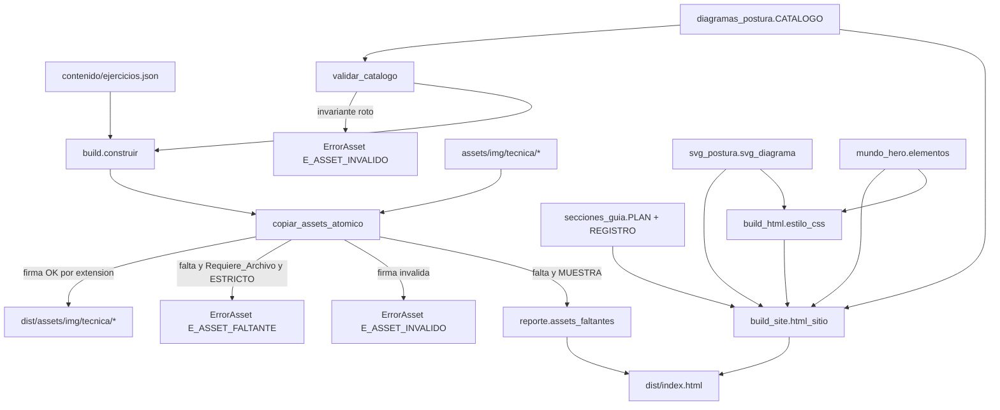
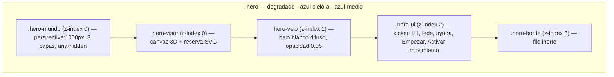
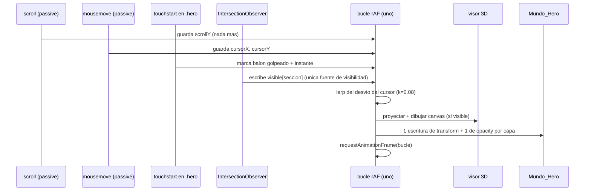
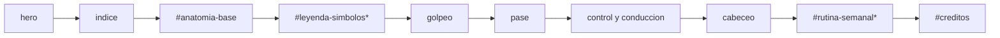

# Design Document

## Overview

La feature entra al proyecto por cinco módulos nuevos y varios puntos de costura en código existente. Nada de la estética congelada se reemplaza: se **añade**, y donde el requisito obliga a cambiar una regla vigente, el cambio queda declarado en la sección de migración.

Módulos nuevos:

| Módulo | Responsabilidad |
| --- | --- |
| `src/guia/diagramas_postura.py` | Catálogo declarativo de los ocho Diagrama_Postura (archivo, `alt`, dimensiones por modo, pasos, Etiqueta_Anatomica, Fase_Numerada, Fundamento, postura equivalente, Requiere_Archivo, Advertencia_Cabeceo, crédito), Validador_Catalogo, listas del Guardarrail_Lexico y render del bloque HTML de cada diagrama. |
| `src/guia/svg_postura.py` | **Generador_SVG**: esqueleto paramétrico único, los ocho conjuntos de ángulos que derivan las poses, colocación determinista de Etiqueta_Anatomica, línea media con centro de gravedad, flechas de movimiento, Fase_Numerada y emisión del `<svg>` en línea. |
| `src/guia/mundo_hero.py` | Declaración de los Elemento_Fondo, matemática del parallax/escala/desvanecimiento, resolución del balón más cercano al toque, SVG en línea de cada figura, bloque CSS del mundo y constantes para el JavaScript. |
| `src/guia/secciones_guia.py` | Plan de secciones del Target_Web (orden del Requisito 19) y **registro de Seccion_Reservada**: el punto de extensión que la Spec_Pizarra rellena sin reescribir `build_site.py`. |
| `src/guia/vistas_figura.py` | **Proyector_Vistas** (Requisitos 21 a 25): Esqueleto_3D derivado de la `Pose` vigente, rotación de azimut y de elevación, proyección a dos coordenadas, clasificación de Miembro_Trasero y Miembro_Delantero, tabla de las diez Clave_Vista, `vista_mas_cercana` con su desempate, emisión de las diez Vista_Figura con los cuatro grupos en orden fijo, Tapa_Torso y Sombra_Contacto. |

> **El nombre `src/guia/rotacion.py` ya está tomado** por la rotación de jugadoras del plan semanal (`ErrorRotacion`, `E_ROTACION_DUPLICADA`, `test/test_rotacion.py`, `test/test_verify_rotacion.py`). El módulo del Proyector_Vistas se llama **`src/guia/vistas_figura.py`** y no toca nada de aquel.

Costuras en código existente:

| Archivo | Cambio |
| --- | --- |
| `src/guia/paleta.py` | Los siete tokens de la Paleta_Guia (una sola constante de Python por color), el bloque de Modo_Oscuro y las funciones `luminancia_relativa(color)` y `contraste(a, b)` (WCAG 2.x). Ningún token existente cambia de valor. |
| `src/guia/build_html.py` | `estilo_css()` añade el bloque del Mundo_Hero, el de `.diagrama-postura`, el del tema claro de la Paleta_Guia, el de celular primero (zonas táctiles, `dvh`, safe area, navegación inferior), el bloque `@media (hover: hover)` que envuelve todas las reglas `:hover`, el de Movimiento_Reducido, el de Modo_Oscuro y el de `@media print`. Se añade `META_VIEWPORT_SITIO`. |
| `src/guia/build_site.py` | El hero inserta la capa `.hero-mundo` y la Zona_Tactil "Activar movimiento"; se emiten las secciones del plan de `secciones_guia` (incluidas las reservadas y el Bloque_Creditos); el `<script>` único pasa a tener **un solo** bucle `requestAnimationFrame` que sirve al visor 3D y al Mundo_Hero, con `IntersectionObserver` como única fuente de visibilidad. |
| `src/guia/build.py` | Fase nueva de copia de assets a `dist/assets/img/tecnica/` con validación de firma por extensión y campos nuevos en el `Reporte`. |
| `src/guia/errores.py` | Códigos `E_ASSET_FALTANTE` y `E_ASSET_INVALIDO` y la subclase `ErrorAsset`. |

Costuras que añade la ampliación multi-vista (Requisitos 21 a 30) sobre módulos que **ya están implementados y en verde**:

| Archivo | Cambio de la ampliación |
| --- | --- |
| `src/guia/svg_postura.py` | **Solo añade, no modifica.** El formateador `_num` se expone como `num` público (misma implementación, un solo formateo en todo el proyecto, criterio 21.11) y se añade `FACTOR_VISTA` a las constantes. No cambia la firma de `esqueleto(pose, ancho_vb, alto_vb, *, factor=1.0)`, ni `HUESOS`, ni `ANGULOS_BASE`, ni `POSES`, ni `escala_figura`, ni ninguna función de etiquetas. Las 504 pruebas vigentes siguen leyendo exactamente lo mismo. |
| `src/guia/diagramas_postura.py` | `DiagramaPostura` gana el campo `girable: bool`, verdadero solo en `anatomia-base` (criterio 22.5), y `validar_catalogo()` lo comprueba. Se añade `EXTENSIONES_PERMITIDAS` y el **Validador_Rutas** `ruta_aceptable(ruta)` (Requisito 30) como única función que decide qué ruta de Asset_Local es aceptable. |
| `src/guia/mundo_hero.py` | Declara las Figura_Girable del hero (tres siluetas), sus duraciones de vuelta, sentidos y `translateZ` propio, la Sombra_Contacto, el Balon_Esfera con sus ocho Gajo_Balon y su Eje_Giro_Inclinado, y amplía `datos_json()` con las constantes del multi-vista. |
| `src/guia/build_html.py` | `estilo_css()` añade el bloque del multi-vista (`.figura-girable`, `.figura-vista`, Vista_Activa), el del Modo_Inerte por clase, el del Balon_Esfera con su degradación 2D y el del Arrastre_Rotacion (`touch-action:none`). |
| `src/guia/build_site.py` | El Script_Unico gana el Conmutador_Vista y el Arrastre_Rotacion **dentro del mismo y único bucle** `requestAnimationFrame` que ya sirven el visor 3D y el Mundo_Hero (criterios 10.17 y 29.1). |

Punto clave de diseño: **Python es la única fuente de verdad de los números**. Los factores de parallax, las escalas, la curva de desvanecimiento, la amplitud del vaivén, el tope de 20 px del cursor, el coeficiente de suavizado 0.08, el radio del toque y el corte de 768 px se declaran en `mundo_hero.py`, se prueban con property-based testing en Python y se inyectan en el JavaScript como un literal JSON compacto. El JavaScript no repite ninguna constante a mano.

Segundo punto clave: **el dibujo también es Python**. El Generador_SVG no dibuja ocho figuras a mano: declara **una** figura paramétrica (un esqueleto de 17 articulaciones unidas por 16 huesos de longitud fija) y **ocho conjuntos de ángulos**. Eso es lo que hace el catálogo mantenible y, sobre todo, lo que permite que las pruebas verifiquen geometría real (longitudes de hueso invariantes, puntos dentro del `viewBox`, etiquetas sin solapes, grosor único, tamaño de fuente efectivo) en vez de comparar cadenas.

Tercer punto clave, el que trae la ampliación: **la vuelta de 360 grados se resuelve en el espacio 3D de Python, no con un `rotateY` del navegador**. Un `rotateY` sobre un SVG plano no gira un cuerpo: al pasar los 90 grados se ve el mismo dibujo espejeado, nunca la espalda. Como el esqueleto ya es paramétrico, el Proyector_Vistas le añade una **tercera coordenada de profundidad**, lo rota alrededor del eje vertical del cuerpo y del eje transversal, y lo proyecta a dos coordenadas **diez veces**, una por Clave_Vista. Las diez Vista_Figura se emiten desde Python y viven en el DOM desde el primer fotograma; el JavaScript solo enciende una y apaga otra. El `rotateY` se conserva, pero reducido a Rotacion_Residual de ±22.5 grados entre dos vistas contiguas, que es lo que hace imperceptible el salto.

Consecuencia que hay que tener escrita porque es el punto que más fácil se rompe al implementar: **la longitud de hueso se mide sobre el Esqueleto_3D rotado, nunca sobre la proyección**. En 3D es invariante con tolerancia 1e-6 con todo azimut y toda elevación (criterios 14.18 y 21.5). En la proyección **no** es constante: el Escorzo la acorta con el coseno del ángulo (criterios 14.19 y 21.7). Cualquier prueba que mida longitudes sobre el SVG resultante y exija constancia está mal escrita.

### Investigación previa (hallazgos del código real)

1. `build_site.py` emite **un solo** `<script>` que contiene el buscador y el visor 3D concatenados. `test_build_site::test_script_propio_y_unico` afirma `count("<script") == 1` y prohíbe la subcadena `//` en el cuerpo. El código nuevo se concatena dentro del mismo `<script>`.
2. `test_arte_futurista` afirma cadenas CSS **exactas**: `.hero-visor{position:absolute;inset:0;z-index:0;`, `.hero-velo{position:absolute;inset:0;z-index:1;`, `.hero-ui{position:relative;z-index:2;`, `backdrop-filter:blur(18px)`, `-webkit-backdrop-filter:blur(18px)`, `@keyframes hero-giro`, `translateZ(26px)`, `rotateY(-13deg)`, `perspective:var(--profundidad)`, `--fondo:#0A0A0F`, `--fondo-profundo:#050508`, `--azul:#7EC8FF`, `html,body{overflow-x:hidden;}`, `min-width:0`, `max-width:100%` y, dentro del bloque de Movimiento_Reducido, `.hero-visor{perspective:none;}` y `.hero-reserva .hero-svg{animation:none !important;}`. Todas se conservan **literalmente**.
3. `test_arte_futurista::test_el_hero_no_depende_de_recursos_externos` afirma que el CSS **no contiene** `http`, ni `@import`, ni `url(`. Por eso los Archivo_Diagrama van en `` del HTML, los diagramas generados y las figuras del fondo en SVG en línea, y ninguna imagen se carga desde CSS.
4. `test_arte_futurista::test_ningun_ancho_fijo_mayor_que_el_viewport` recorre el CSS con `(width|min-width):\s*(\d+)px` y exige `<= 360`. El mundo, los diagramas y las zonas táctiles usan `%`, `rem`, `clamp()`, `dvh` y `aspect-ratio`; los únicos valores en píxeles son `min-height:320px` y `min-height:44px` / `min-width:44px`, que esa regla acota sin problema (44 <= 360; `min-height` no la toca).
5. `test_arte_futurista::test_visor_por_z_index_nunca_position_fixed` acota `position:fixed` a **un único** selector del CSS: `.visor-ampliado`, el overlay modal del Visor_Ampliado (criterio 28.5). Las capas del mundo usan `position:absolute` y la navegación inferior del criterio 15.20 usa `position:sticky` con `bottom:0`. La prueba lo mide por conteo y por posición, así que un `position:fixed` en cualquier otra regla sigue fallando.
6. `build_html.documento_a_html()` genera las páginas de capítulo desde el Modelo_Paginas del PDF; `test_build_html` y `test_arte_futurista` prohíben allí `<script>`, `<canvas>`, atributos `on*` e ``. Esta feature **no toca** esas páginas: los Diagrama_Postura viven solo en el Target_Web.
7. `build.construir()` publica todo de forma atómica desde `dist/.tmp/` con `os.replace`; `_copiar_json_atomico` es el patrón exacto que reutiliza la copia de assets.
8. `test/prop.py` es un motor de property-based testing propio (`for_all`, `ITERACIONES_POR_DEFECTO = 100`, shrinking sobre enteros, secuencias y cadenas, semilla por `SEMILLA_PBT`) y `test/gen.py` aporta generadores. Las propiedades nuevas se escriben con ese motor.
9. Hoy no existe el directorio `assets/`. Lo crea esta feature; con Requiere_Archivo en falso en las ocho entradas, el build estricto llega a `[PUBLICABLE]` **sin que la usuaria coloque un solo archivo**.
10. **`figuras.py` no sirve como Generador_SVG, y la investigación explica por qué.** Tiene `figura_jugadora(dx, *, lado_ejecutor, flexion_rodilla, valgo, inclinacion_tronco, apertura_pies)`, que ya es un esqueleto paramétrico, pero produce `Item` en unidades de mundo para un lienzo de dos paneles ("ASI SI" / "ASI NO"), sin manos, sin pies, sin cabello y sin rostro, y lo pinta `viz.py` con la **otra** paleta (`PALETA` = rosa/negro/rojo) y **sin** atributos `width`/`height` en el `<svg>`. El Requisito 14 pide contorno en `--azul-profundo` con grosor único equivalente a 2 px, relleno en `--azul-cielo` al 0.12, `<text>` reales con línea guía en `--azul-linea` y punto sólido, flechas punteadas en `--coral-alerta`, línea media con centro de gravedad y fases numeradas; y el criterio 4.3 pide `width` y `height` en el `<svg>`. Nada de eso sale de `viz.py` sin romper sus pruebas. **Decisión:** `svg_postura.py` es un emisor nuevo e independiente que **reutiliza las convenciones** de `viz.py` (formateo `_num` con tres decimales y recorte de ceros para bytes estables, escapado con `html.escape`, acumulación en `list[str]` y `''.join`) y **reutiliza de `figuras.py` el modelo mental** (proporciones del cuerpo, ángulos en grados, cinemática directa). Lo que sí se reutiliza literalmente es el **catálogo de posturas**: `postura_id` de cada Diagrama_Postura apunta a una clave real de `figuras.FIGURAS` (`tiro-potencia-empeine`, `pase-corto-interior`, `control-orientado`, `conduccion`, `pase-largo-empeine`), verificado por prueba.
11. **Choque real con una prueba vigente: la meta viewport.** `build_html.META_VIEWPORT` vale `width=device-width, initial-scale=1, maximum-scale=5` y `test_arte_futurista::test_viewport_exacto_en_los_dos_destinos` afirma esa cadena **también dentro del Target_Web**. El criterio 15.11 exige `width=device-width, initial-scale=1, viewport-fit=cover`. No pueden coexistir en el mismo documento. **Resolución:** se añade `META_VIEWPORT_SITIO` para el Target_Web (y solo para él), `META_VIEWPORT` queda intacta para las páginas de capítulo y la publicación, y esa prueba se ajusta para exigir la cadena nueva en el sitio y la vieja en los capítulos. `test_nunca_se_bloquea_el_zoom` sigue en verde: quitar `maximum-scale` amplía el zoom, no lo bloquea.
12. **Choque real número dos: las reglas `:hover`.** La Hoja_Estilo tiene hoy reglas `:hover` fuera de toda consulta de medios (`a:hover`, `figure:hover`, `tbody tr:hover`, `nav.sitio a:hover`, `.descarga a:hover`, `.indice-capitulos a:hover`, `.zona:hover`, `.chip:hover`, `.btn-video:hover`). El criterio 15.13 exige que **toda** regla `:hover` viva dentro de `@media (hover: hover)`. **Resolución sin romper nada:** las reglas se **envuelven** sin reescribir su texto. Las pruebas vigentes usan `assertIn` sobre la cadena de la regla, y la cadena sigue presente literalmente dentro de la consulta. Las variantes `:focus-within`, `:focus-visible` y `:active` se **separan** de la regla `:hover` y quedan fuera de la consulta, para no perder el estado al toque y con teclado.
13. **Migración de tema.** El sitio es hoy oscuro (`--fondo:#0A0A0F`). El Requisito 16 lo convierte en la Paleta_Guia clara con Modo_Oscuro. Los tokens oscuros **no se borran** (criterio 16.17 y las pruebas que afirman sus valores): siguen declarados en `:root`, `--azul` (`#7EC8FF`) queda restringido a las aristas, los acentos y el halo del visor 3D (criterio 16.18) y `--fondo` / `--fondo-profundo` quedan como fondo del lienzo del visor. `test_build_site` sigue encontrando `paleta.WEB_FONDO` en el documento porque el token sigue declarado y usado ahí.

### Investigación de la ampliación (estado real del código al abrir los Requisitos 21 a 30)

14. **La suite está en 504 pruebas en verde** con `python _run_tests.py` desde `guia-sub17/`. Ese es el suelo que la ampliación no puede mover: cada tarea nueva cierra con la suite completa en verde.
15. **`svg_postura.py` ya está implementado y es la base sobre la que se apoya el Proyector_Vistas**, sin tocar una firma. Lo verificado leyéndolo: `FACTOR_VIEWBOX = 2.0`, `ANCHO_CANONICO = 720.0`, `ALTO_CANONICO = 1080.0`, `MARGEN_CANONICO = 20.0`, `RAIZ_CANONICA = (360.0, 620.0)` (que **es** la cadera media, la articulación `torso`), el `Literal` `Articulacion` con las 17 articulaciones, `HUESOS` con los 16 huesos como `(origen, destino, longitud_canónica)` en **orden topológico**, `NOMBRES_HUESOS`, `ANGULOS_BASE` con el ángulo absoluto de cada hueso en la pose neutra, `Pose` con `angulos` como **desviaciones** en grados, `POSES` con las ocho, y las funciones `pose_de`, `esqueleto_canonico(pose) -> tuple[tuple[str, Punto], ...]` (con `lru_cache`), `escala_figura(ancho_vb, alto_vb, factor=1.0)`, `esqueleto(pose, ancho_vb, alto_vb, *, factor=1.0) -> dict[str, Punto]`, `largo_hueso(nombre, ancho_vb, alto_vb, *, factor=1.0)`, `validar_poses`, `grosor_contorno`, `grosor_guia`, `tamano_efectivo_px`, `tamano_fuente_etiqueta`, `radio_cabeza`, `svg_figura`, `Etiqueta`, `ancho_texto`, `rectangulo`, `se_solapan`, `eje_vertical`, `punto_de_etiqueta`, `factor_figura`, `colocar_etiquetas` (modos DENTRO y FUERA), `svg_etiquetas`, `ancla_ampliacion`, `svg_zona_ampliacion` y `caja_figura`. Tres consecuencias de diseño: (a) la cinemática directa **ya** parte de la cadera media, que es exactamente el centro de rotación que pide el criterio 21.3; (b) el parámetro `factor` de `escala_figura` **ya** permite reducir la figura sin cambiar ninguna firma, que es lo que el envolvente de rotación necesita; (c) `caja_figura` es el medidor que usan las propiedades de ancho de hombros proyectado.
16. **`diagramas_postura.py` ya está implementado** con el catálogo de ocho entradas, `ETIQUETAS_ANATOMIA` con los 16 términos, `ARTICULACIONES` como tupla canónica que `svg_postura` reutiliza, `ARTICULACION_POR_ETIQUETA`, `articulacion_de`, el Guardarrail_Lexico, la Advertencia_Cabeceo y `validar_catalogo`. El campo `girable` es lo único que le falta. `paleta.py` ya tiene los siete tokens, `luminancia_relativa`, `contraste` y `pares_declarados`.
17. **`errores.py` ya declara `E_ASSET_FALTANTE`, `E_ASSET_INVALIDO`, los dos dentro de `CODIGOS`, y la subclase `ErrorAsset`** con `CODIGO_POR_DEFECTO = E_ASSET_INVALIDO`. El Proyector_Vistas no necesita ningún código nuevo: todos sus invariantes viajan como `ErrorAsset(..., codigo=E_ASSET_INVALIDO)`. Ningún `assert`, en ninguna rama.
18. **`test/prop.py` es el motor propio de PBT** (`for_all`, `ITERACIONES_POR_DEFECTO = 100`, shrinking, semilla por `SEMILLA_PBT`) y `test/gen.py` ya aporta `gen_presentes`, `gen_bytes_asset`, `gen_progreso`, `gen_secuencia_progresos`, `gen_cursor_relativo`, `gen_punto_toque`, `gen_viewbox`, `gen_conceptos_eliminados`, `gen_texto_lexico`, `gen_campos_credito_ausentes`, `gen_reservadas_registradas` y `gen_catalogo_fundamento_ajeno`. Los generadores de la ampliación se suman a ese archivo.
19. **Pendiente de implementar cuando la ampliación arranca:** las tareas 4.9 a 4.14 y los bloques 6, 7, 9, 11, 12, 13 y 14 del plan. Es decir, `mundo_hero.py`, `secciones_guia.py`, las costuras de `build_html.py`, `build_site.py` y `build.py`, y ahora también `vistas_figura.py`. El diseño del multi-vista se escribe **encima** de lo ya implementado, no en paralelo.

## Architecture

### Flujo de build



### Decisión de render híbrido (Requisito 5)

Una sola función decide, por diagrama y una sola vez por build:

```
modo_render(diagrama, presentes) = ARCHIVO  si ruta_relativa(diagrama) in presentes
                                 = SVG      en caso contrario
```

- `ARCHIVO` → `<figure>` con `.<ext>" ...>` y las dimensiones del archivo.
- `SVG` → `<figure>` con el `<svg>` en línea del Generador_SVG y las dimensiones del SVG.
- **Siempre** hay exactamente un contenido gráfico por diagrama, en Modo_Estricto y en Modo_Muestra (criterio 5.5). El hueco del diseño anterior desaparece.
- Las ocho entradas declaran `requiere_archivo=False` (criterio 5.2), así que el estricto llega a `[PUBLICABLE]` con `presentes = ∅`.
- Firmas comprobadas sobre la copia temporal antes de publicar: `.webp` con `RIFF` en 0..3 y `WEBP` en 8..11; `.png` con `89 50 4E 47` al inicio; `.avif` con `ftyp` en 4..7; `.svg` con la subcadena `<svg` dentro de los primeros 512 bytes.

### Capas del hero (de atrás hacia delante)



`.hero-mundo` se inserta **antes** de `.hero-visor` en el HTML, de modo que el mundo queda detrás del modelo 3D dentro del mismo plano `z-index:0` por orden de pintado. `.hero-velo` deja de oscurecer y pasa a ser el halo blanco difuso que pide el criterio 6.2 (conserva su `linear-gradient(`, que una prueba existente afirma). El degradado del hero termina en `--azul-medio` (`#B8DCFA`), no en `#7EC8FF`, porque ese azul saturado quedó fuera de la Paleta_Guia.

Las siete capas del criterio 6.7 (`hero`, `hero-visor`, `hero-lienzo`, `hero-reserva`, `hero-velo`, `hero-ui`, `hero-borde`) y los 13 elementos congelados del arte actual (criterio 6.9) se conservan sin tocar.

### Un solo bucle de animación



Reglas duras del bucle, todas verificables sobre el código emitido:

- Exactamente **una** llamada a `requestAnimationFrame(`, dentro de la función `bucle` (10.5).
- El escuchador de desplazamiento es `{passive:true}` y **solo guarda** `window.scrollY` (10.4).
- Dentro de `bucle` hay **a lo sumo una** asignación a `style.transform` y **a lo sumo una** a `style.opacity` por capa (10.13), y **cero** apariciones de `getBoundingClientRect`, `offsetTop` y `clientHeight` (10.14).
- La visibilidad viene solo de `IntersectionObserver`, que observa cada sección animada (10.11, 10.12, 10.14).
- El bucle se detiene solo cuando el hero está fuera de la ventana **y** el documento está oculto (10.8); mientras el hero está fuera de la ventana con el documento visible, el bucle sigue vivo pero no dibuja ni escribe (10.9).
- `will-change` pasa a `auto` en las tres capas en cuanto la opacidad llega a 0 (10.7).
- El permiso de `DeviceOrientationEvent` se pide en **un solo lugar**: el manejador de la Zona_Tactil "Activar movimiento" (9.11). Si se deniega o no existe la capacidad, el parallax de scroll sigue (es scroll puro) y la flotación y el giro siguen (son animaciones CSS) (9.12).
- El escuchador de toque vive en el **contenedor** `.hero`, no en los Elemento_Fondo, así que `pointer-events:none` en el Mundo_Hero y en todos sus descendientes queda intacto (9.9, 11.2).

### Orden de las secciones y punto de extensión (Requisito 19)



Los nodos con `*` y las anclas `#ejercicios-<fundamento>` dentro de cada bloque son **Seccion_Reservada**: esta spec emite su encabezado y su ancla, y deja el cuerpo vacío. Cada bloque de Fundamento se compone, en este orden: Diagrama_Postura, pasos numerados, error frecuente y `#ejercicios-<fundamento>`. En el bloque de cabeceo, la Advertencia_Cabeceo va **antes** de los pasos (20.4).

El punto de extensión es explícito y no obliga a la Spec_Pizarra a tocar `build_site.py`:

```python
# secciones_guia.py
Reservada = dataclass(frozen=True, slots=True)
    ancla: str            # "leyenda-simbolos" | "rutina-semanal" | "ejercicios-golpeo" ...
    titulo: str           # encabezado que SIEMPRE se emite
    nivel: int            # 2 para las de primer nivel, 3 para las de fundamento

RESERVADAS: tuple[Reservada, ...]          # declarativo y congelado
PLAN: tuple[str, ...]                      # orden exacto del criterio 19.1

def registrar(ancla: str, render: Callable[[list[str]], None]) -> None:
    """Registra el cuerpo de una Seccion_Reservada. La Spec_Pizarra llama aqui."""

def render_reservada(ancla: str, partes: list[str]) -> None:
    """Emite <section id=ancla> + encabezado y, si hay cuerpo registrado, lo invoca."""

def anclas_esperadas() -> tuple[str, ...]   # para el indice y la navegacion
```

Invariantes del registro: `registrar` solo acepta anclas de `RESERVADAS` (si no, `ErrorBuild`); registrar dos veces la misma ancla es error; y `render_reservada` emite el ancla y el encabezado **exista o no** el cuerpo (19.7). Con el registro vacío el documento es el de esta spec; con el registro lleno es el de las dos specs juntas, y `build_site.py` no cambia una línea entre los dos casos.

## Components and Interfaces

### `diagramas_postura.py`

```python
FUNDAMENTOS: tuple[str, ...] = ("golpeo", "pase", "control-conduccion", "cabeceo")
DIR_ASSETS: str = "assets/img/tecnica"          # ruta relativa, con "/"
EXTENSIONES: tuple[str, ...] = (".webp", ".svg", ".png", ".avif")
ANCLA_TECNICA: str = "tecnica-en-imagenes"
ANCLA_ANATOMIA: str = "anatomia-base"
ANCLA_CREDITOS: str = "creditos"

Credito = dataclass(frozen=True, slots=True)
    autor: str | None
    fuente: str | None
    licencia: str | None
    enlace: str | None          # texto visible, NUNCA <a href>

Fase = dataclass(frozen=True, slots=True)
    numero: int                 # 1..n, sin huecos
    texto: str

DiagramaPostura = dataclass(frozen=True, slots=True)
    id: str                     # "tiro-empeine"
    titulo: str
    archivo: str                # "tiro-empeine.webp"
    alt: str                    # >= 60 caracteres
    ancho_archivo: int          # <= 1200
    alto_archivo: int
    ancho_svg: int              # <= 360 (celular primero)
    alto_svg: int
    pasos: tuple[str, ...]      # 5 pasos, orden fijo, >= 20 caracteres
    etiquetas: tuple[str, ...]  # subconjunto del vocabulario de anatomia-base
    fases: tuple[Fase, ...]     # () cuando el gesto no tiene secuencia
    fundamento: str | None      # None solo en anatomia-base
    postura_id: str | None      # clave real de figuras.FIGURAS o None
    requiere_archivo: bool      # False en las ocho entradas de hoy
    advertencia: str | None     # obligatoria y solo en cabeceo-frente
    error_frecuente: str
    credito: Credito

CATALOGO: tuple[DiagramaPostura, ...]   # exactamente 8, orden fijo

# Vocabulario y lexico (Requisitos 14.13, 14.16, 17)
ETIQUETAS_ANATOMIA: tuple[str, ...]     # las 16 de anatomia-base
VERBOS_PERMITIDOS: tuple[str, ...]      # segunda persona del singular
MASCULINO_GENERICO: tuple[str, ...]     # "el jugador", "los jugadores", ...
FORMAS_MASCULINAS: tuple[str, ...]      # "listo", "atento", ...
CONDESCENDIENTES: tuple[str, ...]       # "es facilisimo", "no te compliques", ...
CONCEPTOS_CABECEO: tuple[tuple[str, tuple[str, ...]], ...]   # concepto -> sinonimos

def ruta_relativa(d: DiagramaPostura) -> str        # "assets/img/tecnica/x.webp"
def ruta_fuente(d: DiagramaPostura) -> str          # ruta absoluta en el repo
def presentes() -> frozenset[str]                   # rutas relativas existentes
def modo_render(d: DiagramaPostura, presentes: frozenset[str]) -> str   # "archivo" | "svg"
def dimensiones(d: DiagramaPostura, modo: str) -> tuple[int, int]
def por_fundamento(f: str) -> tuple[DiagramaPostura, ...]
def validar_catalogo() -> None                      # raise ErrorAsset (nunca assert)
def violaciones_lexicas(id_: str, texto: str) -> tuple[str, ...]
def validar_advertencia(d: DiagramaPostura) -> None  # raise ErrorAsset con el concepto ausente
def render_bloque(d: DiagramaPostura, partes: list[str], *,
                  presentes: frozenset[str], primero: bool) -> None
def render_creditos(partes: list[str], *, presentes: frozenset[str]) -> None
def campos_pendientes() -> tuple[tuple[str, tuple[str, ...]], ...]
def bloque_css() -> str
```

`render_bloque` emite, para cada diagrama:

```html
<article class="diagrama-postura" data-diagrama="tiro-empeine" style="--relacion:3/4">
  <h3>Remate con el empeine</h3>
  <figure class="diagrama-marco">
    <!-- modo archivo -->
    
    <!-- modo svg: el <svg> en linea del Generador_SVG, con width y height del catalogo -->
  </figure>
  <p class="diagrama-aviso">...</p>          <!-- solo en cabeceo-frente, ANTES de los pasos -->
  <ol class="diagrama-pasos">
    <li>Coloca el pie de apoyo al costado del balon, a un pie de distancia.</li>
    ...
  </ol>
  <ol class="diagrama-fases">                 <!-- solo si fases != () -->
    <li value="1">Aproximate en diagonal ...</li>
  </ol>
  <p class="diagrama-error">Error frecuente: ...</p>
</article>
```

Reglas de emisión:

- El **primer** `` del documento lleva `loading="eager"`; los demás `loading="lazy"`. El "primero" depende del subconjunto presente, así que lo calcula el render, no el catálogo.
- `width` y `height` son siempre los del **modo de render efectivo** (4.3, 4.8), tanto en `` como en `<svg>`.
- La relación de aspecto del contenedor viaja como propiedad personalizada en línea (`--relacion`), de modo que el CSS declare una sola regla `aspect-ratio:var(--relacion)` y no haya ningún ancho en píxeles.
- Todo texto pasa por `build_html._esc`.
- El Bloque_Creditos emite el enlace como **texto visible** (18.5) y, para los diagramas rendidos por el Generador_SVG, declara autoría y licencia propias del proyecto (18.4). Un campo ausente se emite con la marca `dato pendiente` (18.8) y `campos_pendientes()` alimenta el reporte (18.9).

### `svg_postura.py` — el Generador_SVG

Responsabilidad: emitir el SVG line art de un Diagrama_Postura. Ninguna figura se dibuja a mano; todas salen de un esqueleto paramétrico y de un conjunto de ángulos.

```python
#: Unidades del viewBox por pixel CSS declarado. viewBox = 2 * dimension declarada.
FACTOR_VIEWBOX: float = 2.0

#: Ancho de referencia al que se escala el SVG en el celular (criterio 15.17).
ANCHO_REFERENCIA_PX: float = 360.0

Articulacion = Literal["cabeza","cuello","hombro_i","hombro_d","codo_i","codo_d",
                       "mano_i","mano_d","torso","cadera_i","cadera_d",
                       "rodilla_i","rodilla_d","tobillo_i","tobillo_d","pie_i","pie_d"]

#: Longitud fija de cada hueso, en unidades del viewBox. INVARIANTE entre poses.
HUESOS: tuple[tuple[Articulacion, Articulacion, float], ...]     # 16 huesos

Pose = dataclass(frozen=True, slots=True)
    id: str                              # coincide con el id del Diagrama_Postura
    inclinacion_tronco: float            # grados
    rotacion_hombros: float
    angulos: tuple[tuple[str, float], ...]   # angulo por hueso articulado, en grados
    apoyo: Articulacion                  # pie que sostiene el peso
    centro_gravedad_x: float             # fraccion del ancho del viewBox
    balon: tuple[float, float] | None
    flechas: tuple[tuple[str, str], ...] # (articulacion_origen, articulacion_destino)

POSES: tuple[Pose, ...]                  # exactamente 8, una por entrada del catalogo

Punto = tuple[float, float]

def esqueleto(pose: Pose, ancho_vb: float, alto_vb: float) -> dict[Articulacion, Punto]
def grosor_contorno(ancho_vb: float, ancho_declarado: float) -> float   # 2 px equivalentes
def grosor_guia(ancho_vb: float, ancho_declarado: float) -> float       # 1 px equivalente
def tamano_efectivo_px(font_size_vb: float, ancho_vb: float) -> float
def tamano_fuente_etiqueta(ancho_vb: float) -> float
def colocar_etiquetas(pose: Pose, etiquetas: tuple[str, ...],
                      puntos: dict[Articulacion, Punto],
                      ancho_vb: float, alto_vb: float) -> tuple[Etiqueta, ...]
def svg_diagrama(d: DiagramaPostura) -> str
def fases_emitidas(d: DiagramaPostura) -> tuple[int, ...]
def omisiones_de_fase(d: DiagramaPostura) -> tuple[tuple[str, int], ...]
```

**Esqueleto paramétrico.** 17 articulaciones unidas por 16 huesos de longitud fija. `esqueleto()` hace cinemática directa: parte de la cadera media, aplica `inclinacion_tronco` al tronco, `rotacion_hombros` a la línea de hombros y el ángulo declarado a cada hueso articulado. Consecuencias probadas: la distancia entre los dos extremos de cada hueso es la longitud declarada **en las ocho poses** (tolerancia 1e-6), el conjunto de articulaciones y de huesos es idéntico en las ocho, y todo punto cae dentro del `viewBox`. Sobre eso se dibuja: círculo de la cabeza sin ningún rasgo facial (cero elementos dentro del círculo), grupo `cabello-recogido` (un arco más un pequeño círculo detrás del cuello) y silueta cerrada con relleno `--azul-cielo` a `fill-opacity:0.12`.

**Grosor de trazo.** Fórmula única y explícita:

```
grosor_contorno(ancho_vb, ancho_declarado) = 2.0 * ancho_vb / ancho_declarado
grosor_guia(ancho_vb, ancho_declarado)     = 1.0 * ancho_vb / ancho_declarado
```

Con `ancho_vb = 720` y `ancho_declarado = 360`: contorno `4`, guía `2`. **Todos** los trazos de contorno de un mismo diagrama comparten ese único valor (14.3); el conjunto de valores distintos de `stroke-width` en los trazos de contorno tiene cardinalidad 1.

**Tamaño de fuente efectivo (criterio 15.17).** El SVG se escala a 360 px de ancho, así que el factor es `360 / ancho_vb` y

```
tamano_efectivo_px(f, ancho_vb) = f * 360.0 / ancho_vb
tamano_fuente_etiqueta(ancho_vb) = ceil(12.0 * ancho_vb / 360.0) + 2
```

Con `ancho_vb = 720`: `tamano_fuente_etiqueta = 26` unidades, que rinden **13 px** efectivos a 360 px de ancho. La función es de Python y está probada: para todo `ancho_vb` positivo, `tamano_efectivo_px(tamano_fuente_etiqueta(ancho_vb), ancho_vb) >= 12`.

**Colocación de Etiqueta_Anatomica (algoritmo determinista).**

```
Entradas: la pose (que da el punto de cada articulacion), la lista de etiquetas
declaradas y las dimensiones del viewBox.
1. Cada etiqueta se ancla a la articulacion que le corresponde por un mapa
   declarado etiqueta -> articulacion (la "linea media" y el "centro de gravedad"
   se anclan al eje vertical y al punto de gravedad).
2. Modo DENTRO (cuando el diagrama declara 8 etiquetas o menos, criterio 15.18):
   la etiqueta se coloca a 34 unidades del punto, en el lado contrario al eje
   vertical, sin sobrepasar los margenes; la linea guia va del borde del texto al
   punto y termina en un circulo relleno de radio 5 sobre el punto.
3. Modo FUERA (cuando el diagrama declara mas de 8 etiquetas, criterio 15.19):
   las etiquetas se reparten en dos columnas fijas, en los margenes izquierdo y
   derecho del viewBox, ordenadas de arriba abajo por la Y de su articulacion;
   ninguna cae dentro del rectangulo que envuelve a la figura; la linea guia es
   una polilinea de dos tramos (horizontal desde el texto, luego recta al punto)
   y termina igual en el circulo relleno.
4. En los dos modos, los rectangulos de texto se reparten con un desplazamiento
   vertical minimo de una linea para que ningun par se solape.
5. En modo FUERA se emite ademas la Zona_Tactil de ampliacion (criterio 15.19).
```

Determinista significa: la misma pose y la misma lista de etiquetas producen exactamente los mismos bytes. Sin aleatoriedad, sin diccionarios sin ordenar, sin `set` en el camino de emisión.

`anatomia-base` es la única entrada en modo FUERA: declara 16 etiquetas. Su Zona_Tactil de ampliación es un enlace de ancla a `#anatomia-base-ampliada`, una sección que el CSS despliega a `min-height:100dvh` con el selector `:target`. Un solo toque, cero JavaScript, y **sin** `position:fixed` (que el CSS tiene prohibido).

**Línea media y centro de gravedad (14.9).** Un segmento vertical (`x1 == x2`, igual al eje declarado de la pose) con `stroke-dasharray` y un círculo relleno sobre él, a la altura del centro de gravedad.

**Flechas de movimiento (14.8).** Una por par declarado en `Pose.flechas`, con `stroke:--coral-alerta`, `stroke-dasharray` declarado y punta como polilínea (sin `marker`, sin `url(`).

**Fases numeradas (14.10 a 14.12, 14.17).** Cuando `fases != ()`, el SVG emite un `<text>` con el número de cada fase junto al punto de la pose que le corresponde. `fases_emitidas()` devuelve los números realmente emitidos: el conjunto debe ser exactamente `{1..n}`. Si un número no se puede emitir (por ejemplo, porque su punto de anclaje cae fuera del `viewBox`), **no se aborta**: se emiten los demás y `omisiones_de_fase()` alimenta el reporte del Orquestador_Build con `(id_diagrama, numero)`. La lista `<ol class="diagrama-fases">` del HTML usa `value="<numero>"` para que la numeración del texto coincida exactamente con la del SVG (14.11).

**Prohibiciones del marcado (14.15).** Cero `<image>`, cero atributos de evento (`on*`), cero `url(`, cero `http`, cero `tabindex`. El SVG lleva `role="img"`, `aria-label` con el `alt` del catálogo, y los atributos `width`, `height` y `viewBox`.

### `vistas_figura.py` — el Proyector_Vistas

Responsabilidad: derivar el Esqueleto_3D de una `Pose` que ya existe, rotarlo, proyectarlo y emitir las diez Vista_Figura. **Solo lee** de `svg_postura`; no cambia ninguna de sus firmas.

```python
#: Los ocho azimuts declarados, en grados, en el orden del criterio 22.1.
AZIMUTS_DECLARADOS: tuple[int, ...] = (0, 45, 90, 135, 180, 225, 270, 315)

#: Las dos elevaciones declaradas: picada y contrapicada.
ELEVACIONES_DECLARADAS: tuple[int, ...] = (60, -60)

#: Subconjunto_Azimuts_Movil: los seis azimuts que sobreviven bajo 768 px.
AZIMUTS_MOVIL: tuple[int, ...] = (0, 45, 90, 180, 270, 315)

#: Las diez Clave_Vista, en el orden EXACTO del criterio 22.1.
CLAVES_VISTA: tuple[str, ...] = (
    "az-000", "az-045", "az-090", "az-135", "az-180",
    "az-225", "az-270", "az-315", "el-p60", "el-m60",
)

#: Tope de la Rotacion_Residual, en grados (criterio 25.10). Es la mitad del
#: paso de 45 grados entre dos azimuts contiguos.
ROTACION_RESIDUAL_MAX: float = 22.5

#: `stroke-opacity` de los Miembro_Trasero (criterio 24.2).
OPACIDAD_TRASERO: float = 0.55

#: Techo de tamano de una Vista_Figura, en bytes (criterio 22.13).
BYTES_MAX_VISTA: int = 6144

#: Techo de Vista_Figura del Target_Web (criterio 22.13).
VISTAS_MAX: int = 40

#: Angulo umbral que conmuta a Vista_Elevacion (criterio 28.11), en grados.
UMBRAL_ELEVACION: float = 30.0

#: Grados de giro por pixel arrastrado (criterio 28.9).
GRADOS_POR_PIXEL: float = 0.6

#: Duracion del Giro_Impulso, en milisegundos (criterio 28.2).
GIRO_IMPULSO_MS: int = 1200

#: Los cuatro miembros que se clasifican por profundidad, y las articulaciones
#: de cada uno. El orden es declarado, para que la clasificacion sea estable.
MIEMBROS: tuple[tuple[str, tuple[str, ...]], ...] = (
    ("brazo_i", ("hombro_i", "codo_i", "mano_i")),
    ("brazo_d", ("hombro_d", "codo_d", "mano_d")),
    ("pierna_i", ("cadera_i", "rodilla_i", "tobillo_i", "pie_i")),
    ("pierna_d", ("cadera_d", "rodilla_d", "tobillo_d", "pie_d")),
)

Punto3D = tuple[float, float, float]

#: Tercera coordenada de cada articulacion, en unidades canonicas. Las claves son
#: EXACTAMENTE las diecisiete de `diagramas_postura.ARTICULACIONES`: no se inventa
#: ninguna articulacion nueva (criterio 21.2).
PROFUNDIDAD_CANONICA: dict[str, float] = {
    "cabeza":     0.0,
    "cuello":     0.0,
    "hombro_i": -22.0,
    "hombro_d":  22.0,
    "codo_i":   -26.0,
    "codo_d":    26.0,
    "mano_i":   -30.0,
    "mano_d":    30.0,
    "torso":      0.0,
    "cadera_i": -18.0,
    "cadera_d":  18.0,
    "rodilla_i":-16.0,
    "rodilla_d": 16.0,
    "tobillo_i":-14.0,
    "tobillo_d": 14.0,
    "pie_i":    -20.0,
    "pie_d":     20.0,
}

def esqueleto_3d(pose: Pose) -> tuple[tuple[str, Punto3D], ...]
def rotar_azimut(p3: Punto3D, grados: float) -> Punto3D
def rotar_elevacion(p3: Punto3D, grados: float) -> Punto3D
def proyectar(p3: Punto3D) -> Punto
def esqueleto_vista(pose: Pose, clave: str, ancho_vb: float, alto_vb: float, *,
                    factor: float = sp.FACTOR_VISTA) -> dict[str, Punto]
def largo_hueso_3d(pose: Pose, nombre: str,
                   azimut: float, elevacion: float) -> float
def largo_hueso_proyectado(pose: Pose, nombre: str,
                           azimut: float, elevacion: float) -> float
def clasificar_miembros(pose: Pose, azimut: float, elevacion: float
                        ) -> tuple[frozenset[str], frozenset[str]]
def vista_mas_cercana(angulo: float, *, movil: bool = False) -> str
def rotacion_residual(angulo: float, clave: str) -> float
def escala_sombra(azimut: float) -> float
def azimut_de(clave: str) -> int          # 0 en las dos Vista_Elevacion
def elevacion_de(clave: str) -> int       # 0 en las ocho Vista_Azimut
def grupos_extra(clave: str) -> tuple[str, ...]
def svg_vista(pose: Pose, clave: str, d: DiagramaPostura) -> str
def svg_figura_girable(pose: Pose, d: DiagramaPostura) -> str
def validar_vistas(pose: Pose, d: DiagramaPostura) -> None   # raise ErrorAsset
```

**Cómo se declara la profundidad y por qué la longitud de hueso sigue siendo exacta.** El criterio de la tabla es simple y se lee de un golpe: las siete articulaciones del **lado derecho** (`hombro_d`, `codo_d`, `mano_d`, `cadera_d`, `rodilla_d`, `tobillo_d`, `pie_d`) llevan profundidad **positiva**; sus siete espejos del lado izquierdo llevan el mismo valor **negativo**; y las tres **axiales** (`cabeza`, `cuello`, `torso`) valen exactamente **0**. La magnitud crece hacia el extremo de cada cadena (hombro 22 → codo 26 → mano 30; cadera 18 → rodilla 16 → tobillo 14 → pie 20), que es lo que da grosor al cuerpo sin deformarlo.

El punto delicado: **no se puede "añadir" una tercera coordenada a un punto y esperar que la longitud del hueso no cambie**. Por eso `esqueleto_3d` no concatena la tabla al resultado de `esqueleto_canonico`: hace cinemática directa en tres dimensiones reusando los mismos dieciséis huesos, las mismas longitudes y los mismos ángulos en el plano. Para cada hueso de longitud `L` cuyo par de profundidades declaradas da un salto `dz = z_destino − z_origen`, se deriva un **ángulo fuera de plano**

```
beta      = asin(dz / L)                      requiere |dz| <= L
vector_3d = (L*cos(beta)*cos(theta),          theta = angulo en el plano de la pose
             -L*cos(beta)*sin(theta),         (la Y del SVG crece hacia abajo)
              L*sin(beta))
```

y el destino se coloca sumando ese vector al origen. La norma del vector es `L*sqrt(cos²beta + sin²beta) = L`, **exacta**, con todo `beta`. La profundidad acumulada a lo largo de la cadena reproduce, articulación por articulación, la tabla `PROFUNDIDAD_CANONICA`, porque el arranque es la cadera media con profundidad 0 y cada hueso aporta su `dz` declarado. La consecuencia visible es que la componente en el plano se acorta por `cos(beta)` (el hombro pasa de 80 a 76.9 unidades de separación horizontal): eso es Escorzo legítimo, no pérdida de longitud. El invariante `|dz| <= L` se comprueba en `validar_vistas` con `raise ErrorAsset`; con la tabla declarada el peor caso es el hueso `cuello-hombro_d`, con `22 / 80` y `beta = 16.0` grados.

**Rotaciones.** Las dos son giros de cuerpo rígido alrededor de ejes que pasan por la cadera media `(xc, yc)`, que es la raíz de la cinemática (`svg_postura.RAIZ_CANONICA`), así que ninguna altera ninguna longitud:

```
rotar_azimut((x,y,z), a)     = (xc + (x-xc)*cos(a) + z*sin(a),
                                y,
                                -(x-xc)*sin(a) + z*cos(a))
rotar_elevacion((x,y,z), e)  = (x,
                                yc + (y-yc)*cos(e) + z*sin(e),
                                -(y-yc)*sin(e) + z*cos(e))
proyectar((x,y,z))           = (x, y)
```

El azimut se aplica **antes** que la elevación (criterios 21.3 y 21.4). El signo de la elevación se elige para que `+60` sea la **picada**: el punto que estaba delante del cuerpo baja en pantalla y la coronilla queda a la vista. `proyectar` descarta la profundidad y nada más (21.6).

`esqueleto_vista` compone la tubería completa y es el único camino de emisión: `esqueleto_3d(pose)` → `rotar_azimut(·, azimut_de(clave))` → `rotar_elevacion(·, elevacion_de(clave))` → `proyectar` → escala y traslado con `svg_postura.escala_figura(ancho_vb, alto_vb, factor)`. El `factor` por defecto es `svg_postura.FACTOR_VISTA` (0.86), la única constante que la ampliación añade a `svg_postura`: reduce la figura lo justo para que la envolvente **rotada** siga cayendo dentro del `viewBox` con los diez pares de ángulos (criterio 21.8). Todo número se formatea con `svg_postura.num`, que es el `_num` de siempre expuesto en público: un solo formateo en todo el proyecto (21.11) y bytes idénticos en dos emisiones de la misma pose y clave (21.12).

**Las dos medidas de longitud, que son distintas a propósito.** `largo_hueso_3d` mide sobre las tres coordenadas del Esqueleto_3D rotado y es **invariante**: iguala la longitud declarada con tolerancia 1e-6 en toda pose, todo azimut y toda elevación (14.18, 21.5). Es la medida que usan las pruebas. `largo_hueso_proyectado` mide sobre las dos coordenadas del dibujo y **no** es constante: el Escorzo la acorta y solo se garantiza que quede en `[0, L]` (14.19, 21.7). Ninguna prueba exige que la segunda sea constante; escribirla así sería un error de la prueba, no del código.

**Clasificación de miembros.** `clasificar_miembros` recorre `MIEMBROS` en su orden declarado, calcula el punto medio de las articulaciones de cada miembro en el Esqueleto_3D **ya rotado** y mira el signo de su profundidad: negativo lo manda a `traseros`, positivo a `delanteros`, y el valor exactamente 0 va a `delanteros` (criterio 21.10, el desempate que evita que un miembro quede sin grupo al pasar por el perfil). Devuelve `(traseros, delanteros)`, dos `frozenset` cuya unión son siempre los cuatro miembros y cuya intersección es siempre vacía (24.6, 24.7). En `az-000` los cuatro quedan en `delanteros` (24.8) y en `az-180` se invierte la asignación respecto de la profundidad canónica (24.9).

**Conmutación de vista.** `vista_mas_cercana(angulo, *, movil=False)` normaliza el ángulo a `[0, 360)`, mide la distancia **circular** a cada azimut candidato y devuelve la Clave_Vista del mínimo; si dos quedan a la misma distancia gana el **azimut declarado menor** (criterio 25.7: a 22.5 grados exactos gana `az-000` sobre `az-045`). Con `movil=True` los candidatos se reducen a `AZIMUTS_MOVIL`, los seis del criterio 12.7. `rotacion_residual(angulo, clave)` devuelve la diferencia con signo entre el ángulo y el azimut de la clave, normalizada al intervalo `(-180, 180]` y **acotada** a `[-22.5, +22.5]`: vale exactamente 0 cuando el ángulo coincide con el azimut declarado (25.11) y satura en el tope cuando el subconjunto móvil deja huecos de 90 grados, de modo que el criterio 25.10 se cumple también degradado. `escala_sombra(azimut) = 0.40 + 0.60 * |cos(azimut)|` da la escala horizontal de la Sombra_Contacto, con escala vertical fija en 1 (25.14): la sombra es más ancha de frente y se estrecha de perfil, sin salirse nunca de `[0.40, 1.00]`.

**Orden fijo de los cuatro grupos.** Toda Vista_Figura emite sus grupos en este orden del documento, y solo en este (criterio 24.1):

1. `miembros-traseros` — los miembros clasificados detrás, con `stroke-opacity="0.55"`.
2. `tapa-torso` — la Tapa_Torso, un polígono **distinto** del relleno de la silueta, con `fill-opacity="1"` y color `--blanco-suave` en los Diagrama_Postura y `--azul-cielo` en los Elemento_Fondo (14.20). Es lo que tapa de verdad los trazos traseros que caen bajo el torso.
3. `torso` — el contorno de la silueta en `--azul-profundo` con el relleno `--azul-cielo` a `fill-opacity:0.12`.
4. `miembros-delanteros` — los miembros clasificados delante, con `stroke-opacity="1"`.

El `stroke-width` de los tres grupos de trazo es el mismo y único valor de contorno del diagrama, el que da `svg_postura.grosor_contorno`: `stroke-opacity` cambia la opacidad, nunca el grosor (24.10).

**Grupos extra por Clave_Vista.** `grupos_extra(clave)` es una tabla declarativa, no una cadena de condicionales dispersa por el emisor:

- `az-180`: `omoplatos`, `coleta-trasera` y `numero-camiseta`. El número de camiseta es un `<text>` en `--azul-profundo` con tamaño efectivo de 12 px o más a 360 px de ancho (23.11), calculado con `svg_postura.tamano_fuente_etiqueta`.
- `az-000`: `coleta-recogida`, y **excluye** los tres de `az-180` (23.2).
- `el-p60`: `hombros-superiores` y `coronilla`, y el grupo del balón se emite **después** del grupo de la figura, con el centro del balón por debajo del centro de la cadera proyectada (23.5).
- `el-m60`: `planta-pie-apoyo` y `suela-taco`.
- Las seis claves restantes no añaden ningún grupo.

Ninguna de las diez vistas emite el grupo `cara` ni ningún elemento con la clase `rasgo-facial` (23.3): la figura es line art sin rostro en todos los ángulos, igual que en el Generador_SVG. Y las diez difieren entre sí en el marcado (23.9), con `az-180` diferenciándose de `az-000` en al menos un **nombre de grupo** además de en coordenadas (23.10).

**Marcado de una Figura_Girable.** `svg_figura_girable` envuelve las diez `svg_vista` en un solo contenedor; el JavaScript no crea ni destruye nada, solo enciende y apaga:

```html
<div class="figura-girable" data-figura="silueta-1" data-girable="1">
  <svg class="figura-vista activa" data-vista="az-000" data-figura="silueta-1"
       viewBox="0 0 720 1080" width="360" height="540" role="img"
       aria-label="Silueta de jugadora de frente" focusable="false">
    <g class="miembros-traseros" stroke-opacity="0.55"></g>
    <g class="tapa-torso"><polygon fill="#DCEEFF" fill-opacity="1" points="..."/></g>
    <g class="torso"><polygon fill="#DCEEFF" fill-opacity="0.12"
       stroke="#0B2C4D" stroke-width="4" points="..."/></g>
    <g class="miembros-delanteros" stroke-opacity="1">...</g>
    <g class="coleta-recogida">...</g>
    <ellipse class="sombra-contacto" cx="360" cy="1032" rx="120" ry="18"
             fill="#0B2C4D" fill-opacity="0.12"/>
  </svg>
  <svg class="figura-vista" data-vista="az-045" data-figura="silueta-1" ...>...</svg>
  <svg class="figura-vista" data-vista="az-090" data-figura="silueta-1" ...>...</svg>
  <svg class="figura-vista" data-vista="az-135" data-figura="silueta-1" ...>...</svg>
  <svg class="figura-vista" data-vista="az-180" data-figura="silueta-1" ...>
    <g class="miembros-traseros" stroke-opacity="0.55">...</g>
    <g class="tapa-torso">...</g>
    <g class="torso">...</g>
    <g class="miembros-delanteros" stroke-opacity="1">...</g>
    <g class="omoplatos">...</g>
    <g class="coleta-trasera">...</g>
    <g class="numero-camiseta"><text x="360" y="470" fill="#0B2C4D"
       font-size="26" text-anchor="middle">10</text></g>
    <ellipse class="sombra-contacto" ... rx="120" ry="18"/>
  </svg>
  <svg class="figura-vista" data-vista="az-225" data-figura="silueta-1" ...>...</svg>
  <svg class="figura-vista" data-vista="az-270" data-figura="silueta-1" ...>...</svg>
  <svg class="figura-vista" data-vista="az-315" data-figura="silueta-1" ...>...</svg>
  <svg class="figura-vista" data-vista="el-p60" data-figura="silueta-1" ...>
    <g class="miembros-traseros" ...>...</g><g class="tapa-torso">...</g>
    <g class="torso">...</g><g class="miembros-delanteros" ...>...</g>
    <g class="hombros-superiores">...</g><g class="coronilla">...</g>
    <g class="balon-picada"><circle cx="360" cy="742" r="46" .../></g>
  </svg>
  <svg class="figura-vista" data-vista="el-m60" data-figura="silueta-1" ...>
    <g class="planta-pie-apoyo">...</g><g class="suela-taco">...</g>
  </svg>
</div>
```

Las diez viven en el DOM desde el primer fotograma, así que retirar el `<script>` las conserva todas (22.8) y `az-000` sigue siendo la Vista_Activa (22.9). Cada `<svg>` lleva `viewBox`, `width` y `height`, y ninguno lleva `<image>`, `url(`, `http`, `tabindex` ni atributo de evento (22.11).

**`validar_vistas`.** Todos los invariantes del Proyector_Vistas, cada uno con `raise ErrorAsset(..., codigo=E_ASSET_INVALIDO)` y mensaje en español que nombra la figura, la clave o el hueso infractor; ningún `assert` en ninguna rama (21.13): claves emitidas exactamente iguales a `CLAVES_VISTA` y en su orden; `|dz| <= L` en los dieciséis huesos; longitud 3D dentro de 1e-6 en los diez pares de ángulos; toda articulación proyectada dentro del `viewBox`; partición exacta de los cuatro miembros; grupos exigidos y prohibidos por clave; diez vistas por Figura_Girable; `BYTES_MAX_VISTA` por vista y `VISTAS_MAX` en total.

### `mundo_hero.py`

```python
CAPA_LEJANA, CAPA_MEDIA, CAPA_CERCANA = "lejana", "media", "cercana"

FACTOR_PARALLAX: dict[str, float] = {"lejana": 0.15, "media": 0.40, "cercana": 0.70}
ESCALA_FINAL:    dict[str, float] = {"lejana": 0.85, "media": 1.00, "cercana": 1.25}
TRASLADO_Z_PX:   dict[str, float] = {"lejana": -320.0, "media": -160.0, "cercana": -40.0}
TOPE_CURSOR_PX: float = 20.0
SUAVIZADO_CURSOR: float = 0.08
CORTE_ANGOSTO_PX: int = 768
ELEMENTOS_ANGOSTO: tuple[int, int] = (5, 7)
RADIO_TOQUE_PCT: float = 18.0        # radio de captura del toque, en % del hero
REBOTE_MS: int = 900                 # duracion del rebote y del giro acelerado
PERSPECTIVA_PX: int = 1000

ElementoFondo = dataclass(frozen=True, slots=True)
    id: str          # "balon-1"
    tipo: str        # balon | silueta | porteria | cono | linea | silbato | copa | taco | arco
    capa: str        # lejana | media | cercana
    x_pct: float     # 0..100, centro del elemento
    y_pct: float     # 0..100
    ancho_pct: float # ancho como % del hero
    opacidad: float
    giro_s: float    # 0 si no gira
    sentido: int     # +1 horario, -1 antihorario, 0 sin giro
    vaiven_px: float # 8..20
    vaiven_s: float  # 5..9
    retraso_s: float
    angosto: bool    # sobrevive por debajo de 768 px

ELEMENTOS: tuple[ElementoFondo, ...]     # 13 elementos, declarativo y congelado

def progreso(scroll_y: float, alto_ventana: float) -> float          # [0,1]
def desplazamiento(capa: str, scroll_y: float) -> float               # px
def escala(capa: str, p: float) -> float                              # 1 -> ESCALA_FINAL
def opacidad(p: float) -> float                                       # 1 - p, acotado
def cursor_objetivo(rel_x: float, rel_y: float) -> tuple[float, float]
def suavizar(actual: float, objetivo: float) -> float
def balon_mas_cercano(x_pct: float, y_pct: float) -> str | None
def activos_angostos() -> tuple[str, ...]
def validar_elementos() -> None                                       # raise ErrorBuild
def svg_elemento(e: ElementoFondo) -> str                             # SVG en linea
def render_mundo(partes: list[str]) -> None                           # capa .hero-mundo
def bloque_css() -> str
def datos_json() -> str    # constantes + ids por capa, para el <script> unico
```

`balon_mas_cercano(x, y)` es una función pura sobre las **coordenadas declaradas** del catálogo (no lee geometría del DOM, criterio 9.8 y 10.14): devuelve el id del Elemento_Fondo de tipo balón que minimiza la distancia euclídea al punto, siempre que esa distancia sea menor o igual que `RADIO_TOQUE_PCT`; si ninguno cae dentro del radio, devuelve `None`. Los empates se rompen por el orden del catálogo, para que sea determinista.

`render_mundo` emite:

```html
<div class="hero-mundo" id="gb-mundo" aria-hidden="true">
  <div class="hero-capa" data-capa="lejana" id="gb-capa-lejana">
    <span class="hero-objeto" data-tipo="arco" data-angosto="0"
          style="left:8%;top:12%;width:22%;opacity:.18;--vaiven:7.5s;--retraso:.4s;--amplitud:10px">
      <svg viewBox="0 0 100 100" width="100%" height="100%" focusable="false">...</svg>
    </span>
    ...
  </div>
  <div class="hero-capa" data-capa="media" id="gb-capa-media">...</div>
  <div class="hero-capa" data-capa="cercana" id="gb-capa-cercana">...</div>
</div>
```

`left`, `top` y `width` van en el `style` en línea **como posición inicial estática**, nunca animados: la animación toca solo `transform` y `opacity` (10.1, 10.2). Los balones llevan un `<span class="hero-giro">` interno cuya animación `hero-rueda` es la única que rota; así el vaivén (en el `span` externo) y el giro (en el interno) no se pisan. Bajo 768 px la animación del balón cambia a `hero-rueda-2d`, que es una rotación de dos dimensiones (12.6).

### `paleta.py`

```python
# Paleta_Guia: SIETE tokens, UNA sola constante de Python por color (criterio 16.2).
WEB_HERO_CIELO: str = "#DCEEFF"     # --azul-cielo   (nombre canonico)
WEB_HERO_MEDIO: str = "#B8DCFA"     # --azul-medio
WEB_HERO_TINTA: str = "#0B2C4D"     # --azul-profundo (nombre canonico)
WEB_HERO_LINEA: str = "#1E6FA8"     # --azul-linea
WEB_HERO_ROSA:  str = "#E85D9B"     # --rosa-acento
WEB_HERO_CORAL: str = "#D92D20"     # --coral-alerta
WEB_HERO_BLANCO: str = "#F7FBFF"    # --blanco-suave

PALETA_GUIA: dict[str, str]          # token CSS -> color, los siete
SOMBRA_GUIA: str = "rgba(11,44,77,0.12)"
OSCURO_FONDO: str = "#0B1F33"
OSCURO_TEXTO: str = "#DCEEFF"        # es el mismo valor que WEB_HERO_CIELO: se reusa la constante

def luminancia_relativa(color: str) -> float          # WCAG 2.x
def contraste(color_a: str, color_b: str) -> float    # (L1+0.05)/(L2+0.05) >= 1
def pares_declarados() -> tuple[tuple[str, str, str], ...]   # (texto, fondo, clase)
```

`contraste` vive en la paleta, no en los tests, porque es una regla del producto. `pares_declarados()` es la lista explícita de pares texto/fondo que la Hoja_Estilo usa —incluidos los del Modo_Oscuro—, con su clase (`cuerpo` o `grande`), y es lo que recorre la propiedad de contraste. Unicidad de constantes (16.2): ninguna constante nueva repite el valor de otra; `OSCURO_TEXTO` **es** `WEB_HERO_CIELO` y se declara como alias explícito de esa constante, no como un segundo literal. Los tokens `WEB_FONDO`, `WEB_FONDO_PROFUNDO` y `WEB_AZUL_CLARO` no cambian (16.17).

### `build_html.py`

- `META_VIEWPORT_SITIO: str = "width=device-width, initial-scale=1, viewport-fit=cover"` (15.11), usada **solo** por el Target_Web. `META_VIEWPORT` queda intacta.
- `estilo_css()` añade, en este orden: tokens de la Paleta_Guia en `:root`, tema claro (fondos y tinta), celular primero (zonas táctiles, `dvh`, safe area, navegación inferior), bloque de los diagramas, bloque del Mundo_Hero, `@media (hover: hover)` con todas las reglas `:hover`, `@media (min-width:48rem)` con los cambios de pantalla ancha, `@media (prefers-color-scheme: dark)` y, al final, `@media (prefers-reduced-motion: reduce)` y `@media print` (en ese orden, para que print gane, criterio 11.7).

### `build_site.py`

- `_hero(...)` inserta `mundo_hero.render_mundo(partes)` como primer hijo de `.hero`, y añade dentro de `.hero-ui` las Zona_Tactil "Empezar" (19.2) y "Activar movimiento" (9.10).
- `_seccion_anatomia(...)`, `_bloques_fundamento(...)` y `_creditos(...)` emiten el plan de `secciones_guia.PLAN`, intercalando las Seccion_Reservada.
- `_nav(...)` añade los enlaces `#anatomia-base`, `#tecnica-en-imagenes` y `#creditos` (3.7, 18.7) y pasa a emitirse como **último** hijo de `<main>`, para que la navegación inferior `position:sticky;bottom:0` funcione bajo 768 px (15.20). Ninguna prueba vigente afirma la posición del `<nav>` ni la cadena de su regla.
- `_indice(...)` añade una Zona_Tactil por sección del plan (19.3), además de las fichas que ya lista.
- `html_sitio(...)` acepta `presentes: frozenset[str] | None` (por defecto `diagramas_postura.presentes()`), de modo que las pruebas y el Modo_Muestra puedan inyectar el subconjunto.
- `_js_visor()` se renombra a `_js_hero()` y pasa de tener su propio bucle a compartirlo:

```
var MUNDO = {...datos_json()...};
var capas = [lejana, media, cercana];
function aplicarMundo(){
  var p = progreso; var op = 1 - p; if(op < 0){op = 0;}
  for(var i = 0; i < capas.length; i++){
    var c = capas[i];
    var ty = -scrollActual * MUNDO.f[i] + curY;
    var es = 1 + (MUNDO.e[i] - 1) * p;
    c.style.transform = 'translate3d(' + curX.toFixed(2) + 'px,' + ty.toFixed(2) +
      'px,' + MUNDO.z[i] + 'px) scale(' + es.toFixed(4) + ')';
    c.style.opacity = op.toFixed(3);
    c.style.willChange = (op === 0) ? 'auto' : 'transform';
  }
}
function bucle(marca){ if(visible.hero){ dibujar(); aplicarMundo(); } rafId = requestAnimationFrame(bucle); }
```

Detalles obligados por los guardarraíles existentes: cero comentarios de línea (solo `/* */`), cero `//` en cadenas, cero `import`, cero `require(`, cero `src=`, cero `http`, escuchadores con `{passive:true}` salvo el gesto de dos dedos ya existente que usa `{passive:false}`. Exactamente una escritura de `transform` y una de `opacity` por capa dentro del bucle, y ninguna lectura de geometría: `visible` lo escribe el `IntersectionObserver`.

### `build.py`

```python
NOMBRE_ASSETS: str = "assets/img/tecnica"   # relativo a dist/

FIRMAS: dict[str, tuple[str, ...]] = {
    ".webp": ("RIFF@0", "WEBP@8"),
    ".png":  ("89504E47@0",),
    ".avif": ("ftyp@4",),
    ".svg":  ("<svg@0:512",),
}

def _copiar_assets_atomico(dir_dist: str, dir_tmp: str, *, estricto: bool)
        -> tuple[tuple[str, ...], tuple[str, ...]]:
    """Copia cada Archivo_Diagrama declarado a dist/.tmp/, valida su firma y publica.

    Devuelve (copiados, faltantes). Un faltante marcado Requiere_Archivo en modo
    estricto es ErrorAsset(E_ASSET_FALTANTE). Una firma que no corresponde a la
    extension es siempre ErrorAsset(E_ASSET_INVALIDO) y la copia temporal no se
    publica. Solo se miran los archivos declarados en el Catalogo_Diagramas.
    """
```

El `Reporte` gana `assets_copiados: int`, `assets_faltantes: tuple[str, ...]`, `diagramas_svg: int`, `fases_omitidas: tuple[tuple[str, int], ...]`, `creditos_pendientes: tuple[tuple[str, tuple[str, ...]], ...]` y `fundamentos_omitidos: tuple[str, ...]`, con sus líneas en `texto()`. Ningún campo existente cambia de nombre ni de tipo, así que las pruebas actuales del reporte siguen pasando.

### `errores.py`

```python
E_ASSET_FALTANTE: str = "E_ASSET_FALTANTE"
E_ASSET_INVALIDO: str = "E_ASSET_INVALIDO"

class ErrorAsset(ErrorBuild):
    CODIGO_POR_DEFECTO = E_ASSET_INVALIDO
    CODIGOS_PERMITIDOS = frozenset({E_ASSET_FALTANTE, E_ASSET_INVALIDO})
```

Los dos códigos se añaden a `CODIGOS`. Nada se renombra.

## Data Models

### Diagrama_Postura (contenido congelado del catálogo, ocho entradas)

| # | id | Fundamento | postura equivalente | archivo × SVG | etiquetas | fases | extras |
| --- | --- | --- | --- | --- | --- | --- | --- |
| 1 | `anatomia-base` | — (vocabulario) | — | 1200 × 1800 · 360 × 540 | 16 (modo FUERA) | — | Zona_Tactil de ampliación |
| 2 | `tiro-empeine` | golpeo | `tiro-potencia-empeine` | 1200 × 1600 · 360 × 480 | empeine, pie, rodilla, cadera, torso, mano | — | — |
| 3 | `pase-interior` | pase | `pase-corto-interior` | 1200 × 1600 · 360 × 480 | parte interna, pie, rodilla, cadera, torso | — | — |
| 4 | `control-balon` | control-conduccion | `control-orientado` | 1200 × 1600 · 360 × 480 | planta, pie, rodilla, cadera, torso | — | — |
| 5 | `conduccion` | control-conduccion | `conduccion` | 1200 × 1600 · 360 × 480 | parte externa, empeine, pie, rodilla, torso | — | — |
| 6 | `potencia-carrera` | golpeo | `tiro-potencia-empeine` | 1200 × 1600 · 360 × 480 | empeine, espinilla, rodilla, cadera, torso, mano | 3 | — |
| 7 | `cabeceo-frente` | cabeceo | — | 1200 × 1600 · 360 × 480 | frente, cuello, torso, mano, cadera | — | Advertencia_Cabeceo |
| 8 | `pase-largo-empeine` | pase | `pase-largo-empeine` | 1200 × 1600 · 360 × 480 | empeine, pie, rodilla, cadera, torso | — | pase elevado a distancia |

El orden de la tabla **es** el orden del catálogo (2.1) y `anatomia-base` va primera (2.2), porque enseña las palabras que usan los otros siete (14.16). Las ocho entradas llevan `requiere_archivo=False` (5.2). Cada entrada de gesto declara exactamente cinco pasos en este orden fijo: pie de apoyo, contacto, torso, brazos y mirada (2.7). El `viewBox` de cada SVG es `0 0 (2·ancho_svg) (2·alto_svg)`, es decir `0 0 720 1080` para `anatomia-base` y `0 0 720 960` para las demás.

### Etiqueta_Anatomica: el vocabulario cerrado (16 términos, criterio 14.13)

| Zona | Etiquetas |
| --- | --- |
| Cabeza y tronco | frente, cuello, hombro, codo, mano, torso |
| Ejes | línea media, centro de gravedad |
| Cadera y pierna | cadera, rodilla, espinilla |
| Pie | pie, empeine, planta, parte interna, parte externa |

Toda Etiqueta_Anatomica de cualquier diagrama pertenece a este conjunto (14.16). El mapa `etiqueta -> articulacion` es declarativo: `frente -> cabeza`, `cuello -> cuello`, `hombro -> hombro_d`, `codo -> codo_d`, `mano -> mano_d`, `torso -> torso`, `cadera -> cadera_d`, `rodilla -> rodilla_d`, `espinilla` (punto medio de rodilla-tobillo), `pie -> pie_d`, `empeine`, `planta`, `parte interna` y `parte externa` (puntos derivados del pie de contacto), `línea media` (eje vertical) y `centro de gravedad` (punto declarado por la pose).

### Fase_Numerada de `potencia-carrera` (criterio 14.12)

| Número | Texto |
| --- | --- |
| 1 | Aproximación en diagonal |
| 2 | Plantado y armado de la pierna de atrás |
| 3 | Impacto y acompañamiento del pie |

El SVG emite `1`, `2` y `3`; el `<ol class="diagrama-fases">` emite `<li value="1">`, `<li value="2">` y `<li value="3">` con esos textos. Los dos conjuntos de números coinciden (14.10, 14.11).

### Advertencia_Cabeceo (criterio 20.1 a 20.3) y sus conceptos verificados

| Concepto exigido | Sinónimos aceptados por el validador |
| --- | --- |
| Frente como única superficie | "frente" |
| Coronilla a evitar | "coronilla" |
| Cara a evitar | "cara", "rostro" |
| Cuello contraído y firme | "cuello contraído", "cuello firme" |
| Ojos abiertos | "ojos abiertos" |
| Balón blando | "balón blando", "balón suave" |
| Sin salto para menores | "sin salto" |

El texto declarado tiene 120 caracteres o más y contiene los siete conceptos. `validar_advertencia` recorre la tabla y lanza `ErrorAsset(E_ASSET_INVALIDO)` nombrando **el concepto ausente** (20.5).

### Guardarrail_Lexico: listas declaradas (Requisito 17)

| Lista | Contenido |
| --- | --- |
| `VERBOS_PERMITIDOS` | coloca, apoya, gira, lleva, mira, golpea, contacta, acompaña, flexiona, alinea, mantén, empuja, recibe, amortigua, controla, conduce, protege, salta, impulsa, respira |
| `MASCULINO_GENERICO` | "el jugador", "los jugadores", "el alumno", "los alumnos", "el niño", "los niños", "el chico", "los chicos" |
| `FORMAS_MASCULINAS` | "listo", "atento", "concentrado", "cansado", "preparado" |
| `CONDESCENDIENTES` | "es facilísimo", "es muy fácil", "no te compliques", "solo tienes que" |

`violaciones_lexicas(id_, texto)` normaliza el texto (minúsculas, acentos plegados, límites de palabra para las formas masculinas para no atrapar "listones" ni "cansancio") y devuelve la tupla de expresiones halladas. El mensaje de fallo nombra el identificador de la entrada y la expresión rechazada (17.7). Cada paso debe empezar por un verbo de `VERBOS_PERMITIDOS` (17.3). La prohibición de nombres propios y de clubes (2.11) reutiliza las listas del guardarraíl vigente `test_guardarrail_clubes.py`.

### Elemento_Fondo (13 elementos, escritorio) — tabla congelada, sin cambios

| id | tipo | capa | x % | y % | ancho % | opacidad | giro s | sentido | vaivén px / s / retraso | angosto |
| --- | --- | --- | --- | --- | --- | --- | --- | --- | --- | --- |
| `arco-1` | arco | lejana | 12 | 16 | 26 | 0.16 | 0 | 0 | 10 / 8.5 / 0.0 | no |
| `linea-1` | linea | lejana | 78 | 22 | 30 | 0.14 | 0 | 0 | 9 / 9.0 / 1.2 | no |
| `arco-2` | arco | lejana | 60 | 82 | 24 | 0.15 | 0 | 0 | 8 / 8.0 / 2.1 | no |
| `porteria-1` | porteria | lejana | 22 | 78 | 28 | 0.20 | 0 | 0 | 11 / 7.5 / 0.8 | sí |
| `balon-1` | balon | media | 18 | 34 | 12 | 0.55 | 16.0 | +1 | 14 / 6.0 / 0.0 | sí |
| `balon-2` | balon | media | 84 | 44 | 9 | 0.45 | 21.0 | −1 | 12 / 7.0 / 1.5 | sí |
| `balon-3` | balon | media | 46 | 88 | 10 | 0.50 | 25.0 | +1 | 16 / 6.5 / 2.6 | no |
| `cono-1` | cono | media | 8 | 62 | 8 | 0.40 | 0 | 0 | 13 / 5.5 / 0.6 | sí |
| `silbato-1` | silbato | media | 70 | 12 | 8 | 0.35 | 0 | 0 | 10 / 6.8 / 1.9 | no |
| `taco-1` | taco | media | 90 | 74 | 11 | 0.35 | 0 | 0 | 12 / 7.2 / 3.0 | no |
| `silueta-1` | silueta | cercana | 30 | 58 | 20 | 0.34 | 0 | 0 | 18 / 5.0 / 0.3 | sí |
| `silueta-2` | silueta | cercana | 76 | 64 | 18 | 0.28 | 0 | 0 | 20 / 5.8 / 1.1 | sí |
| `copa-1` | copa | cercana | 54 | 24 | 9 | 0.30 | 0 | 0 | 15 / 6.2 / 2.4 | no |

Conteos que esta tabla satisface y que las pruebas verifican: 13 elementos (dentro de 8–14), 3 balones (dentro de 3–5), 2 siluetas (dentro de 2–3) con opacidad en 0.25–0.45, al menos un elemento de cada tipo exigido, al menos uno por cuadrante, giros de 16/21/25 s distintos entre sí y con los dos sentidos, vaivén en 8–20 px y 5–9 s con retrasos distintos entre elementos consecutivos del mismo tipo, y 6 elementos marcados `angosto` — de los cuales el JavaScript deja activos entre 5 y 7 según el ancho real.

### Curvas de movimiento (fuente de verdad en Python)

```
progreso(scroll_y, alto)      = min(1, max(0, scroll_y / alto))       si alto > 0, si no 0
desplazamiento(capa, scroll)  = -scroll * FACTOR_PARALLAX[capa]
escala(capa, p)               = 1 + (ESCALA_FINAL[capa] - 1) * p
opacidad(p)                   = 1 - p                                  acotado a [0, 1]
cursor_objetivo(rx, ry)       = (-rx * 20, -ry * 20)                    |componente| <= 20 px
suavizar(actual, objetivo)    = actual + (objetivo - actual) * 0.08
profundidad(capa)             = TRASLADO_Z_PX[capa]                     -320 < -160 < -40
balon_mas_cercano(x, y)       = argmin distancia entre los balones con distancia <= 18 %
```

Con `ESCALA_FINAL` la escala de la Capa_Cercana es `1 + 0.25p` y la de la Capa_Lejana `1 − 0.15p` (8.3). El orden `0.15 < 0.40 < 0.70` garantiza el orden de velocidades (8.7) y el orden `−320 < −160 < −40` el de profundidad (8.8).

### Serialización a JavaScript

`mundo_hero.datos_json()` devuelve JSON compacto, sin `//` y sin `http`:

```json
{"f":[0.15,0.4,0.7],"e":[0.85,1.0,1.25],"z":[-320,-160,-40],"tope":20,"k":0.08,
 "corte":768,"minA":5,"maxA":7,"radio":18,"rebote":900,
 "balones":[["balon-1",18,34],["balon-2",84,44],["balon-3",46,88]]}
```

El orden de los arreglos `f`, `e` y `z` es siempre `[lejana, media, cercana]`, el mismo que el orden de los identificadores de capa que el JavaScript resuelve con `getElementById`. `balones` lleva las coordenadas declaradas del catálogo, que es lo que usa la resolución del toque sin leer geometría del DOM. El round trip `json.loads(datos_json())` reproduce exactamente las constantes de Python, y eso es una propiedad probada.

### Paleta_Guia: tokens y contrastes

| Token CSS | Constante de Python | Valor | Uso permitido |
| --- | --- | --- | --- |
| `--azul-cielo` | `WEB_HERO_CIELO` | `#DCEEFF` | fondo de sección y tarjeta, relleno de silueta al 0.12, inicio del degradado del hero |
| `--azul-medio` | `WEB_HERO_MEDIO` | `#B8DCFA` | fondo de sección y tarjeta, final del degradado del hero |
| `--azul-profundo` | `WEB_HERO_TINTA` | `#0B2C4D` | todo el texto de cuerpo, contorno de los diagramas, texto del hero |
| `--azul-linea` | `WEB_HERO_LINEA` | `#1E6FA8` | líneas guía de las etiquetas, trazos secundarios |
| `--rosa-acento` | `WEB_HERO_ROSA` | `#E85D9B` | numeración de pasos, subrayado del título, pestaña activa, íconos de logro |
| `--coral-alerta` | `WEB_HERO_CORAL` | `#D92D20` | flechas de movimiento, texto de error sobre `--blanco-suave` |
| `--blanco-suave` | `WEB_HERO_BLANCO` | `#F7FBFF` | fondo de sección y tarjeta, fondo del texto de error |

Contrastes calculados con `contraste(a, b)` (WCAG 2.x), y la consecuencia de cada uno:

| Texto | Fondo | Contraste | Umbral | Consecuencia |
| --- | --- | --- | --- | --- |
| `--azul-profundo` | `--azul-cielo` | 11.6 : 1 | 4.5 cuerpo | libre en texto de cuerpo |
| `--azul-profundo` | `--azul-medio` | 9.6 : 1 | 4.5 cuerpo | libre en texto de cuerpo |
| `--azul-profundo` | `--blanco-suave` | 12.6 : 1 | 4.5 cuerpo | libre en texto de cuerpo |
| `--azul-linea` | `--azul-cielo` | 4.6 : 1 | 4.5 cuerpo | válido para texto y para trazo |
| `--rosa-acento` | `--azul-cielo` | 2.7 : 1 | 3.0 grande | **solo** gráficos y texto de 24 px o más (19 px en negrita) |
| `--coral-alerta` | `--azul-cielo` | 4.1 : 1 | 3.0 trazo | válido como flecha, **no** como texto de cuerpo |
| `--coral-alerta` | `--blanco-suave` | 4.7 : 1 | 4.5 cuerpo | el texto de error va **solo** sobre `--blanco-suave` |
| `#DCEEFF` (Modo_Oscuro) | `#0B1F33` | 14.1 : 1 | 4.5 cuerpo | Modo_Oscuro válido en cuerpo y en grande |

Restricciones derivadas que el CSS respeta: el rosa nunca es fondo de sección ni de tarjeta (16.11); el blanco (`#fff`, `#ffffff`, `#FFF`, `white`) no es color de texto sobre ningún fondo de la Paleta_Guia (16.6) ni dentro del hero (6.5); `#7EC8FF` no es fondo de sección ni de tarjeta (16.5) y solo aparece en las aristas, los acentos y el halo del visor 3D (16.18); toda sombra usa `rgba(11,44,77,0.12)` (16.14).

### Contrato del CSS: celular primero (Requisito 15)

```
:root{--cielo:#DCEEFF;--medio:#B8DCFA;--tinta:#0B2C4D;--linea:#1E6FA8;
      --rosa:#E85D9B;--coral:#D92D20;--suave:#F7FBFF;
      --sombra:rgba(11,44,77,0.12);--halo:0 0 0 1px rgba(11,44,77,0.12);
      --fondo:#0A0A0F;--fondo-profundo:#050508;--azul:#7EC8FF;--profundidad:1000px;}
html,body{overflow-x:hidden;}
body{background:var(--suave);color:var(--tinta);
     font-size:clamp(16px,4.2vw,19px);
     padding-top:env(safe-area-inset-top);padding-right:env(safe-area-inset-right);
     padding-bottom:env(safe-area-inset-bottom);padding-left:env(safe-area-inset-left);}
section,main,article{max-width:100%;min-width:0;}
input,select,textarea{font-size:16px;}
.zona-tactil,nav.sitio a,.btn-solid,.btn-outline,.indice-capitulos a,.chip{
  min-height:44px;min-width:44px;display:inline-flex;align-items:center;}
.acciones,nav.sitio,.indice-capitulos,.filtros{display:flex;flex-wrap:wrap;gap:8px;}
nav.sitio{position:sticky;bottom:0;z-index:10;padding-bottom:calc(8px + env(safe-area-inset-bottom));}
.hero{min-height:72dvh;}
@media (hover: hover){ /* TODAS las reglas :hover viven aqui (criterio 15.13) */ }
@media (min-width:48rem){nav.sitio{position:sticky;top:0;bottom:auto;} /* ... */ }
```

Reglas duras: base a 360 × 640 y todo cambio hacia arriba con `min-width` (15.1); ningún `width` ni `min-width` en píxeles por encima de 360 (15.2, con `min-width:44px` de las zonas táctiles como único valor en píxeles junto a `min-height:320px` y `min-height:44px`); `max-width:100%` en secciones y en contenido gráfico (15.3); alturas de ventana siempre en `dvh`, nunca en `vh` (15.10); las cuatro funciones `env(safe-area-inset-*)` (15.12); separación mínima de 8 px entre zonas táctiles (15.7); 16 px de texto de cuerpo y de controles de formulario (15.8, 15.9); navegación inferior con `position:sticky` y `bottom:0` bajo 768 px, **nunca** `position:fixed` (15.20); cero `url(` (1.6) y cero `http` en el CSS.

### Contrato del CSS: diagramas, hero y modos

```
.diagrama-marco{aspect-ratio:var(--relacion,3/4);overflow:hidden;border-radius:var(--radio);
                background:var(--cielo);box-shadow:var(--halo);}
.diagrama-marco img,.diagrama-marco svg{width:100%;height:auto;max-width:100%;
                                        object-fit:cover;display:block;}
.diagrama-pasos li::marker{color:var(--rosa);font-weight:700;}
.diagrama-error{color:var(--coral);background:var(--suave);}
.diagrama-aviso{color:var(--tinta);background:var(--medio);}
@media (max-width:47.9375rem){.diagrama-marco{min-height:320px;}}
#anatomia-base-ampliada:target{min-height:100dvh;background:var(--suave);}

.hero{background:linear-gradient(180deg,var(--cielo),var(--medio));}
.hero-mundo{position:absolute;inset:0;z-index:0;overflow:hidden;pointer-events:none;
            perspective:1000px;transform-style:preserve-3d;}
.hero-mundo *{pointer-events:none;}
.hero-capa{position:absolute;inset:0;will-change:transform;transform-origin:50% 50%;
           transform-style:preserve-3d;}
.hero-objeto{position:absolute;display:block;transform:translate(-50%,-50%);
             animation:hero-flota var(--vaiven) ease-in-out var(--retraso) infinite alternate;}
.hero-giro{display:block;animation:hero-rueda var(--giro) linear infinite;}
@keyframes hero-flota{from{transform:translate(-50%,-50%) translate3d(0,0,0);}
                      to{transform:translate(-50%,-50%) translate3d(0,var(--amplitud),0);}}
@keyframes hero-rueda{from{transform:rotate3d(0,1,0,0deg);}to{transform:rotate3d(0,1,0,var(--vuelta));}}
@keyframes hero-rueda-2d{from{transform:rotate(0deg);}to{transform:rotate(var(--vuelta));}}
@media (max-width:47.9375rem){.hero-giro{animation-name:hero-rueda-2d;}}

@media (prefers-color-scheme: dark){
  body{background:#0B1F33;color:#DCEEFF;}
  section,article{background:#0B1F33;}
}
@media (prefers-reduced-motion: reduce){
  .hero-visor{perspective:none;}
  .hero-reserva .hero-svg{animation:none !important;}
  .hero-mundo .hero-capa,.hero-mundo .hero-objeto,.hero-mundo .hero-giro{
    animation:none !important;transform:none !important;opacity:1 !important;}
}
@media print{.hero-mundo{display:none;}}
```

El sentido de giro se codifica en `--vuelta` (`360deg` u `-360deg`), la amplitud del vaivén en `--amplitud`, la duración en `--vaiven` y el retraso en `--retraso`, todos por elemento en el `style` en línea. No hay ninguna propiedad `top`, `left`, `width`, `height`, `margin` ni `box-shadow` dentro de un `@keyframes` ni de una `transition` del hero (10.2). `will-change:transform` aparece **solo** en el selector de las tres capas (10.6). El bloque `@media print` va después del de Movimiento_Reducido, así que gana por cascada y oculta el Mundo_Hero incluso con movimiento reducido activo (11.7).

Las cadenas congeladas por pruebas vigentes se conservan **literalmente** en su sitio: `.hero-visor{position:absolute;inset:0;z-index:0;`, `.hero-velo{position:absolute;inset:0;z-index:1;`, `.hero-ui{position:relative;z-index:2;`, `backdrop-filter:blur(18px)`, `-webkit-backdrop-filter:blur(18px)`, `@keyframes hero-giro`, `translateZ(26px)`, `rotateY(-13deg)`, `perspective:var(--profundidad)`, el `linear-gradient(` de `.hero-velo`, `--fondo:#0A0A0F`, `--fondo-profundo:#050508`, `--azul:#7EC8FF`, `html,body{overflow-x:hidden;}`, `min-width:0`, `max-width:100%`, `.hero-visor{perspective:none;}` y `.hero-reserva .hero-svg{animation:none !important;}`.

### Clave_Vista: las diez vistas de una Figura_Girable

| Clave_Vista | Azimut | Elevación | Grupos extra | En móvil |
| --- | --- | --- | --- | --- |
| `az-000` | 0 | 0 | `coleta-recogida` | sí |
| `az-045` | 45 | 0 | — | sí |
| `az-090` | 90 | 0 | — | sí |
| `az-135` | 135 | 0 | — | no |
| `az-180` | 180 | 0 | `omoplatos`, `coleta-trasera`, `numero-camiseta` | sí |
| `az-225` | 225 | 0 | — | no |
| `az-270` | 270 | 0 | — | sí |
| `az-315` | 315 | 0 | — | sí |
| `el-p60` | 0 | +60 | `hombros-superiores`, `coronilla`, balón después de la figura | no |
| `el-m60` | 0 | −60 | `planta-pie-apoyo`, `suela-taco` | no |

El orden de la tabla **es** el orden de `CLAVES_VISTA` y el orden de emisión (22.1, 22.6). La columna "En móvil" es `AZIMUTS_MOVIL`: los seis azimuts que sobreviven bajo 768 px (12.7). Las dos Vista_Elevacion quedan fuera del subconjunto móvil, así que en pantalla angosta el giro automático solo recorre azimuts; el Arrastre_Rotacion sí las alcanza, porque es gesto de la usuaria y no giro automático. Ninguna de las diez emite `cara` ni `rasgo-facial` (23.3).

### Figura_Girable: cuatro figuras, cuarenta vistas

| Figura_Girable | Origen | Capa | Vuelta (s) | Sentido | `--z-figura` | Vistas |
| --- | --- | --- | --- | --- | --- | --- |
| `silueta-1` | Elemento_Fondo tipo silueta | cercana | 19 | +1 horario | −18 px | 10 |
| `silueta-2` | Elemento_Fondo tipo silueta | cercana | 24 | −1 antihorario | −42 px | 10 |
| `silueta-3` | Elemento_Fondo tipo silueta | cercana | 28 | +1 horario | −6 px | 10 |
| `anatomia-base` | Diagrama_Postura con Girable verdadero | — (Visor_Ampliado) | 22 | −1 antihorario | 0 px | 10 |

Las cuatro duraciones caen en [18, 30] y son distintas entre sí (25.2, 25.3); aparecen los dos sentidos (25.4); la animación es infinita (25.5); y las tres siluetas, que comparten la Capa_Cercana, declaran un `--z-figura` propio y distinto que se suma al `translateZ` de la capa (25.16). `anatomia-base` no vive en ninguna capa del fondo: gira dentro de su Visor_Ampliado, así que su `translateZ` propio es 0 y no compite con nadie. Total: **4 Figura_Girable × 10 Vista_Figura = 40**, que es exactamente `VISTAS_MAX` y cumple los criterios 22.12 y 22.13 sin margen de sobra. Añadir una quinta Figura_Girable obliga a bajar el número de vistas o a subir el techo, y `validar_vistas` lo dice con `ErrorAsset` en vez de dejar que el documento engorde en silencio.

> **La ampliación añade `silueta-3` al catálogo de Elemento_Fondo** (Capa_Cercana, x 62 %, y 52 %, ancho 19 %, opacidad 0.31, vaivén 17 px / 6.6 s / retraso 1.8 s, marcada `angosto`). Ninguna fila de la tabla de trece elementos cambia: el total pasa a **14 Elemento_Fondo** y a **3 siluetas**, y los dos siguen dentro de los rangos que la Propiedad 25 verifica (8–14 elementos, 2–3 siluetas con opacidad en [0.25, 0.45]). Su retraso es distinto del de `silueta-1` y `silueta-2`, y su cuadrante ya estaba cubierto, así que ningún conteo de la Propiedad 25 se rompe.

### Balon_Esfera: tres balones, ocho gajos cada uno

| Balon_Esfera | Capa | Vuelta (s) | Sentido | Eje_Giro_Inclinado `rotate3d(x,y,z,·)` | Inclinación vs vertical |
| --- | --- | --- | --- | --- | --- |
| `balon-1` | media | 16 | +1 horario | `(0.26, 0.93, 0.26)` | 21.5° |
| `balon-2` | media | 21 | −1 antihorario | `(0.42, 0.82, 0.39)` | 35.1° |
| `balon-3` | media | 25 | +1 horario | `(0.18, 0.96, 0.21)` | 16.3° |

Las tres duraciones son las que la tabla de Elemento_Fondo ya declaraba en su columna `giro s`: caen en [14, 26], son distintas entre sí y aparecen los dos sentidos (7.6, 26.7, 26.9). Las tres componentes de cada eje son distintas de cero (26.4) y la inclinación respecto de la vertical, `acos(|y| / |(x,y,z)|)`, cae en [15, 45] grados (26.5). Los tres balones viven en la Capa_Media, así que la comparación del criterio 26.8 (cercana más rápida que lejana) se cumple de forma vacía; el diseño declara además la regla fuerte que la valida cuando un balón cambie de capa: **la duración de vuelta crece con la lejanía de la capa**, y `validar_elementos` la comprueba con `ErrorAsset`.

Los ocho Gajo_Balon de cada balón declaran su propia rotación con `rotate3d(`, distinta de la de los otros siete (26.2), repartidos cada 22.5 grados alrededor del eje polar:

| Gajo_Balon | `rotate3d(` declarado |
| --- | --- |
| `gajo-1` | `rotate3d(0,1,0,0deg)` |
| `gajo-2` | `rotate3d(0,1,0,22.5deg)` |
| `gajo-3` | `rotate3d(0,1,0,45deg)` |
| `gajo-4` | `rotate3d(0,1,0,67.5deg)` |
| `gajo-5` | `rotate3d(0,1,0,90deg)` |
| `gajo-6` | `rotate3d(0,1,0,112.5deg)` |
| `gajo-7` | `rotate3d(0,1,0,135deg)` |
| `gajo-8` | `rotate3d(0,1,0,157.5deg)` |

Cada Balon_Esfera emite además los grupos `polo-superior` y `polo-inferior` (26.6), que son los dos casquetes que hacen que el balón se lea redondo al inclinarse el eje. Bajo 768 px la esfera degrada a `rotate(` de dos dimensiones y se emite un Gajo_Balon sombreado desplazado del centro, que es lo que sostiene la ilusión de volumen sin `preserve-3d` (26.10, 12.6). El marcado no lleva `<image>`, ni `url(`, ni `http`, ni atributos de evento (26.11).

### Fórmulas de la ampliación (fuente de verdad en Python)

```
beta(dz, L)                   = asin(dz / L)                       requiere |dz| <= L
rotar_azimut((x,y,z), a)      = (xc + (x-xc)*cos(a) + z*sin(a),
                                 y,
                                 -(x-xc)*sin(a) + z*cos(a))
rotar_elevacion((x,y,z), e)   = (x,
                                 yc + (y-yc)*cos(e) + z*sin(e),
                                 -(y-yc)*sin(e) + z*cos(e))
proyectar((x,y,z))            = (x, y)
largo_hueso_3d(...)           = |p_destino - p_origen| en 3D  ==  L  (+/- 1e-6)
largo_hueso_proyectado(...)   = |p_destino - p_origen| en 2D  en [0, L]
escorzo(L, a)                 = L * |cos(a)|      hueso paralelo al eje horizontal frontal
vista_mas_cercana(g, movil)   = argmin distancia_circular(g, az) sobre los candidatos,
                                empate -> azimut declarado menor
distancia_circular(g, az)     = min(|g - az| mod 360, 360 - (|g - az| mod 360))
rotacion_residual(g, clave)   = acotar(normalizar(g - azimut_de(clave)), -22.5, +22.5)
normalizar(d)                 = ((d + 180) mod 360) - 180          en (-180, 180]
escala_sombra(a)              = 0.40 + 0.60 * |cos(a)|             en [0.40, 1.00]
azimut_arrastre(a0, dx)       = (a0 + dx * 0.6) mod 360            en [0, 360)
elevacion_arrastre(e0, dy)    = acotar(e0 + dy * 0.6, -60, +60)    en [-60, +60]
clave_arrastre(a, e)          = "el-p60" si e >= +30
                                "el-m60" si e <= -30
                                vista_mas_cercana(a) si |e| < 30
```

`GRADOS_POR_PIXEL = 0.6` es la constante declarada del criterio 28.9: un arrastre de 600 px da una vuelta completa, que en 360 px de ancho es un gesto cómodo de un pulgar. El azimut resultante vive en el intervalo semiabierto `[0, 360)` por el módulo, y la elevación se **acota** a `[-60, +60]` en vez de envolverse, porque una contrapicada de 90 grados no tiene vista declarada (28.10). El umbral de 30 grados es el que decide entre Vista_Elevacion y Vista_Azimut, con el mismo desempate del criterio 25.7 en la rama de azimut (28.11, 28.12).

### Ampliación de `datos_json()`

Las claves nuevas se suman al mismo literal JSON compacto, sin `//` y sin `http`:

```json
{"f":[0.15,0.4,0.7],"e":[0.85,1.0,1.25],"z":[-320,-160,-40],"tope":20,"k":0.08,
 "corte":768,"minA":5,"maxA":7,"radio":18,"rebote":900,
 "balones":[["balon-1",18,34],["balon-2",84,44],["balon-3",46,88]],
 "vistas":["az-000","az-045","az-090","az-135","az-180","az-225","az-270","az-315",
           "el-p60","el-m60"],
 "residual":22.5,"azMovil":[0,45,90,180,270,315],"umbralEl":30,
 "figuras":[["silueta-1",19,1,-18],["silueta-2",24,-1,-42],["silueta-3",28,1,-6],
            ["anatomia-base",22,-1,0]],
 "girarMs":1200,"dragDeg":0.6}
```

`vistas` es `CLAVES_VISTA` en su orden, y el índice de esa lista **es** el índice de la Vista_Figura dentro de su contenedor, así que el Conmutador_Vista resuelve la vista con un entero y nunca con una búsqueda en el DOM. `figuras` lleva `[id, duración en segundos, sentido, translateZ propio en px]`. `residual` es el tope de la Rotacion_Residual, `umbralEl` el umbral de conmutación a elevación, `girarMs` la duración del Giro_Impulso y `dragDeg` los grados por píxel del Arrastre_Rotacion. El round trip `json.loads(datos_json())` reproduce exactamente las constantes de Python, incluidas las nuevas.

### Contrato del CSS de la ampliación

```
.figura-girable{position:relative;perspective:1000px;transform-style:preserve-3d;}
.figura-vista{position:absolute;inset:0;opacity:0;visibility:hidden;
              transition:opacity 320ms linear;}
.figura-vista.activa{opacity:1;visibility:visible;}
.hero-mundo .figura-vista{pointer-events:none;}
.sombra-contacto{transform-origin:50% 100%;}

.balon-esfera{position:relative;transform-style:preserve-3d;}
@keyframes balon-3d{from{transform:rotate3d(var(--eje),0deg);}
                    to{transform:rotate3d(var(--eje),var(--vuelta));}}
@keyframes balon-2d{from{transform:rotate(0deg);}to{transform:rotate(var(--vuelta));}}
.balon-esfera{animation:balon-3d var(--giro) linear infinite;}
@media (max-width:47.9375rem){.balon-esfera{animation-name:balon-2d;}
                              .gajo-sombreado{transform:translate(12%,0);}}

.hero-mundo.inerte{visibility:hidden;animation-play-state:paused;}
.hero-mundo.inerte .hero-capa,.hero-mundo.inerte .hero-objeto,
.hero-mundo.inerte .figura-vista,.hero-mundo.inerte .gajo-balon,
.hero-mundo.inerte .sombra-contacto{visibility:hidden;animation-play-state:paused;}
.hero-mundo.inerte .hero-capa{will-change:auto;}
.hero-mundo{transition:opacity 380ms linear;}

.visor-ampliado{touch-action:none;position:absolute;inset:0;}
.visor-ampliado:target{min-height:100dvh;background:var(--suave);}
.visor-cerrar{min-height:44px;min-width:44px;display:inline-flex;align-items:center;}

@media (prefers-reduced-motion: reduce){
  .figura-vista,.gajo-balon,.sombra-contacto,.balon-esfera{animation:none !important;}
  .figura-vista{opacity:0;visibility:hidden;}
  .figura-vista[data-vista="az-000"]{opacity:1;visibility:visible;}
}
```

Notas del contrato, cada una atada a su criterio:

- `.figura-girable` declara `perspective:1000px` y `transform-style:preserve-3d` (25.1); `.balon-esfera` declara `transform-style:preserve-3d` (26.3).
- La Vista_Activa se distingue **solo** por la clase: `opacity:0` + `visibility:hidden` sin ella, `opacity:1` + `visibility:visible` con ella (22.10). El JavaScript alterna la clase y escribe esas dos propiedades; nunca toca `display`.
- La transición de `opacity` de la reaparición del Mundo_Hero es de 380 ms, dentro de la ventana de 200 a 600 ms que pide el criterio 27.7.
- El Modo_Inerte es **una clase en el contenedor** y su regla alcanza las tres capas, los Elemento_Fondo, las Vista_Figura, los Gajo_Balon y las Sombra_Contacto (27.2, 27.3), libera `will-change` a `auto` (27.4) y conserva el número de nodos, porque nada se crea ni se borra (27.8).
- **Ninguna regla animada declara `box-shadow`.** La Sombra_Contacto es un `<ellipse>` dentro del SVG y su ancho lo mueve `transform: scaleX(escala_sombra(a))` con escala vertical 1 (25.14, 25.15, 29.8). Tampoco aparecen `top`, `left`, `width`, `height` ni `margin` en ninguna `@keyframes` ni `transition` de Vista_Figura, Gajo_Balon o Sombra_Contacto (29.7, 29.8).
- `will-change:transform` sigue apareciendo **solo** en el selector de las tres capas, y nunca en un selector de Vista_Figura (29.9).
- El Visor_Ampliado declara `touch-action:none` (28.13), es un **overlay modal** con `position:fixed;inset:0` y `z-index` propio (28.5), y lleva una Zona_Tactil de cierre circular de 44 × 44 px o más con la ✕ en SVG en línea y `aria-label="Cerrar"` (28.16).

> **Rediseño del Visor_Ampliado: de sección `:target` a overlay modal (criterio 28.5 actualizado).** El diseño original resolvía la ampliación con una `<section>` en el flujo del documento que `:target` estiraba a `min-height:100dvh`, y prohibía `position:fixed` en **toda** la Hoja_Estilo porque en el navegador incrustado de Android pelea con el desplazamiento. Eso producía cuatro defectos reales, verificados sobre el artefacto: el `<h3>` del `<article>` del bloque y el del visor se pintaban **los dos** en el mismo flujo (títulos encimados), no había velo ni barra superior, el "Cerrar" era un ancla con estilo de enlace y la ilustración, con `.vista-figura` en `position:absolute;inset:0` sin contenedor dimensionado, se desbordaba.
>
> El criterio 28.5 queda por tanto **acotado, no eliminado**: `position:fixed` está permitido **solo** en `.visor-ampliado` y prohibido en el resto de la hoja. El hero sigue yendo detrás por `z-index` y la navegación inferior sigue con `position:sticky`. La objeción del WebView de Android no aplica aquí: mientras el overlay está abierto no hay nada que desplazar detrás, porque el `<body>` lleva `overflow:hidden` (criterio 28.24), y el único scroll vivo es el del cuerpo del propio overlay, con `overscroll-behavior:contain`. Se mide como ya se medía `touch-action:none`: **por conteo y por posición**, de modo que un `position:fixed` nuevo en cualquier otra regla sigue siendo un fallo.
>
> **Mejora progresiva, tres reglas en este orden.** `.visor-ampliado[hidden]{display:none;}` es el reposo; `.visor-ampliado:target{display:flex;}` lo destapa **sin JavaScript** ganando la cascada con la misma especificidad, y el cierre es un `<a href="#diagrama-<id>">` que cambia el destino y lo vuelve a cerrar (nadie queda atrapada dentro); `.con-modal .visor-ampliado[hidden]{display:none;}` es más específica y devuelve el mando al atributo `hidden` en cuanto el Script_Unico marca `<html>` con la clase `con-modal`.
>
> **El bloqueo de desplazamiento va por clase y no en línea.** El criterio 10.3 restringe las escrituras de estilo en línea del Script_Unico a `transform`, `opacity`, `visibility` y `will-change`. `overflow:hidden` no está en esa lista y no se añade: `abrirModal` pone la clase `modal-abierto` en el `<body>` y la Hoja_Estilo declara `body.modal-abierto{overflow:hidden;}`. El presupuesto de escrituras del criterio 10.3 queda intacto.
>
> **El alto máximo del lienzo se expresa en `svh` (criterio 15.10 actualizado).** `dvh` cambia de valor cuando la barra de direcciones de Android se esconde, y en un overlay eso hace saltar la ilustración a media lectura. `svh` es la ventana **pequeña** —la que incluye la barra— y por tanto no se mueve nunca. El criterio 15.10 admite ahora `dvh` y `svh`, y excluye `vh` a secas y `lvh` (que es la ventana grande y recortaría con la barra visible).
>
> **`preventDefault` pasa de una aparición a cuatro, y ninguna nueva cuelga de un evento de toque.** Las tres del overlay viven en `alAbrirVisor` y `alCerrarVisor` (`click`, para que el ancla no salte y la restauración de scroll sea exacta) y en `atraparFoco` (`keydown`, para la trampa de tabulación). La única que cuelga de un `touchmove` sigue siendo la de la pinza del visor 3D, detrás de la comprobación `ts.length>1`: con un solo dedo el navegador conserva el gesto vertical y `.hero-visor` / `.hero-lienzo` mantienen su `touch-action:pan-y`.
- El bloque de Movimiento_Reducido congela las animaciones de vistas, gajos y sombras y deja visible exactamente `az-000` (11.8, 11.9). El Arrastre_Rotacion sigue respondiendo, porque es la usuaria quien lo mueve y no una animación (28.18).

## Correctness Properties

*Una propiedad es una característica o comportamiento que debe cumplirse en todas las ejecuciones válidas del sistema: un enunciado formal de lo que el software debe hacer. Las propiedades son el puente entre la especificación legible por personas y las garantías de corrección verificables por máquina.*

Estas propiedades salen del análisis previo de los 209 criterios de aceptación de los 20 requisitos y ya pasaron por la reflexión de redundancia. Las 17 propiedades de la revisión anterior se conservan reconciliadas (ninguna se pierde): la de forma del catálogo se amplía a ocho entradas y a los campos nuevos, la de firma WebP se generaliza a cuatro formatos, la de marcado seguro se generaliza a **todo** SVG en línea emitido por Python, la de contraste se generaliza a **todos** los pares declarados incluido el Modo_Oscuro, y la de orden de parallax absorbe la monotonía de `translateZ` en vez de duplicarla.

### Property 1: Forma del Catalogo_Diagramas

*Para toda* entrada del Catalogo_Diagramas: su identificador y su posición coinciden con el orden declarado de las ocho entradas; su Archivo_Diagrama es `assets/img/tecnica/<id>.<ext>` con `<ext>` en el conjunto de extensiones aceptadas; su ancho declarado está en el intervalo (0, 1200] y su alto es mayor que 0 en los dos modos de render; su texto alternativo tiene 60 caracteres o más y nombra la superficie de contacto junto con al menos dos elementos de postura (o al menos seis Etiqueta_Anatomica en el caso de `anatomia-base`); tiene exactamente cinco pasos en el orden fijo pie de apoyo, contacto, torso, brazos y mirada, cada uno de 20 caracteres o más y comenzando por un verbo de la lista declarada; su Fundamento pertenece al conjunto cerrado de cuatro o es nulo solo en `anatomia-base`; su postura equivalente existe en el catálogo de `figuras.py` o es nula solo en `anatomia-base` y en `cabeceo-frente`; su marca Requiere_Archivo es falsa; y `pase-largo-empeine` declara el pase elevado a distancia en su título y en su texto alternativo mientras `potencia-carrera` declara sus tres Fase_Numerada en el orden fijo.

**Validates: Requirements 2.1, 2.2, 2.3, 2.4, 2.5, 2.6, 2.7, 2.8, 2.9, 2.10, 2.12, 5.1, 5.2, 14.12, 17.2**

### Property 2: Vocabulario anatómico cerrado

*Para todo* Diagrama_Postura y *para toda* Etiqueta_Anatomica que declara, la etiqueta pertenece al vocabulario de dieciséis términos que declara `anatomia-base`, y ese vocabulario contiene exactamente esos dieciséis términos.

**Validates: Requirements 14.13, 14.16**

### Property 3: Guardarrail_Lexico

*Para todo* texto del Catalogo_Diagramas y de las fichas, el detector léxico no halla ninguna expresión de las listas declaradas de masculino genérico, de formas masculinas, de expresiones condescendientes ni de nombres de clubes, y todo paso empieza por un verbo de la lista de verbos permitidos en segunda persona del singular; y *para todo* texto limpio y *toda* expresión de esas listas, insertar la expresión en cualquier posición del texto hace que el detector la halle y que el mensaje de fallo contenga el identificador de la entrada y la expresión rechazada.

**Validates: Requirements 2.11, 17.1, 17.3, 17.4, 17.5, 17.6, 17.7**

### Property 4: Advertencia_Cabeceo obligatoria y completa

*Para toda* variante del texto de la Advertencia_Cabeceo obtenida quitando uno o más de los conceptos exigidos o recortándola por debajo de 120 caracteres, el Validador_Catalogo lanza `ErrorAsset` con el código `E_ASSET_INVALIDO` y su mensaje nombra un concepto ausente; y el texto declarado en el catálogo pasa la validación conteniendo la frente como única superficie de contacto, la coronilla y la cara como superficies a evitar, el cuello contraído y firme, los ojos abiertos, el balón blando y la progresión sin salto.

**Validates: Requirements 14.14, 20.1, 20.2, 20.3, 20.5**

### Property 5: Geometría del esqueleto paramétrico

*Para toda* pose de las ocho declaradas y *para todo* par de dimensiones válidas de `viewBox`, el esqueleto derivado tiene el mismo conjunto de diecisiete articulaciones y los mismos dieciséis huesos, la distancia entre los extremos de cada hueso es igual a la longitud declarada de ese hueso, todo punto articulado cae dentro del `viewBox`, y el marcado resultante contiene el grupo del cabello recogido y ningún elemento dentro del círculo de la cabeza.

**Validates: Requirements 14.1, 14.4**

### Property 6: Grosor de trazo único y escalado

*Para todo* ancho declarado positivo y *todo* ancho de `viewBox` positivo, el grosor del contorno es `2 * ancho_viewBox / ancho_declarado` y el de la línea guía es la mitad de ese valor; y *para todo* Diagrama_Postura emitido, el conjunto de valores distintos de `stroke-width` entre los trazos de contorno de su figura tiene exactamente un elemento.

**Validates: Requirements 14.2, 14.3**

### Property 7: Colores y elementos obligatorios del SVG

*Para todo* Diagrama_Postura emitido: todo trazo de contorno usa el color `--azul-profundo`; el relleno de la silueta usa `--azul-cielo` con una opacidad de 0.12 o menor; toda flecha de movimiento usa `--coral-alerta` y declara `stroke-dasharray`; existe una línea media con las dos coordenadas horizontales iguales y con `stroke-dasharray`; y existe exactamente un punto relleno de centro de gravedad, situado sobre esa línea media.

**Validates: Requirements 14.5, 14.8, 14.9**

### Property 8: Colocación determinista de Etiqueta_Anatomica

*Para todo* Diagrama_Postura y *para toda* Etiqueta_Anatomica que declara: la etiqueta se emite como elemento `<text>` con el color `--azul-profundo`; su línea guía usa `--azul-linea`, arranca del borde del texto y termina exactamente en la coordenada de la articulación señalada, con un círculo relleno en ese extremo; ningún par de rectángulos de texto se solapa; el número de etiquetas emitidas dentro del contorno de la figura es 8 o menos; si el diagrama declara más de 8 etiquetas, entonces ninguna cae dentro del rectángulo que envuelve a la figura y el bloque emite además una Zona_Tactil de ampliación a pantalla completa; y dos emisiones del mismo diagrama producen bytes idénticos.

**Validates: Requirements 14.6, 14.7, 15.18, 15.19**

### Property 9: Tamaño de fuente efectivo a 360 píxeles

*Para todo* ancho de `viewBox` positivo, el tamaño de fuente que elige el Generador_SVG para las Etiqueta_Anatomica cumple que su tamaño efectivo, calculado como `tamaño * 360 / ancho_viewBox`, es 12 píxeles o más; y *para todo* elemento `<text>` emitido en cualquier Diagrama_Postura, su tamaño efectivo a 360 píxeles de ancho es 12 píxeles o más.

**Validates: Requirements 15.17**

### Property 10: Coherencia y degradación de las Fase_Numerada

*Para todo* Diagrama_Postura que declara Fase_Numerada, el conjunto de números emitidos en el SVG es exactamente el conjunto de enteros de 1 al número de fases declaradas, y la lista ordenada de fases del HTML tiene un elemento por número con el mismo valor y el mismo texto que la fase correspondiente; y *para todo* subconjunto de fases cuya emisión se fuerza a fallar, el SVG emite los números de las fases restantes, no lanza excepción y el reporte del Orquestador_Build contiene el identificador del diagrama junto al número de cada fase omitida.

**Validates: Requirements 14.10, 14.11, 14.17**

### Property 11: Marcado SVG seguro

*Para todo* SVG en línea que emite Python (Generador_SVG y Mundo_Hero), el marcado contiene un elemento `<svg>`, contiene el atributo de datos declarado por su fuente cuando corresponde (`data-angosto` con el valor de la marca de pantalla angosta en los Elemento_Fondo), y no contiene ningún elemento `<image>`, ningún elemento ``, ninguna cadena `http`, ninguna función `url(`, ningún atributo `tabindex` ni ningún atributo de evento en línea.

**Validates: Requirements 1.9, 7.8, 11.3, 12.4, 14.15**

### Property 12: Render híbrido y dimensiones efectivas

*Para todo* subconjunto de Archivo_Diagrama presentes en el repositorio y *para toda* entrada del catálogo, el bloque emitido contiene exactamente un contenido gráfico: un elemento `` con `src` igual a la ruta relativa declarada y con `decoding="async"` cuando su archivo está presente, o el `<svg>` en línea del Generador_SVG cuando falta; ese contenido lleva el texto alternativo declarado y los atributos `width` y `height` con los valores que el catálogo declara **para el modo de render efectivo**, incluso cuando los dos modos declaran dimensiones distintas.

**Validates: Requirements 3.4, 4.3, 4.4, 4.8, 5.3, 5.4, 5.5**

### Property 13: Carga diferida de las imágenes

*Para todo* subconjunto de Archivo_Diagrama presentes, el documento contiene a lo sumo un elemento `` con `loading="eager"`, ese elemento es el primer `` del documento, y todos los demás elementos `` llevan `loading="lazy"`.

**Validates: Requirements 4.1, 4.2**

### Property 14: Validador de recursos y excepción de los créditos

*Para toda* cadena de ruta, el validador del Guardarrail_Recursos la acepta si y solo si es una ruta relativa que empieza por `assets/` y termina en `.webp`, `.svg`, `.png` o `.avif`, y la rechaza nombrándola siempre que empiece por `http://`, por `https://`, por `//` o por `/`; y *para todo* documento emitido, todo atributo `src` lleva una ruta que ese validador acepta, el HTML no contiene ningún elemento `<link>` a hoja de estilo ni ningún `@import`, la Hoja_Estilo no contiene `url(` ni `http`, el Script_Unico es único y no contiene `src=`, `http` ni la subcadena `//`, ninguna aparición de la subcadena `http` cae en un atributo que provoque una petición de red (solo en el `xmlns` de los `<svg>` en línea y en el `href` de los enlaces de video de las fichas, que son navegación y no subrecursos), y dentro del Bloque_Creditos la subcadena `http` aparece únicamente como texto visible, nunca en un atributo y nunca dentro de un `<a href>`.

**Validates: Requirements 1.1, 1.2, 1.3, 1.4, 1.5, 1.8**

### Property 15: Firma por extensión de los assets copiados

*Para toda* secuencia de bytes y *para toda* extensión declarada, la copia de assets publica el archivo si y solo si su contenido cumple la firma que corresponde a su extensión (`RIFF` en 0 a 3 con `WEBP` en 8 a 11 para `.webp`, los bytes `89 50 4E 47` al inicio para `.png`, `ftyp` en 4 a 7 para `.avif`, y la subcadena `<svg` dentro de los primeros 512 bytes para `.svg`); cuando la firma no coincide lanza `ErrorAsset` con el código `E_ASSET_INVALIDO` nombrando el archivo y no publica esa copia; y *para todo* conjunto de archivos no declarados en el Catalogo_Diagramas presentes en el directorio, la comprobación los ignora por completo.

**Validates: Requirements 5.12, 5.13, 5.14**

### Property 16: Copia de assets, degradación y reporte

*Para todo* subconjunto de Archivo_Diagrama presentes: la copia publica en `dist/assets/img/tecnica/` exactamente los presentes, con su mismo nombre, y no deja ningún resto en `dist/.tmp/`; el reporte declara el número de copiados, la lista de ausentes y el número de diagramas rendidos desde el Generador_SVG, y esos dos conteos de diagramas suman ocho; en Modo_Muestra el build termina siempre; en Modo_Estricto el build termina cuando todo ausente está marcado con Requiere_Archivo en falso, y lanza `ErrorAsset` con el código `E_ASSET_FALTANTE` y con la ruta relativa de un archivo ausente en el mensaje cuando alguno marcado Requiere_Archivo falta.

**Validates: Requirements 5.6, 5.7, 5.8, 5.9, 5.10, 5.11**

### Property 17: Estructura, orden, anclas reservadas y navegación

*Para todo* subconjunto de Archivo_Diagrama presentes y *para todo* subconjunto de cuerpos de Seccion_Reservada registrados, las posiciones de aparición de las anclas en el documento siguen el orden hero, índice, `anatomia-base`, `leyenda-simbolos`, los cuatro bloques de Fundamento en el orden golpeo, pase, control y conducción y cabeceo, `rutina-semanal` y `creditos`; toda Seccion_Reservada emite su ancla y su encabezado aunque su cuerpo no esté registrado; y la navegación en página contiene un enlace a `anatomia-base`, a `tecnica-en-imagenes` y a `creditos`, mientras el índice contiene una Zona_Tactil con enlace de ancla por cada sección del plan.

**Validates: Requirements 3.1, 3.2, 3.7, 18.1, 18.7, 19.1, 19.3, 19.5, 19.6, 19.7**

### Property 18: Composición del bloque de Fundamento

*Para todo* subconjunto de Archivo_Diagrama presentes y *para todo* bloque de Fundamento, el bloque contiene los Diagrama_Postura que el catálogo le asigna en el orden del catálogo, y dentro del bloque de cada diagrama aparecen, en este orden de posición: el título como encabezado de nivel 3, el elemento `<figure>` con su contenido gráfico, la lista ordenada con exactamente un elemento por paso declarado y con el mismo texto, y el error frecuente, seguido del ancla `ejercicios-<fundamento>`; y en el bloque de cabeceo la Advertencia_Cabeceo aparece después del `<figure>` y antes de la lista de pasos.

**Validates: Requirements 3.3, 3.5, 3.6, 19.4, 20.4**

### Property 19: Fundamento fuera del conjunto cerrado

*Para todo* catálogo que declara uno o más Fundamento fuera del conjunto cerrado de cuatro, el Motor_Sitio emite exactamente los cuatro bloques declarados, ningún bloque para los fundamentos ajenos, y el reporte del Orquestador_Build enumera exactamente los fundamentos omitidos.

**Validates: Requirements 3.9**

### Property 20: Bloque_Creditos completo y sin peticiones de red

*Para todo* subconjunto de Archivo_Diagrama presentes y *para todo* subconjunto de campos de crédito ausentes, el Bloque_Creditos contiene exactamente una entrada por Diagrama_Postura del catálogo; cada entrada contiene autor, fuente, licencia y enlace, con la marca "dato pendiente" en cada campo ausente; las entradas de los diagramas rendidos por el Generador_SVG declaran la autoría y la licencia propias del proyecto; ningún enlace se emite como elemento `<a href>` ni con ningún atributo que provoque una petición de red; el reporte enumera el identificador de cada entrada incompleta junto al nombre de cada campo ausente y el build termina.

**Validates: Requirements 18.2, 18.3, 18.4, 18.5, 18.6, 18.8, 18.9**

### Property 21: Degradación sin JavaScript

*Para todo* subconjunto de Archivo_Diagrama presentes, retirar el elemento `<script>` del documento conserva íntegros los ocho bloques de Diagrama_Postura con su contenido gráfico, sus listas de pasos, sus fases y la Advertencia_Cabeceo, más las anclas de todas las secciones del plan, el Bloque_Creditos, las 58 fichas con sus anclas, el buscador y sus filtros, el índice y los tres enlaces de descarga relativos.

**Validates: Requirements 3.8, 13.7, 13.8, 20.6**

### Property 22: Curvas de parallax, escala y opacidad

*Para todo* valor real de desplazamiento vertical y de alto de ventana, el progreso resultante cae en el intervalo [0, 1]; y *para todo* progreso, la escala de cada capa es `1 + (escala_final − 1) * p` (es decir `1 + 0.25p` en la Capa_Cercana y `1 − 0.15p` en la Capa_Lejana) y la opacidad es `1 − p`, valiendo exactamente 0 cuando el progreso es 1 o mayor y exactamente 1 cuando es 0 o menor.

**Validates: Requirements 8.3, 8.4, 8.5**

### Property 23: Reversibilidad del desvanecimiento y de la escala

*Para toda* secuencia de progresos de scroll, recorrerla en orden creciente y luego en orden decreciente produce, para cada progreso, exactamente el mismo valor de opacidad y de escala en las tres capas.

**Validates: Requirements 8.6**

### Property 24: Orden de las velocidades y de la profundidad

*Para todo* desplazamiento vertical mayor que 0, el desplazamiento aplicado a la Capa_Cercana es mayor en valor absoluto que el de la Capa_Media y el de la Capa_Media mayor que el de la Capa_Lejana, con los factores 0.70, 0.40 y 0.15; y el valor de `translateZ` declarado para cada capa es propio y estrictamente creciente de la Capa_Lejana a la Capa_Cercana, con el más negativo en la lejana.

**Validates: Requirements 8.2, 8.7, 8.8**

### Property 25: Forma del catálogo de Elemento_Fondo

*Para todo* catálogo de Elemento_Fondo del Mundo_Hero, el número total de elementos está entre 8 y 14, el de balones entre 3 y 5, el de siluetas entre 2 y 3 con opacidad en [0.25, 0.45]; existe al menos un elemento de cada uno de los tipos portería, cono, línea de campo, silbato, copa y taco; existe al menos un elemento con centro en cada cuadrante; todo balón gira 360 grados con una duración en [14, 26] segundos, esas duraciones son distintas entre sí y aparecen los dos sentidos de giro; toda capa declarada pertenece al conjunto de tres y cada elemento pertenece a exactamente una; todo vaivén está en [8, 20] píxeles y [5, 9] segundos, se repite de forma indefinida y los retrasos de elementos consecutivos del mismo tipo son distintos.

**Validates: Requirements 7.1, 7.2, 7.3, 7.4, 7.5, 7.6, 7.7, 8.1, 9.1, 9.2, 9.3**

### Property 26: Interpolación del desplazamiento por cursor

*Para toda* posición relativa del cursor dentro del hero, el desplazamiento objetivo tiene signo opuesto al de la posición del cursor en cada eje y su módulo no supera 20 píxeles; y *para todo* estado inicial, iterar la interpolación con coeficiente 0.08 hacia ese objetivo produce una sucesión cuya distancia al objetivo decrece de forma estricta y que nunca lo sobrepasa, incluido el objetivo cero al que se vuelve cuando el cursor sale del hero.

**Validates: Requirements 9.4, 9.5, 9.6**

### Property 27: Resolución del balón más cercano al toque

*Para todo* punto de toque expresado en coordenadas porcentuales del hero, la resolución devuelve el identificador del Elemento_Fondo de tipo balón que minimiza la distancia a ese punto entre los que están dentro del radio declarado, devuelve nulo cuando ningún balón está dentro del radio, nunca devuelve un elemento que no sea de tipo balón, rompe los empates por el orden del catálogo, y usa únicamente las coordenadas declaradas del catálogo.

**Validates: Requirements 9.8**

### Property 28: Round trip de las constantes a JSON

*Para todo* catálogo de Elemento_Fondo válido, deserializar el literal que produce la serialización de constantes reproduce exactamente los factores de parallax, las escalas finales, los valores de `translateZ`, el tope del cursor, el coeficiente de suavizado, el corte de pantalla angosta, los límites de elementos activos, el radio del toque, la duración del rebote y las coordenadas de los balones declaradas en Python; y el literal no contiene la subcadena `//` ni la cadena `http`.

**Validates: Requirements 8.2, 9.5, 10.10, 12.1**

### Property 29: Bucle único y presupuesto de escrituras

*Para todo* Script_Unico emitido, el código contiene exactamente una llamada a `requestAnimationFrame`, situada dentro de una única función de bucle compartida por el visor 3D y por el Mundo_Hero; dentro del cuerpo de esa función hay a lo sumo una asignación a `transform` y a lo sumo una asignación a `opacity` por capa del Mundo_Hero, todas las escrituras de estilo del Mundo_Hero ocurren dentro de ella, las únicas propiedades de estilo en línea que se escriben son `transform`, `opacity` y `willChange`, y el cuerpo no contiene ninguna lectura de geometría (`getBoundingClientRect`, `offsetTop`, `clientHeight`); la visibilidad de cada sección animada proviene de un `IntersectionObserver` que observa todas las secciones animadas emitidas; el dibujado y las escrituras están guardados por esa visibilidad y por la guarda de Movimiento_Reducido, y la detención del bucle exige a la vez hero fuera de la ventana y documento oculto.

**Validates: Requirements 10.3, 10.5, 10.8, 10.9, 10.11, 10.12, 10.13, 10.14, 11.5**

### Property 30: Higiene del Script_Unico

*Para todo* documento emitido, contiene exactamente un elemento `<script>`, propio y sin atributo `src`, con el CSS embebido en un elemento `<style>` y ningún recurso que bloquee el renderizado; el cuerpo del script registra el escuchador de desplazamiento con `{passive:true}` y en él guarda únicamente el valor de `window.scrollY`; registra el escuchador de toque sobre el contenedor del hero y no sobre ningún Elemento_Fondo; contiene la solicitud de permiso de `DeviceOrientationEvent` en un solo lugar, dentro del manejador del Gesto_Activacion, y ninguna guarda de ese permiso envuelve el parallax de scroll; contiene la rama que devuelve `will-change` a `auto` cuando la opacidad llega a 0; y no contiene la subcadena `//`, ni `import `, ni `require(`, ni `src=`, ni ninguna cadena `http`.

**Validates: Requirements 9.7, 9.9, 9.11, 9.12, 10.4, 10.7, 10.10, 13.1, 15.16**

### Property 31: Propiedades animadas y capas del hero

*Para toda* regla `@keyframes` y *para toda* declaración de `transition` del bloque del hero en la Hoja_Estilo, el conjunto de propiedades animadas está contenido en `{transform, opacity}` y no contiene `top`, `left`, `width`, `height`, `margin` ni `box-shadow`; `will-change:transform` aparece únicamente en el selector de las tres capas del Mundo_Hero; el hero declara el degradado vertical de `--azul-cielo` a `--azul-medio`, el halo de `.hero-velo` con opacidad en [0.30, 0.40] conservando su `linear-gradient(`, y el contenedor del Mundo_Hero declara `perspective:1000px` y `transform-style:preserve-3d`; y el documento conserva las siete capas del hero y las cadenas congeladas de los 13 elementos del arte actual.

**Validates: Requirements 6.1, 6.2, 6.7, 6.8, 6.9, 10.1, 10.2, 10.6**

### Property 32: Pantallas angostas y degradación que preserva los diagramas

*Para todo* ancho de ventana menor que 768 píxeles, el número de Elemento_Fondo activos está entre 5 y 7 y coincide con el subconjunto marcado para pantalla angosta, el desplazamiento por cursor queda omitido, el parallax de tres capas con su escala y su desvanecimiento sigue activo, y los balones se animan con una rotación de dos dimensiones; y *para todo* nivel de degradación por rendimiento, la reducción afecta únicamente al número de Elemento_Fondo activos, mientras el contenido gráfico de los ocho Diagrama_Postura y sus dimensiones declaradas permanecen idénticos.

**Validates: Requirements 10.15, 12.1, 12.2, 12.3, 12.5, 12.6**

### Property 33: Accesibilidad del fondo, movimiento reducido e impresión

*Para todo* documento emitido, el contenedor del Mundo_Hero lleva `aria-hidden="true"` y la Hoja_Estilo declara `pointer-events:none` para él y para todos sus descendientes; dentro del bloque de Movimiento_Reducido las capas y los Elemento_Fondo declaran `animation:none`, `transform:none` y opacidad 1; y el bloque `@media print` que oculta el contenedor del Mundo_Hero aparece después del bloque de Movimiento_Reducido en el orden del CSS.

**Validates: Requirements 11.1, 11.2, 11.4, 11.6, 11.7**

### Property 34: Contraste de todos los pares declarados

*Para todo* par de colores válidos, la función de contraste es simétrica, vale al menos 1 y a lo sumo 21; *para todo* par de texto y fondo declarado por la Hoja_Estilo, incluidos los del bloque de Modo_Oscuro, el contraste es 4.5 o más cuando el texto es de cuerpo y 3.0 o más cuando es texto grande, icono o trazo; el contraste de `--azul-profundo` con `--azul-cielo`, con `--azul-medio` y con `--blanco-suave` es 4.5 o más; todo uso de `--rosa-acento` como color de texto lo hace en texto de 24 píxeles o más, o de 19 píxeles o más en negrita; y todo uso de `--coral-alerta` como color de texto ocurre sobre el fondo `--blanco-suave`.

**Validates: Requirements 6.4, 16.7, 16.8, 16.10, 16.13, 16.16**

### Property 35: Tokens de la Paleta_Guia y unicidad de las constantes

*Para todo* token de la Paleta_Guia, existe exactamente una constante de Python que lo declara y su valor es el declarado por el requisito, con `WEB_HERO_CIELO` como nombre canónico de `--azul-cielo` y `WEB_HERO_TINTA` como nombre canónico de `--azul-profundo`; el mapa de constantes a colores es inyectivo, de modo que ningún color de la Paleta_Guia tiene dos nombres con literales distintos; los siete tokens llegan al CSS emitido; y los tokens `WEB_FONDO`, `WEB_FONDO_PROFUNDO` y `WEB_AZUL_CLARO` conservan exactamente su valor anterior.

**Validates: Requirements 6.6, 16.1, 16.2, 16.17**

### Property 36: Reglas de uso del color en la Hoja_Estilo

*Para toda* declaración de color de la Hoja_Estilo: todo color de texto de cuerpo es `--azul-profundo`, y en el hero el kicker, el título de nivel 1, el lede y la línea de ayuda también; todo fondo de sección y de tarjeta pertenece al conjunto `{--azul-cielo, --azul-medio, --blanco-suave}` y por tanto ninguna declara blanco, `#7EC8FF` ni `--rosa-acento` como fondo; ningún color de texto es blanco en ninguna parte del documento; `--rosa-acento` aparece en la numeración de pasos, en el subrayado del título, en la pestaña activa y en los íconos de logro; `--coral-alerta` aparece en las flechas de los diagramas y en el texto de error; toda sombra usa `rgba(11,44,77,0.12)`; el bloque de Modo_Oscuro declara el fondo `#0B1F33` y el texto `#DCEEFF`; y `#7EC8FF` aparece únicamente en las aristas, los acentos y el halo del visor 3D.

**Validates: Requirements 6.3, 6.5, 16.3, 16.4, 16.5, 16.6, 16.9, 16.11, 16.12, 16.14, 16.15, 16.18**

### Property 37: Guardarrail_Movil geométrico

*Para toda* declaración de la Hoja_Estilo: ningún valor de `width` ni de `min-width` expresado en píxeles supera 360; ningún ancho declarado supera `100vw`; no aparece la unidad `vh` y todo alto relativo a la ventana usa `dvh`; `html` y `body` declaran `overflow-x:hidden`; todo contenedor de nivel de sección y todo contenido gráfico de Diagrama_Postura declara `max-width:100%`; el contenedor de cada Diagrama_Postura declara una `aspect-ratio` y su contenido `object-fit:cover`, con un alto mínimo de 320 píxeles bajo 768 píxeles de ancho; toda consulta de medios de ancho que introduce cambios respecto de la base usa `min-width`; y la Hoja_Estilo no contiene la función `url(`.

**Validates: Requirements 1.6, 4.5, 4.6, 4.7, 15.1, 15.2, 15.3, 15.4, 15.5, 15.10**

### Property 38: Guardarrail_Movil de interacción y tipografía

*Para toda* Zona_Tactil declarada por el Target_Web: su regla declara `min-height` y `min-width` de 44 píxeles o más, su contenedor declara una separación de 8 píxeles o más, y existe una Zona_Tactil por cada función ofrecida, incluidas la rotulada "Empezar" y la rotulada "Activar movimiento"; el texto de cuerpo y los elementos `input`, `select` y `textarea` declaran 16 píxeles o más; el relleno de bordes de pantalla usa las cuatro funciones `env(safe-area-inset-*)`; *para toda* aparición de la pseudoclase `:hover` en la Hoja_Estilo, la regla que la contiene está dentro de una consulta `@media (hover: hover)`; y la navegación principal declara `position:sticky` con `bottom:0` y relleno inferior que suma `env(safe-area-inset-bottom)` bajo 768 píxeles, sin que la Hoja_Estilo contenga `position:fixed` en ninguna regla.

**Validates: Requirements 9.10, 15.6, 15.7, 15.8, 15.9, 15.12, 15.13, 15.14, 15.20, 19.2**

### Property 39: Guardarraíles de código de los módulos nuevos

*Para todo* archivo de `src/guia/`, su árbol de sintaxis no contiene ninguna instrucción `assert` y sus importaciones se limitan a módulos de la librería estándar y a módulos del paquete `guia`; y *para todo* documento de capítulo generado por `build_html`, el documento no contiene `<script`, `<canvas`, `` con `viewBox`, `width` y `height`; exactamente una lleva la clase de Vista_Activa y es la de Clave_Vista `az-000`, mientras las otras nueve quedan sin ella; retirar el elemento `<script>` del documento conserva las diez; el número total de Vista_Figura del documento es diez veces el número de Figura_Girable, es 40 o menos, y el tamaño de cada Vista_Figura es de 6144 bytes o menos.

**Validates: Requirements 22.1, 22.2, 22.3, 22.6, 22.7, 22.8, 22.9, 22.10, 22.11, 22.12, 22.13**

### Property 45: Orden de los cuatro grupos y opacidad de profundidad

*Para toda* pose y *para toda* Clave_Vista, la Vista_Figura emite sus grupos en el orden fijo del documento `miembros-traseros`, `tapa-torso`, `torso`, `miembros-delanteros`; todo trazo del grupo `miembros-traseros` lleva `stroke-opacity` con el valor 0.55 y todo trazo del grupo `miembros-delanteros` lo lleva con el valor 1; el grupo `tapa-torso` emite un elemento distinto del relleno de la silueta, con `fill-opacity` igual a 1 y con el color declarado para su fuente; el grupo `torso` conserva el relleno `--azul-cielo` con opacidad de 0.12 o menor y el contorno `--azul-profundo`; y el conjunto de valores distintos de `stroke-width` entre los trazos de contorno de los tres grupos de trazo tiene exactamente un elemento, sin que `stroke-opacity` lo altere.

**Validates: Requirements 14.20, 24.1, 24.2, 24.3, 24.4, 24.5, 24.10**

### Property 46: Contenido propio de cada vista especial

*Para toda* pose: la Vista_Figura de Clave_Vista `az-180` contiene los grupos `omoplatos`, `coleta-trasera` y `numero-camiseta`, con el número de camiseta emitido como elemento `<text>` en `--azul-profundo` y con un tamaño efectivo de 12 píxeles o más a 360 píxeles de ancho; la de Clave_Vista `az-000` contiene `coleta-recogida` y excluye esos tres; la de Clave_Vista `el-p60` contiene `hombros-superiores` y `coronilla` y emite el grupo del balón después del grupo de la figura, con el centro del balón por debajo del centro de la cadera proyectada; la de Clave_Vista `el-m60` contiene `planta-pie-apoyo` y `suela-taco`; ninguna de las diez contiene el grupo `cara` ni ningún elemento con la clase `rasgo-facial`; el ancho del rectángulo envolvente de la línea de hombros proyectada es el 35 % o menos del de `az-000` en `az-090` y en `az-270`, y queda estrictamente entre el de `az-090` y el de `az-000` en `az-045`, `az-135`, `az-225` y `az-315`; y el marcado de cada una de las diez difiere del de las otras nueve, con `az-180` difiriendo de `az-000` en al menos un nombre de grupo además de en coordenadas.

**Validates: Requirements 23.1, 23.2, 23.3, 23.4, 23.5, 23.6, 23.7, 23.8, 23.9, 23.10, 23.11**

### Property 47: Conmutación de vista y escalera de degradación

*Para todo* ángulo de giro real, la Clave_Vista que elige el Conmutador_Vista es la que minimiza la distancia circular entre ese ángulo y su azimut declarado, y cuando dos quedan a la misma distancia es la de azimut declarado menor; la Rotacion_Residual de esa clave tiene un valor absoluto de 22.5 grados o menos y vale exactamente 0 cuando el ángulo coincide con el azimut declarado; *para todo* ángulo bajo el corte de 768 píxeles, el azimut de la clave elegida pertenece al Subconjunto_Azimuts_Movil de seis grados; y la degradación conserva el número de Diagrama_Postura, sus dimensiones declaradas, sus Etiqueta_Anatomica y sus Fase_Numerada.

**Validates: Requirements 12.7, 25.6, 25.7, 25.10, 25.11, 29.5, 29.6**

### Property 48: Higiene del Conmutador_Vista en el Script_Unico

*Para todo* Script_Unico emitido, el código no contiene las subcadenas `innerHTML`, `outerHTML`, `createElement`, `appendChild`, `removeChild`, `insertAdjacentHTML` ni `cloneNode`; las únicas propiedades de estilo que escribe sobre las Vista_Figura son `transform`, `opacity` y `visibility`; por fotograma y por Figura_Girable hay a lo sumo una asignación a `transform`, dos a `opacity` y dos a `visibility`, y todas ocurren dentro de la única función de bucle, que también sirve al visor 3D, al Mundo_Hero y al Arrastre_Rotacion; mientras la Clave_Vista más cercana al ángulo actual no cambia no hay ninguna escritura sobre las Vista_Figura de esa figura, y cuando cambia las escrituras alcanzan solo a la vista que sale y a la que entra; el código contiene exactamente una llamada a `requestAnimationFrame`; y el cuerpo de la función de bucle no contiene `getBoundingClientRect`, `offsetTop` ni `clientHeight`.

**Validates: Requirements 10.3, 25.8, 25.9, 25.12, 25.13, 29.1, 29.2, 29.3**

### Property 49: Giro de la Figura_Girable y Sombra_Contacto

*Para todo* catálogo de Figura_Girable, cada figura declara una duración de vuelta completa en el intervalo cerrado de 18 a 30 segundos, las duraciones son distintas entre figuras distintas, aparece al menos un sentido horario y al menos uno antihorario, cada animación de giro se repite de forma indefinida, y cada figura declara un valor de `translateZ` propio distinto del de las otras figuras de su misma capa; y *para todo* azimut real, la escala horizontal de la Sombra_Contacto es `0.40 + 0.60 * |cos(azimut)|` con escala vertical 1, la sombra se emite como elemento `<ellipse>` dentro del SVG de su figura, y ninguna regla de la Sombra_Contacto declara `box-shadow`.

**Validates: Requirements 25.1, 25.2, 25.3, 25.4, 25.5, 25.14, 25.15, 25.16**

### Property 50: Balon_Esfera con gajos y eje inclinado

*Para todo* Elemento_Fondo de tipo balón, el Balon_Esfera emite exactamente ocho Gajo_Balon y cada uno declara su propia rotación con la función `rotate3d(`, distinta de la de los otros siete; su Eje_Giro_Inclinado tiene las tres componentes distintas de cero y una inclinación respecto de la vertical en el intervalo cerrado de 15 a 45 grados; emite los grupos `polo-superior` y `polo-inferior`; su duración de vuelta cae en el intervalo cerrado de 14 a 26 segundos, las duraciones son distintas entre balones, y la de todo balón de la Capa_Cercana es menor que la de todo balón de la Capa_Lejana; aparece al menos un sentido horario y al menos uno antihorario; bajo 768 píxeles de ancho la animación usa la función `rotate(` de dos dimensiones y existe un Gajo_Balon sombreado desplazado del centro; y el marcado no contiene ningún elemento `<image>`, ninguna función `url(`, ninguna cadena `http` ni ningún atributo de evento en línea.

**Validates: Requirements 7.6, 12.6, 26.1, 26.2, 26.3, 26.4, 26.5, 26.6, 26.7, 26.8, 26.9, 26.10, 26.11**

### Property 51: Modo_Inerte

*Para toda* secuencia de progresos de scroll, la clase de Modo_Inerte está presente en el contenedor del Mundo_Hero exactamente cuando su opacidad vale 0, y se retira en cuanto el progreso baja por debajo de 1 sin reiniciar las animaciones pausadas; la regla de Modo_Inerte declara `visibility:hidden` y `animation-play-state:paused` y alcanza las tres capas, los Elemento_Fondo, las Vista_Figura, los Gajo_Balon y las Sombra_Contacto, y declara `will-change:auto` para las tres capas; mientras está activo no hay ninguna escritura de `transform` ni de `opacity` sobre las capas ni sobre las Vista_Figura; el número de nodos del Mundo_Hero es el mismo con la clase y sin ella; la reaparición declara una transición de `opacity` con una duración entre 200 y 600 milisegundos; y el Script_Unico alterna el estado con la lista de clases del contenedor, sin ninguna escritura en línea de `animation-play-state` ni de `display`.

**Validates: Requirements 10.16, 27.1, 27.2, 27.3, 27.4, 27.5, 27.6, 27.7, 27.8, 27.9**

### Property 52: Arrastre_Rotacion y ampliación

*Para todo* desplazamiento de dedo en los dos ejes, el azimut resultante queda en el intervalo semiabierto de 0 a 360 grados y la elevación resultante queda acotada al intervalo cerrado de −60 a +60 grados, las dos derivadas del desplazamiento por la constante declarada de grados por píxel; cuando el valor absoluto de la elevación es de 30 grados o más la vista activa es la Vista_Elevacion del signo de esa elevación, y cuando es menor que 30 grados es la Vista_Azimut más cercana al azimut resultante con el mismo desempate de la conmutación automática; *para todo* documento emitido, el contenido del Visor_Ampliado declara `touch-action:none`, los escuchadores del Arrastre_Rotacion se registran con la opción `{passive:true}` y guardan únicamente las coordenadas del puntero, la resolución de la vista ocurre dentro de la única función de bucle, las únicas propiedades escritas son `transform`, `opacity` y `visibility`, el número de nodos del Visor_Ampliado no cambia, cada Visor_Ampliado contiene una Zona_Tactil de cierre de 44 píxeles o más de alto y de ancho, cada Diagrama_Postura y cada Figura_Girable ampliable emite una Zona_Tactil de ampliación cuyo destino es el ancla `#<id>-ampliada` que abre su Visor_Ampliado con un solo toque tras retirar el elemento `<script>` y sin que la Hoja_Estilo declare `position:fixed`, el Giro_Impulso completa una vuelta en 1.2 segundos con una tolerancia de 0.1 segundos y al terminar el elemento retoma la duración de vuelta declarada, y bajo la condición Movimiento_Reducido la Vista_Activa de cada Figura_Girable es la de Clave_Vista `az-000` con las otras nueve en opacidad 0 y `visibility:hidden` mientras el Arrastre_Rotacion conserva su respuesta.

**Validates: Requirements 11.8, 11.9, 28.1, 28.2, 28.3, 28.4, 28.5, 28.6, 28.7, 28.8, 28.9, 28.10, 28.11, 28.12, 28.13, 28.14, 28.15, 28.16, 28.18**

### Property 53: Validador_Rutas

*Para toda* cadena de ruta, el Validador_Rutas la acepta si y solo si empieza por `assets/`, no contiene el segmento `..` y su extensión, comparada en minúsculas, pertenece a Extensiones_Permitidas; cuando la rechaza por prefijo de red o por segmento `..` su mensaje nombra la ruta, y cuando la rechaza por extensión su mensaje nombra la extensión; Extensiones_Permitidas contiene exactamente `.webp`, `.svg`, `.png` y `.avif`, en ese orden; y las ocho rutas relativas del Catalogo_Diagramas son aceptadas.

**Validates: Requirements 30.1, 30.2, 30.3, 30.4, 30.5, 30.6, 30.7**

> **Por qué la 53 es propia y la Propiedad 14 no se toca.** La Propiedad 14 vigente cubre el Requisito 1 (aceptar rutas relativas bajo `assets/` con las cuatro extensiones, rechazar `http://`, `https://`, `//` y `/`, prohibir `<link>`, `@import`, `url(`, `http` y `//` en el Script_Unico) y se conserva **literalmente**. El Requisito 30 añade cuatro cosas que la 14 no afirma: el **orden exacto** de Extensiones_Permitidas, el rechazo del **segmento `..`**, la comparación de la extensión **en minúsculas** y la aceptación de las **ocho rutas del catálogo**. Eso es lo que valida la 53, y solo eso: los criterios 30.8 a 30.11 quedan cubiertos por las Propiedades 14, 15 y 37 y no se duplican aquí.

## Error Handling

| Situación | Código | Excepción | Comportamiento |
| --- | --- | --- | --- |
| Falta un Archivo_Diagrama marcado Requiere_Archivo, Modo_Estricto | `E_ASSET_FALTANTE` | `ErrorAsset` | Aborta el build nombrando la ruta relativa ausente. Nada se publica en `dist/assets/`. |
| Falta un Archivo_Diagrama con Requiere_Archivo en falso, cualquier modo | — | — | El build sigue. El diagrama se rinde con el SVG del Generador_SVG; el reporte cuenta un diagrama más en `diagramas_svg`. Es el caso normal de hoy en las ocho entradas. |
| Falta un Archivo_Diagrama, Modo_Muestra | — | — | El build termina; el reporte lista la ruta en `assets_faltantes`. Nunca queda un hueco: el `<figure>` lleva el SVG generado. |
| La copia no cumple la firma de su extensión (`.webp`, `.png`, `.avif`, `.svg`) | `E_ASSET_INVALIDO` | `ErrorAsset` | Aborta en cualquier modo nombrando el archivo y la firma esperada. La copia temporal se borra y no se publica. |
| El catálogo declara un ancho mayor que 1200, un `alt` corto, un número de pasos distinto de cinco, un paso que no empieza por un verbo permitido, un Fundamento nulo fuera de `anatomia-base` o una postura equivalente inexistente | `E_ASSET_INVALIDO` | `ErrorAsset` | `diagramas_postura.validar_catalogo()` aborta al arrancar el render, antes de emitir HTML. |
| Una Etiqueta_Anatomica fuera del vocabulario de `anatomia-base` | `E_ASSET_INVALIDO` | `ErrorAsset` | Aborta nombrando la etiqueta y el diagrama. |
| `cabeceo-frente` sin Advertencia_Cabeceo, con menos de 120 caracteres o con un concepto ausente | `E_ASSET_INVALIDO` | `ErrorAsset` | `validar_advertencia()` aborta nombrando el concepto ausente. |
| Una Fase_Numerada no se puede emitir en el SVG | — | — | **No aborta.** Se emiten las fases restantes y el reporte registra `(id_diagrama, numero)` en `fases_omitidas`. |
| Una entrada del Bloque_Creditos carece de autor, fuente, licencia o enlace | — | — | **No aborta.** Se emite la entrada con la marca "dato pendiente" en cada campo ausente y el reporte registra el identificador y los campos en `creditos_pendientes`. |
| El catálogo declara un Fundamento fuera del conjunto cerrado de cuatro | — | — | **No aborta.** Se emiten solo los cuatro bloques declarados y el reporte lo registra en `fundamentos_omitidos`. |
| El catálogo de Elemento_Fondo viola un conteo, un rango, la cobertura de cuadrantes o la unicidad de duraciones de giro | `E_ASSET_INVALIDO` | `ErrorAsset` | `mundo_hero.validar_elementos()` aborta antes de emitir el hero. |
| El registro de Seccion_Reservada recibe un ancla desconocida o un ancla repetida | `E_ASSET_INVALIDO` | `ErrorAsset` | `secciones_guia.registrar()` aborta nombrando el ancla. Protege la frontera con la Spec_Pizarra. |
| Error de entrada/salida al copiar un asset | `E_ASSET_FALTANTE` | `ErrorAsset` | Se envuelve el `OSError` con la ruta afectada en el detalle. |

Filas que añade la ampliación multi-vista. Todas viajan como `ErrorAsset` con el código `E_ASSET_INVALIDO`, todas abortan antes de emitir HTML, todas con mensaje en español que nombra la figura, la Clave_Vista o el hueso infractor, y ninguna usa `assert` (criterio 21.13):

| Situación | Código | Excepción | Comportamiento |
| --- | --- | --- | --- |
| Se pide una vista con un azimut fuera de Azimuts_Declarados o una elevación fuera de Elevaciones_Declaradas | `E_ASSET_INVALIDO` | `ErrorAsset` | `validar_vistas()` aborta nombrando el ángulo recibido y la tupla de ángulos declarados. |
| Un hueso cuya longitud medida en el Esqueleto_3D rotado se desvía de la declarada más de 1e-6 | `E_ASSET_INVALIDO` | `ErrorAsset` | Aborta nombrando el hueso, la pose, el azimut, la elevación, la longitud declarada y la medida. Es el guardián del criterio 21.5: si esto salta, la profundidad se está sumando en vez de rotarse. |
| Un hueso cuyo salto de profundidad declarado supera su longitud (`|dz| > L`, con lo que `asin` no está definido) | `E_ASSET_INVALIDO` | `ErrorAsset` | Aborta nombrando el hueso, el salto de profundidad y la longitud. Es un error de la tabla `PROFUNDIDAD_CANONICA`, no de la pose. |
| Una articulación proyectada cae fuera del `viewBox` de su Vista_Figura | `E_ASSET_INVALIDO` | `ErrorAsset` | Aborta nombrando la articulación, la Clave_Vista, el punto y el `viewBox`. Se resuelve bajando `FACTOR_VISTA`, nunca recortando el punto. |
| Clave_Vista desconocida | `E_ASSET_INVALIDO` | `ErrorAsset` | Aborta nombrando la clave recibida y las diez de `CLAVES_VISTA`. |
| Una Figura_Girable emite un número de Vista_Figura distinto de diez | `E_ASSET_INVALIDO` | `ErrorAsset` | Aborta nombrando la figura, el número emitido y las claves ausentes o repetidas. |
| Una Vista_Figura supera `BYTES_MAX_VISTA` | `E_ASSET_INVALIDO` | `ErrorAsset` | Aborta nombrando la figura, la Clave_Vista, los bytes emitidos y el techo de 6144. |
| El total de Vista_Figura del documento supera `VISTAS_MAX` | `E_ASSET_INVALIDO` | `ErrorAsset` | Aborta nombrando el total, el techo de 40 y el número de Figura_Girable declaradas. |
| Dos Figura_Girable declaran la misma duración de vuelta, o una duración fuera de [18, 30] | `E_ASSET_INVALIDO` | `ErrorAsset` | `mundo_hero.validar_elementos()` aborta nombrando las dos figuras y la duración repetida, o la figura y la duración fuera de rango. |
| Dos Figura_Girable de la misma capa declaran el mismo `translateZ` | `E_ASSET_INVALIDO` | `ErrorAsset` | Aborta nombrando la capa, las dos figuras y el valor repetido (criterio 25.16). |
| Un Eje_Giro_Inclinado con una componente nula, o con inclinación respecto de la vertical fuera de [15, 45] | `E_ASSET_INVALIDO` | `ErrorAsset` | Aborta nombrando el balón, las tres componentes y la inclinación calculada. |
| Dos Balon_Esfera con la misma duración de vuelta, o una fuera de [14, 26], o una capa cercana más lenta que una lejana | `E_ASSET_INVALIDO` | `ErrorAsset` | Aborta nombrando los balones, sus capas y sus duraciones. |
| Una Vista_Figura emite el grupo `cara`, un elemento con la clase `rasgo-facial`, un grupo prohibido por su clave o le falta uno exigido | `E_ASSET_INVALIDO` | `ErrorAsset` | Aborta nombrando la Clave_Vista y el nombre del grupo sobrante o ausente. |
| Un miembro queda sin grupo o en los dos grupos de profundidad | `E_ASSET_INVALIDO` | `ErrorAsset` | Aborta nombrando el miembro, la Clave_Vista y los dos conjuntos resultantes. |

Reglas transversales: ningún invariante se comprueba con `assert` (`python -O` los borraría); todo error viaja como `ErrorBuild` o subclase con un código de `CODIGOS`; los mensajes van en español y nombran siempre el archivo, el diagrama, la etiqueta o el concepto infractor. Las degradaciones que **no** abortan (fases, créditos, fundamentos ajenos, assets no requeridos) siempre dejan rastro en el reporte: nunca se pierde información en silencio.

## Testing Strategy

Se corre todo con `python _run_tests.py` desde `guia-sub17/`. Ninguna prueba nueva escribe archivos fuera de un directorio temporal, y no se crean archivos scratch en el repositorio.

### Pruebas de propiedad

Se usa el motor propio `test/prop.py` (`for_all`), porque `pip` no está disponible y el proyecto es solo stdlib. Reglas:

- Mínimo **100 iteraciones** por propiedad (`ITERACIONES_POR_DEFECTO`).
- Cada prueba de propiedad lleva la etiqueta en su docstring **y** en el argumento `etiqueta`:
  `Feature: imagenes-reales-hero-interactivo, Property N: <texto de la propiedad>`
- **Una sola prueba por propiedad del diseño.** Reparto de las 53 propiedades en archivos de `test/`:

| Archivo | Propiedades |
| --- | --- |
| `test/test_diagramas_postura.py` | 1, 2, 12, 13 |
| `test/test_guardarrail_lexico.py` | 3, 4 |
| `test/test_svg_postura.py` | 5, 6, 7, 8, 9, 10, 11 |
| `test/test_assets_diagramas.py` | 14, 15, 16, 53 |
| `test/test_estructura_guia.py` | 17, 18, 19, 20, 21 |
| `test/test_mundo_hero.py` | 22, 23, 24, 25, 26, 27, 28, 32, 49, 50, 51 |
| `test/test_script_hero.py` | 29, 30, 31, 33, 48, 52 |
| `test/test_paleta_guia.py` | 34, 35, 36 |
| `test/test_guardarrail_movil.py` | 37, 38 |
| `test/test_invariantes_proyecto.py` | 39 |
| `test/test_vistas_figura.py` (**archivo nuevo**) | 40, 41, 42, 43, 44, 45, 46, 47 |

Las once propiedades nuevas caen donde vive el código que verifican: la geometría, la tabla de vistas, el orden de grupos, las vistas especiales y la conmutación van al archivo nuevo del Proyector_Vistas; el análisis estático del Script_Unico (48) y el Arrastre_Rotacion (52) van con las demás propiedades de script; el giro de figuras, el Balon_Esfera y el Modo_Inerte (49, 50, 51) van con el catálogo del Mundo_Hero; y el Validador_Rutas (53) va junto a la Propiedad 14, que es su vecina temática, para que el contraejemplo de una y de otra se lea en el mismo archivo.

- Generadores nuevos en `test/gen.py`: subconjuntos de Archivo_Diagrama presentes (incluido el vacío y el total), bytes con y sin firma para las cuatro extensiones, progresos de scroll dentro y fuera de rango, secuencias de progresos crecientes y decrecientes, posiciones relativas de cursor, puntos de toque dentro y fuera del hero, dimensiones de `viewBox`, subconjuntos de conceptos eliminados de la Advertencia_Cabeceo, textos con expresiones léxicas prohibidas insertadas en posiciones aleatorias, subconjuntos de campos de crédito ausentes, subconjuntos de cuerpos de Seccion_Reservada registrados y catálogos mutados con Fundamento ajeno.
- Generadores que añade la ampliación, en el mismo `test/gen.py`: `gen_azimut_declarado` y `gen_elevacion_declarada` (dentro de las tuplas declaradas), `gen_angulo_fuera_de_rango` (azimuts y elevaciones que el validador debe rechazar), `gen_angulo_giro` (ángulos continuos en `[0, 360)`, con los ocho azimuts exactos y los ocho puntos medios de 22.5 grados forzados como casos límite del desempate), `gen_pose_clave` (pares de pose y Clave_Vista, las diez), `gen_desplazamiento_dedo` (desplazamientos en los dos ejes, con el cero y con valores que saturan la elevación en ±60), `gen_secuencia_angulos` (secuencias crecientes y decrecientes para la reversibilidad de la conmutación y para el Modo_Inerte) y `gen_bytes_vista` (cargas de marcado alrededor del techo de 6144 bytes, por debajo, en el límite exacto y por encima).
- **Precondición de las tareas de prueba de la ampliación: `test/gen.py` debe quedar importable por sí solo.** Hoy el archivo lleva una nota de que no lo es, y eso es un arrastre pendiente que bloquea todas las propiedades nuevas: `test_vistas_figura.py` importa generadores de ahí y no puede arrancar si el módulo falla al importarse. La primera tarea del bloque de pruebas de la ampliación es dejar `python -c "import sys; sys.path.insert(0, 'test'); import gen"` en verde, y solo después se escriben las Propiedades 40 a 53.
- Las propiedades sobre el CSS y sobre el Script_Unico se apoyan en ayudantes de extracción, no en comparación de cadenas completas: `bloques_media(css)`, `declaraciones(css, propiedad)`, `cuerpo_de_funcion(js, nombre)` y `escrituras_de_estilo(js)`. Así el contraejemplo que reporta el shrinker es la declaración infractora, no el CSS entero.

### Pruebas de ejemplo, integración y guardarraíles

- **Ampliación del Guardarrail_Recursos** en `test/test_build_site.py`: las aserciones `assertNotIn("`, `@import`, `src="http` y `//` en el script quedan igual, y la aceptación de `http` se acota al texto del Bloque_Creditos.
- **Ajuste declarado de `test_arte_futurista::test_viewport_exacto_en_los_dos_destinos`**: pasa a exigir `META_VIEWPORT_SITIO` en el Target_Web y `META_VIEWPORT` en las páginas de capítulo. `test_nunca_se_bloquea_el_zoom` no cambia y sigue en verde.
- **Meta viewport del sitio** (criterio 15.11): prueba de ejemplo con la cadena exacta.
- **`potencia-carrera` y `pase-largo-empeine`**: dos ejemplos de contenido (tres fases en orden fijo; pase elevado a distancia en título y `alt`), además de su cobertura por la Propiedad 1.
- **Build estricto de integración** (criterio 13.6): `build.construir(modo=MODO_ESTRICTO, ...)` sobre un `dist` temporal **sin ningún asset**, afirmando que el reporte contiene `PUBLICABLE`, que los ocho diagramas se rindieron por SVG y que `dist/assets/` no se creó vacío. Un solo ejemplo; repetirlo 100 veces no aporta nada.
- **Build estricto con assets presentes**: un ejemplo con los ocho archivos sintéticos de firma válida, afirmando la copia y `PUBLICABLE`.
- **Preflight**: se ejecuta tal cual para confirmar que los cuatro módulos nuevos solo importan stdlib y `guia`.
- **Suite completa** (criterio 13.5): `python _run_tests.py` en verde es la condición de cierre de cada tarea.

### Qué no se prueba desde Python, y qué se prueba en su lugar

Estas tres cosas **no** son observables desde la suite y quedan como comprobación manual de la usuaria en las herramientas de desarrollo del navegador (emulación "Moto G Power", CPU throttling 4x):

| No observable | Criterio | Contrato del código emitido que sí se prueba |
| --- | --- | --- |
| Fotogramas por segundo reales (60 con piso de 30) | 15.15 | Propiedad 29 (un solo `requestAnimationFrame`, una escritura de `transform` y una de `opacity` por capa y fotograma, cero lecturas de geometría en el bucle), Propiedad 31 (solo `transform` y `opacity` animados, `box-shadow` excluido, `will-change` acotado), Propiedad 30 (escuchador de scroll pasivo que solo guarda `scrollY`). |
| Tiempo hasta interactivo (3000 ms) | 15.15 | Propiedad 30 (CSS embebido en `<style>`, JS en el Script_Unico, cero recursos que bloqueen el renderizado, cero peticiones de red), Propiedad 13 (carga diferida de todas las imágenes menos la primera). |
| Comportamiento con CPU throttling 4x y degradación real | 10.15 | Propiedad 32 (la reducción toca solo el número de Elemento_Fondo activos y jamás el contenido gráfico ni las dimensiones de los Diagrama_Postura), Propiedad 28 (los umbrales viven en Python y viajan al JavaScript sin reescribirse). |
| Fluidez del multi-vista: 60 fotogramas por segundo con **diez** Vista_Figura por Figura_Girable y limitación de procesador de cuatro veces | 29.13 | Propiedad 48 (una sola llamada a `requestAnimationFrame`, presupuesto de a lo sumo una escritura de `transform`, dos de `opacity` y dos de `visibility` por figura y fotograma, cero creación o destrucción de nodos, cero lecturas de geometría), Propiedad 51 (el Modo_Inerte pausa animaciones y libera `will-change` en cuanto la opacidad llega a 0, sin tocar el número de nodos), Propiedad 47 (la escalera de degradación baja a los seis azimuts del Subconjunto_Azimuts_Movil y jamás toca los Diagrama_Postura). Las cuarenta vistas viven en el DOM desde el primer fotograma **por diseño**, así que lo que la suite verifica es que el coste por fotograma no crezca con el número de vistas: la suite cuenta escrituras y nodos, el navegador mide fotogramas. |

Tampoco se instrumenta la ausencia de tráfico de red (criterio 1.7): se cubre con el análisis estático de importaciones de `preflight` y con el guardarraíl de URLs sobre HTML, CSS y JavaScript (Propiedad 14). Y la percepción estética (que la figura "se vea femenil", que el hero "se sienta luminoso") no es computable: lo que se prueba es la composición declarada, es decir que existan los huesos del cuerpo completo y el grupo de cabello recogido, que no exista ningún elemento dentro del círculo de la cabeza (Propiedad 5) y que los contrastes y los tokens sean los declarados (Propiedades 34 a 36).

### Dos notas de contraste que quedan anotadas y no se tocan

El par `--azul-linea` (`#1E6FA8`) sobre `--azul-cielo` (`#DCEEFF`) da **4.549 : 1**. Cumple el umbral de 4.5 para texto de cuerpo, pero con un margen de 0.049, es decir prácticamente nulo. Queda **anotado y sin cambiar**: los dos valores están congelados por el Requisito 16 y por las pruebas que afirman sus literales, y la Propiedad 34 lo verifica con el umbral tal cual. La consecuencia práctica es que ese par no admite ningún retoque de tono: cualquier aclarado de `--azul-linea` o cualquier oscurecido de `--azul-cielo` lo tira por debajo de 4.5 y rompe la propiedad. Si algún día hace falta mover uno de los dos, hay que recalcular el par antes de tocarlo, no después.

La lista de pasos de cada Diagrama_Postura va sobre `--blanco-suave` (`#F7FBFF`), no sobre `--azul-cielo`. El motivo es la numeración: el marcador usa `--rosa-acento` (`#E85D9B`), que sobre `--azul-cielo` da 2.7 : 1 y **no** llega al 3 : 1 que pide un elemento gráfico, mientras sobre `--blanco-suave` da **3.12 : 1** y sí lo cumple. Es una decisión de fondo, no de color de texto: el rosa se conserva exactamente igual y lo que cambia es el fondo del contenedor de la lista. La Propiedad 34 lo recorre como uno de los pares declarados por `paleta.pares_declarados()`, con clase `grande`.
