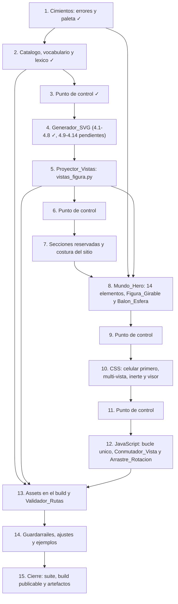

# Implementation Plan: imagenes-reales-hero-interactivo

## Overview

Implementación incremental en Python 3.11+ solo con librería estándar. El orden va por riesgo y dependencia: cimientos (`errores.py`, `paleta.py`) → catálogo de diagramas y Guardarrail_Lexico → Generador_SVG (la pieza de mayor riesgo, partida en subtareas verificables) → **Proyector_Vistas del multi-vista** → secciones reservadas y costura del Target_Web → Mundo_Hero con sus Figura_Girable y Balon_Esfera → CSS celular primero, multi-vista, Modo_Inerte y Visor_Ampliado → JavaScript del hero con un solo bucle que también sirve al Conmutador_Vista y al Arrastre_Rotacion → assets en el Orquestador_Build con el Validador_Rutas → guardarraíles, ajustes de pruebas vigentes y cierre. Cada bloque deja la suite en verde antes del siguiente.

Cinco módulos nuevos (`diagramas_postura.py`, `svg_postura.py`, `vistas_figura.py`, `mundo_hero.py`, `secciones_guia.py`) y cinco costuras (`errores.py`, `paleta.py`, `build_html.py`, `build_site.py`, `build.py`). Python es la única fuente de verdad de los números y del dibujo: el JavaScript recibe las constantes como literal JSON y no repite ninguna a mano. La vuelta de 360 grados se resuelve en el espacio 3D de Python: el Proyector_Vistas emite diez Vista_Figura por Figura_Girable y el JavaScript solo enciende una y apaga otra.

Estado real al abrir la ampliación: la suite está en **504 pruebas en verde** con `python _run_tests.py` desde `guia-sub17/`. Bloques 1, 2 y 3 cerrados; bloque 4 cerrado hasta 4.8 (esqueleto, grosores, tipografía y las dos modalidades de colocación de etiquetas, con las Propiedades 5, 6 y 9 escritas). Pendientes: 4.9 a 4.14 y los bloques 5 a 15.

Reglas de ejecución vigentes: una tarea a la vez; nunca `assert` en producción (invariantes con `raise ErrorBuild` o `ErrorAsset`); tests con `python _run_tests.py` desde `guia-sub17/`; en PowerShell el separador es `;`; prohibido crear archivos scratch en `guia-sub17/` (para verificar algo, script en `.kiro/tmp/` y `python .kiro/tmp/paso.py`, nunca `python -c`).

## Tasks

- [x] 1. Cimientos: códigos de error, Paleta_Guia y utilería de generadores
  - [x] 1.1 Añadir los códigos de asset y la excepción `ErrorAsset`
    - En `src/guia/errores.py`: `E_ASSET_FALTANTE` y `E_ASSET_INVALIDO`, ambos dentro de `CODIGOS`, y la subclase `ErrorAsset(ErrorBuild)` con `CODIGO_POR_DEFECTO = E_ASSET_INVALIDO` y `CODIGOS_PERMITIDOS = frozenset({E_ASSET_FALTANTE, E_ASSET_INVALIDO})`
    - No renombrar ni quitar ningún código existente; ningún `assert`
    - _Requirements: 5.8, 5.13, 13.4, 20.5_

  - [x] 1.2 Declarar los siete tokens de la Paleta_Guia con una sola constante por color
    - En `src/guia/paleta.py`: `WEB_HERO_CIELO="#DCEEFF"`, `WEB_HERO_MEDIO="#B8DCFA"`, `WEB_HERO_TINTA="#0B2C4D"`, `WEB_HERO_LINEA="#1E6FA8"`, `WEB_HERO_ROSA="#E85D9B"`, `WEB_HERO_CORAL="#D92D20"`, `WEB_HERO_BLANCO="#F7FBFF"`
    - `PALETA_GUIA` como mapa token CSS → color con los siete; `SOMBRA_GUIA="rgba(11,44,77,0.12)"`; `OSCURO_FONDO="#0B1F33"` y `OSCURO_TEXTO = WEB_HERO_CIELO` declarado como **alias explícito** de la constante, nunca como segundo literal
    - Conservar exactos `WEB_FONDO`, `WEB_FONDO_PROFUNDO` y `WEB_AZUL_CLARO`
    - _Requirements: 6.6, 16.1, 16.2, 16.14, 16.15, 16.17_

  - [x] 1.3 Implementar `luminancia_relativa`, `contraste` y `pares_declarados`
    - `luminancia_relativa(color)` y `contraste(a, b)` según WCAG 2.x, con el resultado ordenado para que sea simétrico y quede en [1, 21]
    - `pares_declarados()` devuelve la tupla explícita `(texto, fondo, clase)` con `clase` en `{"cuerpo", "grande"}`, incluidos los pares del Modo_Oscuro
    - _Requirements: 6.4, 16.7, 16.8, 16.13, 16.16_

  - [x]* 1.4 Escribir la prueba de propiedad de los tokens de la paleta
    - **Property 35: Tokens de la Paleta_Guia y unicidad de las constantes**
    - **Validates: Requirements 6.6, 16.1, 16.2, 16.17**

  - [x]* 1.5 Escribir la prueba de propiedad del contraste
    - **Property 34: Contraste de todos los pares declarados**
    - **Validates: Requirements 6.4, 16.7, 16.8, 16.10, 16.13, 16.16**

  - [x]* 1.6 Añadir los generadores nuevos a `test/gen.py`
    - Subconjuntos de Archivo_Diagrama presentes (incluidos el vacío y el total), bytes con y sin firma para `.webp`, `.png`, `.avif` y `.svg`, progresos de scroll dentro y fuera de rango, secuencias de progresos crecientes y decrecientes, posiciones relativas de cursor, puntos de toque dentro y fuera del hero, dimensiones de `viewBox`, subconjuntos de conceptos eliminados de la Advertencia_Cabeceo, textos con expresiones léxicas prohibidas insertadas en posición arbitraria, subconjuntos de campos de crédito ausentes, subconjuntos de cuerpos de Seccion_Reservada registrados y catálogos mutados con un Fundamento ajeno
    - _Requirements: 13.5_

- [x] 2. Catálogo de los ocho diagramas, vocabulario anatómico y Guardarrail_Lexico
  - [x] 2.1 Crear `src/guia/diagramas_postura.py` con las estructuras y las ocho entradas
    - `FUNDAMENTOS`, `DIR_ASSETS="assets/img/tecnica"`, `EXTENSIONES`, `ANCLA_TECNICA`, `ANCLA_ANATOMIA`, `ANCLA_CREDITOS`
    - Dataclases `frozen=True, slots=True`: `Credito` (autor, fuente, licencia, enlace), `Fase` (numero, texto) y `DiagramaPostura` con todos los campos del diseño
    - `CATALOGO` con las ocho entradas en el orden `anatomia-base`, `tiro-empeine`, `pase-interior`, `control-balon`, `conduccion`, `potencia-carrera`, `cabeceo-frente`, `pase-largo-empeine`, con sus dimensiones por modo, sus cinco pasos en el orden fijo, su Fundamento, su `postura_id` real de `figuras.FIGURAS`, `requiere_archivo=False`, su error frecuente y su crédito; `potencia-carrera` con sus tres Fase_Numerada y `pase-largo-empeine` declarado como pase elevado a distancia
    - Sin nombres propios de personas ni de clubes en ningún texto
    - _Requirements: 2.1, 2.2, 2.3, 2.4, 2.5, 2.6, 2.7, 2.8, 2.9, 2.10, 2.11, 2.12, 5.1, 5.2, 14.12_

  - [x] 2.2 Declarar el vocabulario anatómico cerrado y su mapa a articulaciones
    - `ETIQUETAS_ANATOMIA` con los dieciséis términos de `anatomia-base` y el mapa declarativo etiqueta → articulación (incluidos los puntos derivados `espinilla`, `empeine`, `planta`, `parte interna`, `parte externa`, `línea media` y `centro de gravedad`)
    - Comprobación de que toda etiqueta de cualquier diagrama pertenece a ese conjunto
    - _Requirements: 14.13, 14.16_

  - [x] 2.3 Declarar las cuatro listas del Guardarrail_Lexico y `violaciones_lexicas`
    - `VERBOS_PERMITIDOS`, `MASCULINO_GENERICO`, `FORMAS_MASCULINAS` y `CONDESCENDIENTES` con el contenido de la tabla del diseño
    - `violaciones_lexicas(id_, texto)` normaliza (minúsculas, acentos plegados, límites de palabra en las formas masculinas para no atrapar "listones" ni "cansancio") y devuelve la tupla de expresiones halladas; el mensaje de fallo nombra el identificador y la expresión
    - Reutilizar las listas de clubes del guardarraíl vigente `test_guardarrail_clubes.py`
    - _Requirements: 2.11, 17.1, 17.2, 17.3, 17.4, 17.5, 17.6, 17.7_

  - [x] 2.4 Declarar la Advertencia_Cabeceo, sus conceptos y su validador
    - `CONCEPTOS_CABECEO` como tupla `(concepto, sinónimos)` con los siete conceptos de la tabla del diseño
    - Texto de `cabeceo-frente` con 120 caracteres o más que nombra la frente como única superficie, la coronilla y la cara a evitar, el cuello contraído y firme, los ojos abiertos, el balón blando y la progresión sin salto
    - `validar_advertencia(d)` lanza `ErrorAsset(E_ASSET_INVALIDO)` nombrando el concepto ausente
    - _Requirements: 14.14, 20.1, 20.2, 20.3, 20.5_

  - [x] 2.5 Implementar el Validador_Catalogo y las consultas del catálogo
    - `ruta_relativa`, `ruta_fuente`, `presentes()`, `modo_render(d, presentes)`, `dimensiones(d, modo)` y `por_fundamento(f)`
    - `validar_catalogo()` comprueba orden e identificadores, extensión y ubicación del Archivo_Diagrama, ancho en (0, 1200] y alto positivo en los dos modos, `alt` de 60 caracteres o más, cinco pasos de 20 caracteres o más que empiezan por verbo permitido, Fundamento del conjunto cerrado o nulo solo en `anatomia-base`, `postura_id` existente en `figuras.FIGURAS`, etiquetas del vocabulario y fases sin huecos; todo con `raise ErrorAsset`, nunca `assert`
    - _Requirements: 2.3, 2.4, 2.5, 2.6, 2.7, 2.8, 2.9, 2.10, 3.3, 4.8, 5.3, 5.4, 13.4_

  - [x]* 2.6 Escribir la prueba de propiedad de la forma del catálogo
    - **Property 1: Forma del Catalogo_Diagramas**
    - **Validates: Requirements 2.1, 2.2, 2.3, 2.4, 2.5, 2.6, 2.7, 2.8, 2.9, 2.10, 2.12, 5.1, 5.2, 14.12, 17.2**

  - [x]* 2.7 Escribir la prueba de propiedad del vocabulario anatómico
    - **Property 2: Vocabulario anatómico cerrado**
    - **Validates: Requirements 14.13, 14.16**

  - [x]* 2.8 Escribir la prueba de propiedad del Guardarrail_Lexico
    - **Property 3: Guardarrail_Lexico**
    - **Validates: Requirements 2.11, 17.1, 17.3, 17.4, 17.5, 17.6, 17.7**

  - [x]* 2.9 Escribir la prueba de propiedad de la Advertencia_Cabeceo
    - **Property 4: Advertencia_Cabeceo obligatoria y completa**
    - **Validates: Requirements 14.14, 20.1, 20.2, 20.3, 20.5**

- [x] 3. Punto de control
  - Ensure all tests pass, ask the user if questions arise.

- [x] 4. Generador_SVG: `svg_postura.py` paso a paso (esqueleto, grosores, tipografía, etiquetas, adornos, fases, ensamblado)
  - [x] 4.1 Crear el esqueleto paramétrico y las ocho poses
    - `FACTOR_VIEWBOX=2.0`, `ANCHO_REFERENCIA_PX=360.0`, el tipo `Articulacion` con sus diecisiete valores y `HUESOS` con los dieciséis huesos de longitud fija
    - `Pose` (frozen, slots) con inclinación de tronco, rotación de hombros, ángulos por hueso, apoyo, centro de gravedad, balón y flechas; `POSES` con las ocho poses, una por entrada del catálogo
    - `esqueleto(pose, ancho_vb, alto_vb)` por cinemática directa desde la cadera media, con todos los puntos dentro del `viewBox`
    - _Requirements: 14.1, 14.4_

  - [x]* 4.2 Escribir la prueba de propiedad de la geometría del esqueleto
    - **Property 5: Geometría del esqueleto paramétrico**
    - **Validates: Requirements 14.1, 14.4**

  - [x] 4.3 Implementar los grosores de trazo
    - `grosor_contorno(ancho_vb, ancho_declarado) = 2.0 * ancho_vb / ancho_declarado` y `grosor_guia(...)` con el factor 1.0, ambos como funciones puras
    - Un único valor de `stroke-width` compartido por todos los trazos de contorno de un mismo diagrama
    - _Requirements: 14.2, 14.3_

  - [x]* 4.4 Escribir la prueba de propiedad del grosor único
    - **Property 6: Grosor de trazo único y escalado**
    - **Validates: Requirements 14.2, 14.3**

  - [x] 4.5 Implementar la tipografía de las etiquetas
    - `tamano_efectivo_px(f, ancho_vb) = f * 360.0 / ancho_vb` y `tamano_fuente_etiqueta(ancho_vb) = ceil(12.0 * ancho_vb / 360.0) + 2`
    - Todo `<text>` emitido usa ese tamaño, de modo que a 360 px de ancho rinde 12 px o más
    - _Requirements: 15.17_

  - [x]* 4.6 Escribir la prueba de propiedad del tamaño de fuente efectivo
    - **Property 9: Tamaño de fuente efectivo a 360 píxeles**
    - **Validates: Requirements 15.17**

  - [x] 4.7 Implementar `colocar_etiquetas` en modo DENTRO
    - Ancla por el mapa etiqueta → articulación; texto a 34 unidades del punto, en el lado contrario al eje vertical y sin sobrepasar los márgenes; línea guía en `--azul-linea` desde el borde del texto hasta el punto, terminada en círculo relleno de radio 5; reparto vertical mínimo de una línea para que ningún par de rectángulos se solape; ocho etiquetas como máximo dentro del contorno
    - Emisión determinista: sin aleatoriedad, sin `set` y sin diccionarios sin ordenar en el camino de emisión
    - _Requirements: 14.6, 14.7, 15.18_

  - [x] 4.8 Implementar `colocar_etiquetas` en modo FUERA y la Zona_Tactil de ampliación
    - Dos columnas fijas en los márgenes, ordenadas por la Y de su articulación, ninguna dentro del rectángulo que envuelve la figura; línea guía como polilínea de dos tramos terminada en el círculo relleno
    - `anatomia-base` es la única entrada en este modo (dieciséis etiquetas) y emite además el enlace de ancla a `#anatomia-base-ampliada` como Zona_Tactil, sin JavaScript y sin `position:fixed`
    - _Requirements: 15.19_

  - [x]* 4.9 Escribir la prueba de propiedad de la colocación de etiquetas
    - **Property 8: Colocación determinista de Etiqueta_Anatomica**
    - **Validates: Requirements 14.6, 14.7, 15.18, 15.19**

  - [x] 4.10 Dibujar silueta, cabeza, línea media, centro de gravedad y flechas
    - Contorno en `--azul-profundo` con el grosor único; relleno de silueta en `--azul-cielo` con `fill-opacity:0.12`; círculo de cabeza sin ningún rasgo facial dentro y grupo `cabello-recogido`
    - Línea media vertical con `x1 == x2` y `stroke-dasharray`, más un único punto relleno de centro de gravedad situado sobre ella
    - Una flecha por par declarado en `Pose.flechas`, en `--coral-alerta`, con `stroke-dasharray` y punta como polilínea (sin `marker`, sin `url(`)
    - Verificado hoy: `svg_figura` **no** emite `stroke-dasharray` ni el coral, así que esta tarea añade las tres piezas
    - _Requirements: 14.5, 14.8, 14.9_

  - [x]* 4.11 Escribir la prueba de propiedad de colores y elementos obligatorios
    - **Property 7: Colores y elementos obligatorios del SVG**
    - **Validates: Requirements 14.5, 14.8, 14.9**

  - [x] 4.12 Emitir las Fase_Numerada con degradación registrada
    - Un `<text>` con el número de cada fase junto a su punto de anclaje; `fases_emitidas(d)` devuelve los números realmente emitidos y `omisiones_de_fase(d)` los pares `(id_diagrama, numero)` de las que no se pudieron emitir
    - Una fase no emitible **no aborta**: se emiten las demás y la omisión queda para el reporte
    - _Requirements: 14.10, 14.17_

  - [x]* 4.13 Escribir la prueba de propiedad de las fases numeradas
    - **Property 10: Coherencia y degradación de las Fase_Numerada**
    - **Validates: Requirements 14.10, 14.11, 14.17**

  - [x] 4.14 Ensamblar `svg_diagrama(d)`
    - `<svg>` con `viewBox="0 0 (2·ancho_svg) (2·alto_svg)"`, `width` y `height` del modo SVG, `role="img"` y `aria-label` con el `alt` del catálogo
    - Orden de emisión estable y formateo numérico con recorte de ceros para bytes reproducibles
    - Cero `<image>`, cero ``, cero atributos `on*`, cero `url(`, cero `http`, cero `tabindex`
    - _Requirements: 4.3, 14.1, 14.15_

- [x] 5. Proyector_Vistas: `vistas_figura.py`, Esqueleto_3D y las diez Vista_Figura
  - [x] 5.1 Dejar `test/gen.py` importable por sí solo
    - Arrastre pendiente que **bloquea todas las propiedades nuevas**: `test_vistas_figura.py` importa generadores de ahí y no arranca si el módulo falla al importarse
    - Condición de cierre: un script de verificación en `.kiro/tmp/` que hace `sys.path.insert(0, 'test'); import gen` termina en verde (`python .kiro/tmp/paso.py` desde `guia-sub17/`), y `python _run_tests.py` sigue en 504 en verde
    - Sin `*`: sin esta tarea ninguna de las Propiedades 40 a 53 puede escribirse
    - _Requirements: 13.5_

  - [x]* 5.2 Añadir los generadores de la ampliación a `test/gen.py`
    - `gen_azimut_declarado` y `gen_elevacion_declarada` (dentro de las tuplas declaradas), `gen_angulo_fuera_de_rango`, `gen_angulo_giro` (ángulos continuos en `[0, 360)` con los ocho azimuts exactos y los ocho puntos medios de 22.5 grados forzados como casos límite del desempate), `gen_pose_clave` (pares de pose y Clave_Vista, las diez), `gen_desplazamiento_dedo` (con el cero y con valores que saturan la elevación en ±60), `gen_secuencia_angulos` (crecientes y decrecientes) y `gen_bytes_vista` (cargas alrededor del techo de 6144 bytes: por debajo, en el límite exacto y por encima)
    - _Requirements: 13.5_

  - [x] 5.3 Añadir `FACTOR_VISTA` a `svg_postura.py` y exponer `num` público
    - `FACTOR_VISTA = 0.86` como constante nueva y `num` como el mismo `_num` de siempre expuesto en público: un solo formateo en todo el proyecto
    - **Solo añadir**: no cambia la firma de `esqueleto(pose, ancho_vb, alto_vb, *, factor=1.0)`, ni `HUESOS`, ni `ANGULOS_BASE`, ni `POSES`, ni `escala_figura`, ni ninguna función de etiquetas. Las 504 pruebas vigentes siguen leyendo exactamente lo mismo
    - _Requirements: 21.8, 21.11, 21.12_

  - [x] 5.4 Añadir el campo `girable`, `EXTENSIONES_PERMITIDAS` y el Validador_Rutas a `diagramas_postura.py`
    - `DiagramaPostura` gana `girable: bool`, verdadero solo en `anatomia-base` y falso en las otras siete, y `validar_catalogo()` lo comprueba
    - `EXTENSIONES_PERMITIDAS = (".webp", ".svg", ".png", ".avif")` en ese orden exacto
    - `ruta_aceptable(ruta)` como **única** función que decide qué ruta de Asset_Local es aceptable: acepta si empieza por `assets/`, no contiene el segmento `..` y su extensión en minúsculas pertenece a `EXTENSIONES_PERMITIDAS`; rechaza `http://`, `https://`, `//` y `/` nombrando la ruta, rechaza el segmento `..` nombrando la ruta y rechaza la extensión ajena nombrando la extensión
    - Las ocho rutas relativas del catálogo son aceptadas
    - _Requirements: 22.5, 30.1, 30.2, 30.3, 30.4, 30.5, 30.6, 30.7_

  - [x] 5.5 Crear `src/guia/vistas_figura.py` con sus constantes, `PROFUNDIDAD_CANONICA` y `MIEMBROS`
    - `AZIMUTS_DECLARADOS=(0,45,90,135,180,225,270,315)`, `ELEVACIONES_DECLARADAS=(60,-60)`, `AZIMUTS_MOVIL=(0,45,90,180,270,315)`, `CLAVES_VISTA` con las diez claves en el orden exacto del criterio 22.1
    - `ROTACION_RESIDUAL_MAX=22.5`, `OPACIDAD_TRASERO=0.55`, `BYTES_MAX_VISTA=6144`, `VISTAS_MAX=40`, `UMBRAL_ELEVACION=30.0`, `GRADOS_POR_PIXEL=0.6`, `GIRO_IMPULSO_MS=1200`
    - `PROFUNDIDAD_CANONICA` derivada de **las diecisiete articulaciones reales** de `diagramas_postura.ARTICULACIONES`, sin inventar ninguna: positivo en las siete del lado derecho, el mismo valor negado en sus siete espejos y exactamente 0 en `cabeza`, `cuello` y `torso`
    - `MIEMBROS` con los cuatro miembros y las articulaciones de cada uno, en orden declarado para que la clasificación sea estable; `Punto3D` como alias de tupla de tres flotantes
    - **Solo lee** de `svg_postura`: no cambia ninguna de sus firmas
    - _Requirements: 21.1, 21.2, 22.1, 22.2, 22.3, 24.2, 12.7, 22.13, 25.10, 28.2, 28.9, 28.11_

  - [x] 5.6 Implementar `esqueleto_3d` por cinemática directa en tres dimensiones
    - **Esto es lo crítico del bloque:** `esqueleto_3d` **no** concatena `PROFUNDIDAD_CANONICA` al resultado de `esqueleto_canonico`. Hace cinemática directa en 3D reusando los mismos dieciséis huesos, las mismas longitudes y los mismos ángulos en el plano
    - Por cada hueso de longitud `L` con salto de profundidad `dz`: `beta = asin(dz / L)` y `vector_3d = (L*cos(beta)*cos(theta), -L*cos(beta)*sin(theta), L*sin(beta))`, sumado al origen. La norma es `L` **exacta** con todo `beta`; la componente en el plano se acorta por `cos(beta)`, que es Escorzo legítimo
    - Arranque en la cadera media (`RAIZ_CANONICA`) con profundidad 0, de modo que la profundidad acumulada reproduce articulación por articulación la tabla declarada
    - Validación `|dz| <= L` con `raise ErrorAsset(..., codigo=E_ASSET_INVALIDO)` nombrando el hueso, el salto y la longitud; nunca `assert`
    - _Requirements: 14.18, 21.1, 21.2, 21.5, 21.13_

  - [x]* 5.7 Escribir la prueba de propiedad de la invariancia de hueso en 3D
    - **Property 40: Invariancia de hueso en el Esqueleto_3D**
    - **Validates: Requirements 14.18, 21.1, 21.2, 21.3, 21.4, 21.5**

  - [x] 5.8 Implementar las rotaciones, la proyección y las dos medidas de longitud
    - `rotar_azimut` alrededor del eje vertical que pasa por la cadera media y `rotar_elevacion` alrededor del eje horizontal transversal, las dos como giros de cuerpo rígido; el azimut se aplica **antes** que la elevación; `+60` es la picada
    - `proyectar((x,y,z)) = (x, y)`: descarta la profundidad y nada más
    - `esqueleto_vista` compone la tubería completa (`esqueleto_3d` → azimut → elevación → proyectar → `escala_figura(ancho_vb, alto_vb, factor)`), con `factor = svg_postura.FACTOR_VISTA` por defecto, y es el único camino de emisión
    - `largo_hueso_3d` mide sobre las tres coordenadas y es **invariante** (1e-6); `largo_hueso_proyectado` mide sobre las dos del dibujo y **no** es constante: solo se garantiza `[0, L]`
    - Todo número por `svg_postura.num`: dos emisiones de la misma pose y clave dan bytes idénticos
    - _Requirements: 14.19, 21.3, 21.4, 21.6, 21.7, 21.8, 21.11, 21.12_

  - [x]* 5.9 Escribir la prueba de propiedad del Escorzo
    - **Property 41: Escorzo por coseno en la proyección**
    - **Validates: Requirements 14.19, 21.6, 21.7**

  - [x]* 5.10 Escribir la prueba de propiedad de los puntos dentro del `viewBox`
    - **Property 42: Puntos dentro del viewBox en las diez vistas**
    - **Validates: Requirements 21.8**

  - [x] 5.11 Implementar `clasificar_miembros`
    - Recorre `MIEMBROS` en su orden declarado, calcula el punto medio de las articulaciones de cada miembro en el Esqueleto_3D **ya rotado** y mira el signo de su profundidad: negativo a `traseros`, positivo a `delanteros` y **exactamente 0 a `delanteros`**
    - Devuelve `(traseros, delanteros)` como dos `frozenset` cuya unión son siempre los cuatro miembros y cuya intersección es siempre vacía; en `az-000` los cuatro quedan delante
    - _Requirements: 21.9, 21.10, 24.6, 24.7, 24.8, 24.9_

  - [x]* 5.12 Escribir la prueba de propiedad de la clasificación y del determinismo
    - **Property 43: Clasificación de miembros y determinismo de la emisión**
    - **Validates: Requirements 21.9, 21.10, 21.11, 21.12, 24.6, 24.7, 24.8, 24.9**

  - [x] 5.13 Implementar la conmutación: `vista_mas_cercana`, `rotacion_residual`, `escala_sombra` y la tabla por clave
    - `vista_mas_cercana(angulo, *, movil=False)` normaliza a `[0, 360)`, mide la distancia **circular** y devuelve el mínimo; empate al **azimut declarado menor** (a 22.5 grados exactos gana `az-000`); con `movil=True` los candidatos son `AZIMUTS_MOVIL`
    - `rotacion_residual(angulo, clave)` normaliza a `(-180, 180]` y **acota** a `[-22.5, +22.5]`, valiendo exactamente 0 cuando el ángulo coincide con el azimut declarado
    - `escala_sombra(azimut) = 0.40 + 0.60 * |cos(azimut)|`, siempre en `[0.40, 1.00]`, con escala vertical fija en 1
    - `azimut_de`, `elevacion_de` y `grupos_extra(clave)` como **tabla declarativa**, no como cadena de condicionales dispersa por el emisor
    - _Requirements: 12.7, 25.6, 25.7, 25.10, 25.11, 25.14, 29.5, 29.6_

  - [x]* 5.14 Escribir la prueba de propiedad de la conmutación y de la escalera de degradación
    - **Property 47: Conmutación de vista y escalera de degradación**
    - **Validates: Requirements 12.7, 25.6, 25.7, 25.10, 25.11, 29.5, 29.6**

  - [x] 5.15 Implementar `svg_vista` con los cuatro grupos en orden fijo
    - Orden del documento exacto y único: `miembros-traseros` (con `stroke-opacity="0.55"`), `tapa-torso`, `torso`, `miembros-delanteros` (con `stroke-opacity="1"`)
    - Tapa_Torso como elemento **distinto** del relleno de la silueta, con `fill-opacity="1"`, `--blanco-suave` en los Diagrama_Postura y `--azul-cielo` en los Elemento_Fondo; `torso` conserva relleno `--azul-cielo` a 0.12 y contorno `--azul-profundo`
    - Un solo valor de `stroke-width` en los tres grupos de trazo, el de `grosor_contorno`: `stroke-opacity` cambia la opacidad, nunca el grosor
    - Grupos extra por clave desde `grupos_extra`, y Sombra_Contacto como `<ellipse>` dentro del SVG; en `el-p60` el grupo del balón se emite **después** del de la figura, con su centro por debajo del centro de la cadera proyectada; el número de camiseta como `<text>` en `--azul-profundo` con tamaño efectivo de 12 px o más a 360 px
    - Ninguna de las diez emite el grupo `cara` ni ningún elemento con la clase `rasgo-facial`; cero `<image>`, cero `url(`, cero `http`, cero `tabindex`, cero atributos `on*`
    - _Requirements: 14.20, 22.11, 23.1, 23.2, 23.3, 23.4, 23.5, 23.6, 23.11, 24.1, 24.2, 24.3, 24.4, 24.5, 24.10, 25.15_

  - [x]* 5.16 Escribir la prueba de propiedad del orden de grupos y de la opacidad de profundidad
    - **Property 45: Orden de los cuatro grupos y opacidad de profundidad**
    - **Validates: Requirements 14.20, 24.1, 24.2, 24.3, 24.4, 24.5, 24.10**

  - [x]* 5.17 Escribir la prueba de propiedad del contenido propio de cada vista especial
    - **Property 46: Contenido propio de cada vista especial**
    - **Validates: Requirements 23.1, 23.2, 23.3, 23.4, 23.5, 23.6, 23.7, 23.8, 23.9, 23.10, 23.11**

  - [x] 5.18 Implementar `svg_figura_girable` con las diez vistas
    - `<div class="figura-girable" data-figura=... data-girable="1">` que envuelve las diez `svg_vista`, cada una con `data-vista` (su Clave_Vista), `data-figura`, `viewBox`, `width`, `height`, `role="img"`, `aria-label` y `focusable="false"`
    - `az-000` marcada como Vista_Activa en el marcado inicial; las diez viven en el DOM desde el primer fotograma, así que retirar el `<script>` las conserva todas
    - El JavaScript no crea ni destruye nada: solo enciende y apaga
    - _Requirements: 22.6, 22.7, 22.8, 22.9, 22.12, 22.13_

  - [x]* 5.19 Escribir la prueba de propiedad de la tabla de las diez vistas
    - **Property 44: Tabla de las diez vistas de cada Figura_Girable**
    - **Validates: Requirements 22.1, 22.2, 22.3, 22.6, 22.7, 22.8, 22.9, 22.10, 22.11, 22.12, 22.13**

  - [x] 5.20 Implementar `validar_vistas` con todas las filas de Error Handling de la ampliación
    - Cada invariante con `raise ErrorAsset(..., codigo=E_ASSET_INVALIDO)` y mensaje en español que nombra la figura, la Clave_Vista o el hueso infractor; ningún `assert` en ninguna rama
    - Filas cubiertas: azimut o elevación fuera de las tuplas declaradas; longitud 3D desviada más de 1e-6 (nombrando hueso, pose, azimut, elevación, longitud declarada y medida); `|dz| > L`; articulación proyectada fuera del `viewBox` (se resuelve bajando `FACTOR_VISTA`, nunca recortando el punto); Clave_Vista desconocida; número de Vista_Figura distinto de diez; `BYTES_MAX_VISTA` por vista; `VISTAS_MAX` en total; grupo prohibido o exigido por clave; miembro sin grupo o en los dos
    - _Requirements: 21.13, 22.12, 22.13, 23.3, 24.6, 24.7_

- [x] 6. Punto de control
  - Ensure all tests pass, ask the user if questions arise.

- [x] 7. Secciones reservadas, bloques de diagrama, créditos y costura del Target_Web
  - [x] 7.1 Crear `src/guia/secciones_guia.py` con el plan y el registro de secciones reservadas
    - `Reservada` (frozen, slots) con ancla, título y nivel; `RESERVADAS` congelado con `leyenda-simbolos`, `rutina-semanal` y `ejercicios-<fundamento>`; `PLAN` con el orden exacto del criterio 19.1
    - `registrar(ancla, render)` acepta solo anclas de `RESERVADAS` y rechaza el registro repetido con `ErrorAsset`; `render_reservada(ancla, partes)` emite la `<section>` con su ancla y su encabezado **exista o no** el cuerpo; `anclas_esperadas()` alimenta el índice y la navegación
    - _Requirements: 19.1, 19.6, 19.7_

  - [x] 7.2 Implementar `render_bloque` con el render híbrido
    - `<article class="diagrama-postura" data-diagrama=... style="--relacion:...">`, `<h3>` con el título, `<figure class="diagrama-marco">` con `` (ruta relativa, `alt`, `width`, `height`, `decoding="async"`) cuando el archivo está presente y con el `<svg>` en línea cuando falta
    - `loading="eager"` solo en el primer `` del documento y `loading="lazy"` en los demás; `width` y `height` siempre del modo de render efectivo
    - Advertencia_Cabeceo después del `<figure>` y antes de los pasos; `<ol class="diagrama-pasos">` con un `<li>` por paso; `<ol class="diagrama-fases">` con `value="<numero>"` cuando hay fases; `<p class="diagrama-error">` al final; todo texto por `build_html._esc`
    - Toda ruta de `` pasa por `diagramas_postura.ruta_aceptable` antes de emitirse
    - _Requirements: 3.4, 3.5, 3.6, 4.1, 4.2, 4.3, 4.4, 4.8, 5.3, 5.4, 5.5, 14.11, 19.4, 20.4, 30.2_

  - [x] 7.3 Implementar `render_creditos` y `campos_pendientes`
    - Una entrada por Diagrama_Postura con autor, fuente, licencia y enlace; enlace como **texto visible**, sin `<a href>` y sin atributo que provoque petición de red
    - Autoría y licencia propias del proyecto en los diagramas rendidos por el Generador_SVG; marca `dato pendiente` en cada campo ausente
    - `campos_pendientes()` devuelve `(id, campos_ausentes)` para el reporte; el Bloque_Creditos existe aunque las ocho entradas se rindan por SVG
    - _Requirements: 18.1, 18.2, 18.3, 18.4, 18.5, 18.6, 18.8, 18.9_

  - [x] 7.4 Implementar `bloque_css()` de los diagramas
    - `.diagrama-marco` con `aspect-ratio:var(--relacion,3/4)` y `overflow:hidden`; `.diagrama-marco img,.diagrama-marco svg` con `width:100%`, `height:auto`, `max-width:100%` y `object-fit:cover`; `min-height:320px` bajo 47.9375rem; `#anatomia-base-ampliada:target` con `min-height:100dvh`
    - Sin `url(`, sin `http` y sin ningún `width` ni `min-width` en píxeles mayor que 360
    - _Requirements: 4.5, 4.6, 4.7, 15.3_

  - [x] 7.5 Coser las secciones en `build_site.py`
    - `_hero(...)` inserta `mundo_hero.render_mundo(partes)` como primer hijo de `.hero` y añade en `.hero-ui` las Zona_Tactil "Empezar" y "Activar movimiento", conservando las siete capas y los elementos congelados del arte actual
    - Emitir las secciones de `secciones_guia.PLAN` con las reservadas intercaladas: `#anatomia-base`, `#leyenda-simbolos`, los cuatro bloques de Fundamento en orden con su `#ejercicios-<fundamento>`, `#rutina-semanal` y el Bloque_Creditos; los Fundamento ajenos al conjunto cerrado se omiten y se devuelven para el reporte
    - Una Zona_Tactil de ampliación por Diagrama_Postura y por Figura_Girable ampliable, con destino `#<id>-ampliada` y su Visor_Ampliado con Zona_Tactil de cierre; `anatomia-base` (Girable verdadero) lleva su `svg_figura_girable`, y las siete entradas con Girable falso muestran su vista frontal sin Arrastre_Rotacion
    - `_nav(...)` añade `#anatomia-base`, `#tecnica-en-imagenes` y `#creditos`, y pasa a emitirse como **último** hijo de `<main>`; `_indice(...)` añade una Zona_Tactil por sección del plan
    - `html_sitio(..., presentes=None)` con `diagramas_postura.presentes()` por defecto
    - _Requirements: 3.1, 3.2, 3.7, 3.9, 6.7, 6.9, 9.10, 18.7, 19.1, 19.2, 19.3, 19.5, 19.6, 28.4, 28.6, 28.16, 28.17_

  - [x]* 7.6 Escribir la prueba de propiedad del render híbrido
    - **Property 12: Render híbrido y dimensiones efectivas**
    - **Validates: Requirements 3.4, 4.3, 4.4, 4.8, 5.3, 5.4, 5.5**

  - [x]* 7.7 Escribir la prueba de propiedad de la carga diferida
    - **Property 13: Carga diferida de las imágenes**
    - **Validates: Requirements 4.1, 4.2**

  - [x]* 7.8 Escribir la prueba de propiedad de la estructura y el orden de las secciones
    - **Property 17: Estructura, orden, anclas reservadas y navegación**
    - **Validates: Requirements 3.1, 3.2, 3.7, 18.1, 18.7, 19.1, 19.3, 19.5, 19.6, 19.7**

  - [x]* 7.9 Escribir la prueba de propiedad de la composición del bloque de Fundamento
    - **Property 18: Composición del bloque de Fundamento**
    - **Validates: Requirements 3.3, 3.5, 3.6, 19.4, 20.4**

  - [x]* 7.10 Escribir la prueba de propiedad del Fundamento fuera del conjunto cerrado
    - **Property 19: Fundamento fuera del conjunto cerrado**
    - **Validates: Requirements 3.9**

  - [x]* 7.11 Escribir la prueba de propiedad del Bloque_Creditos
    - **Property 20: Bloque_Creditos completo y sin peticiones de red**
    - **Validates: Requirements 18.2, 18.3, 18.4, 18.5, 18.6, 18.8, 18.9**

  - [x]* 7.12 Escribir la prueba de propiedad de la degradación sin JavaScript
    - **Property 21: Degradación sin JavaScript**
    - **Validates: Requirements 3.8, 13.7, 13.8, 20.6**

- [x] 8. Mundo_Hero: catálogo de 14 elementos, Figura_Girable, Balon_Esfera, matemática, toque y emisión
  - [x] 8.1 Crear `src/guia/mundo_hero.py` con constantes, los 14 Elemento_Fondo y su validador
    - `FACTOR_PARALLAX`, `ESCALA_FINAL`, `TRASLADO_Z_PX`, `TOPE_CURSOR_PX`, `SUAVIZADO_CURSOR`, `CORTE_ANGOSTO_PX`, `ELEMENTOS_ANGOSTO`, `RADIO_TOQUE_PCT`, `REBOTE_MS`, `PERSPECTIVA_PX`
    - `ElementoFondo` (frozen, slots) y `ELEMENTOS` con los 13 elementos de la tabla congelada **más `silueta-3`** (Capa_Cercana, x 62 %, y 52 %, ancho 19 %, opacidad 0.31, vaivén 17 px / 6.6 s / retraso 1.8 s, `angosto=True`): total **14 elementos y 3 siluetas**, ambos dentro de los rangos que la Propiedad 25 verifica. Ninguna fila de las trece cambia
    - `validar_elementos()` lanza `ErrorAsset(E_ASSET_INVALIDO)` cuando falla un conteo, un rango, la cobertura de tipos, la cobertura de cuadrantes, la unicidad de duraciones de giro, la presencia de los dos sentidos o la distinción de retrasos entre elementos consecutivos del mismo tipo
    - _Requirements: 7.1, 7.2, 7.3, 7.4, 7.5, 7.6, 7.7, 8.1, 8.8, 9.1, 9.2, 9.3, 12.4, 22.4_

  - [x]* 8.2 Escribir la prueba de propiedad del catálogo de Elemento_Fondo
    - **Property 25: Forma del catálogo de Elemento_Fondo**
    - **Validates: Requirements 7.1, 7.2, 7.3, 7.4, 7.5, 7.6, 7.7, 8.1, 9.1, 9.2, 9.3**

  - [x] 8.3 Implementar las curvas de movimiento
    - `progreso(scroll_y, alto)` acotado a [0, 1]; `desplazamiento(capa, scroll)`; `escala(capa, p) = 1 + (ESCALA_FINAL[capa] - 1) * p`; `opacidad(p) = 1 - p` acotado
    - Funciones puras y sin estado, para que la reversibilidad salga por construcción
    - _Requirements: 8.2, 8.3, 8.4, 8.5, 8.6, 8.7_

  - [x]* 8.4 Escribir la prueba de propiedad de las curvas
    - **Property 22: Curvas de parallax, escala y opacidad**
    - **Validates: Requirements 8.3, 8.4, 8.5**

  - [x]* 8.5 Escribir la prueba de propiedad de la reversibilidad
    - **Property 23: Reversibilidad del desvanecimiento y de la escala**
    - **Validates: Requirements 8.6**

  - [x]* 8.6 Escribir la prueba de propiedad del orden de velocidades y profundidad
    - **Property 24: Orden de las velocidades y de la profundidad**
    - **Validates: Requirements 8.2, 8.7, 8.8**

  - [x] 8.7 Implementar `cursor_objetivo` y `suavizar`
    - `cursor_objetivo(rx, ry) = (-rx * TOPE_CURSOR_PX, -ry * TOPE_CURSOR_PX)` con módulo acotado a 20 px por eje
    - `suavizar(actual, objetivo) = actual + (objetivo - actual) * SUAVIZADO_CURSOR`, válida también para el objetivo cero al salir del hero
    - _Requirements: 9.4, 9.5, 9.6, 28.19_

  - [x]* 8.8 Escribir la prueba de propiedad de la interpolación del cursor
    - **Property 26: Interpolación del desplazamiento por cursor**
    - **Validates: Requirements 9.4, 9.5, 9.6**

  - [x] 8.9 Implementar `balon_mas_cercano` y `activos_angostos`
    - `balon_mas_cercano(x_pct, y_pct)` sobre las coordenadas declaradas del catálogo: mínimo de distancia euclídea entre los balones dentro de `RADIO_TOQUE_PCT`, `None` si ninguno cae dentro, empates por orden del catálogo y ninguna lectura de geometría
    - `activos_angostos()` devuelve los identificadores marcados `angosto`, entre 5 y 7
    - _Requirements: 9.8, 12.1, 12.5_

  - [x]* 8.10 Escribir la prueba de propiedad del balón más cercano
    - **Property 27: Resolución del balón más cercano al toque**
    - **Validates: Requirements 9.8**

  - [x] 8.11 Declarar las Figura_Girable del hero y su Sombra_Contacto
    - `FIGURAS_GIRABLES` con las tres siluetas de la Capa_Cercana: `silueta-1` 19 s sentido +1 y `--z-figura:-18px`, `silueta-2` 24 s sentido −1 y `--z-figura:-42px`, `silueta-3` 28 s sentido +1 y `--z-figura:-6px`; más la entrada `anatomia-base` (22 s, sentido −1, `translateZ` propio 0) que gira dentro de su Visor_Ampliado
    - Cada figura emite su Sombra_Contacto como `<ellipse>` dentro de su SVG, con escala horizontal `vistas_figura.escala_sombra(azimut)` y escala vertical 1; ninguna regla de la sombra declara `box-shadow`
    - `validar_elementos()` gana las filas nuevas: duración de vuelta en [18, 30], duraciones distintas entre figuras, los dos sentidos presentes, animación infinita y `translateZ` propio y distinto entre figuras de la misma capa, todo con `ErrorAsset` nombrando las figuras y el valor repetido
    - _Requirements: 22.4, 25.1, 25.2, 25.3, 25.4, 25.5, 25.14, 25.15, 25.16_

  - [x]* 8.12 Escribir la prueba de propiedad del giro de la Figura_Girable y de la Sombra_Contacto
    - **Property 49: Giro de la Figura_Girable y Sombra_Contacto**
    - **Validates: Requirements 25.1, 25.2, 25.3, 25.4, 25.5, 25.14, 25.15, 25.16**

  - [x] 8.13 Declarar el Balon_Esfera con sus ocho Gajo_Balon y su Eje_Giro_Inclinado
    - Cada balón emite exactamente ocho Gajo_Balon con `rotate3d(0,1,0,·)` cada 22.5 grados (0, 22.5, 45, 67.5, 90, 112.5, 135, 157.5), todos distintos entre sí, más los grupos `polo-superior` y `polo-inferior`
    - Eje_Giro_Inclinado por balón de la tabla del diseño: `balon-1` `(0.26,0.93,0.26)` 21.5°, `balon-2` `(0.42,0.82,0.39)` 35.1°, `balon-3` `(0.18,0.96,0.21)` 16.3°, las tres componentes distintas de cero e inclinación `acos(|y|/|(x,y,z)|)` en [15, 45] grados
    - Duraciones 16 / 21 / 25 s (las mismas de la columna `giro s`), distintas entre balones, en [14, 26] y con los dos sentidos; un Gajo_Balon marcado como sombreado para la degradación 2D
    - `validar_elementos()` gana las filas de eje con componente nula o inclinación fuera de rango, duración repetida o fuera de [14, 26] y la regla fuerte "la duración de vuelta crece con la lejanía de la capa"
    - Marcado sin `<image>`, sin `url(`, sin `http` y sin atributos de evento
    - _Requirements: 7.6, 12.6, 26.1, 26.2, 26.3, 26.4, 26.5, 26.6, 26.7, 26.8, 26.9, 26.10, 26.11_

  - [x]* 8.14 Escribir la prueba de propiedad del Balon_Esfera
    - **Property 50: Balon_Esfera con gajos y eje inclinado**
    - **Validates: Requirements 7.6, 12.6, 26.1, 26.2, 26.3, 26.4, 26.5, 26.6, 26.7, 26.8, 26.9, 26.10, 26.11**

  - [x] 8.15 Ampliar `datos_json()` con las claves del mundo y las del multi-vista
    - Claves del mundo: `f`, `e`, `z`, `tope`, `k`, `corte`, `minA`, `maxA`, `radio`, `rebote` y `balones` (id y coordenadas declaradas), con el orden de arreglos siempre `[lejana, media, cercana]`
    - Claves nuevas de la ampliación: `vistas` (`CLAVES_VISTA` en su orden, cuyo índice **es** el índice de la Vista_Figura dentro de su contenedor), `residual`, `azMovil`, `umbralEl`, `figuras` (`[id, duración s, sentido, translateZ px]`), `girarMs` y `dragDeg`
    - JSON compacto, sin la subcadena `//` y sin `http`; el round trip reproduce exactamente las constantes de Python, incluidas las nuevas
    - _Requirements: 8.2, 8.8, 9.5, 9.8, 10.10, 12.1, 12.7, 22.1, 25.10, 25.16, 28.2, 28.9, 28.11_

  - [x]* 8.16 Escribir la prueba de propiedad del round trip a JSON
    - **Property 28: Round trip de las constantes a JSON**
    - **Validates: Requirements 8.2, 9.5, 10.10, 12.1**

  - [x] 8.17 Implementar `svg_elemento`, `render_mundo` y el `bloque_css()` del mundo
    - `svg_elemento(e)` con las figuras de balón, silueta, portería, cono, línea de campo, silbato, copa, taco y arco, todas SVG en línea con colores de la Paleta_Guia y sin referencia a archivo; los balones se emiten como `.balon-esfera` con sus ocho gajos y sus dos polos, y las siluetas como `.figura-girable` con las diez Vista_Figura de `vistas_figura.svg_figura_girable`
    - `render_mundo(partes)` emite `.hero-mundo` con `aria-hidden="true"`, las tres capas con su `id` y su `data-capa`, y cada objeto con `left`, `top`, `width`, `opacity`, `--vaiven`, `--amplitud`, `--giro`, `--vuelta`, `--retraso`, `--eje`, `--z-figura` y `data-angosto`
    - `bloque_css()` con `.hero-mundo` (`perspective:1000px`, `transform-style:preserve-3d`, `pointer-events:none` propio y en descendientes), `.hero-capa` con `will-change:transform`, `.hero-objeto`, `.hero-giro`, `@keyframes hero-flota`, `hero-rueda` y `hero-rueda-2d`, con el cambio a `hero-rueda-2d` bajo 47.9375rem
    - Sin `tabindex`, sin atributos `on*`, sin ``, sin `http`, sin `url(`, sin `position:fixed`
    - _Requirements: 6.8, 7.8, 10.1, 10.2, 10.6, 11.1, 11.2, 11.3, 12.4, 12.6, 22.4_

  - [x]* 8.18 Escribir la prueba de propiedad del marcado SVG seguro
    - **Property 11: Marcado SVG seguro**
    - **Validates: Requirements 1.9, 7.8, 11.3, 12.4, 14.15**

  - [x]* 8.19 Escribir la prueba de propiedad del Modo_Inerte
    - **Property 51: Modo_Inerte**
    - **Validates: Requirements 10.16, 27.1, 27.2, 27.3, 27.4, 27.5, 27.6, 27.7, 27.8, 27.9**
    - Depende del bloque de Modo_Inerte del CSS (10.6) y de la alternancia de clase del Script_Unico (12.6): su ola del grafo va después de las dos

- [x] 9. Punto de control
  - Ensure all tests pass, ask the user if questions arise.

- [x] 10. CSS celular primero, tema claro, multi-vista y modos en `build_html.estilo_css()`
  - [x] 10.1 Añadir `META_VIEWPORT_SITIO`
    - `META_VIEWPORT_SITIO = "width=device-width, initial-scale=1, viewport-fit=cover"`, usada **solo** por el Target_Web; `META_VIEWPORT` queda intacta para las páginas de capítulo y la publicación
    - _Requirements: 15.11_

  - [x] 10.2 Emitir los tokens de la Paleta_Guia y el tema claro
    - `:root` con los siete tokens, `--sombra`, `--halo` y los tokens oscuros conservados (`--fondo:#0A0A0F`, `--fondo-profundo:#050508`, `--azul:#7EC8FF`)
    - Texto de cuerpo y texto del hero (kicker, `h1`, lede, línea de ayuda) en `--azul-profundo`; fondos de sección y de tarjeta solo `--azul-cielo`, `--azul-medio` o `--blanco-suave`; ningún blanco como color de texto; `--rosa-acento` en numeración de pasos, subrayado del título, pestaña activa e íconos de logro y nunca como fondo; `--coral-alerta` en flechas y en texto de error sobre `--blanco-suave`; toda sombra con `rgba(11,44,77,0.12)`; `#7EC8FF` solo en aristas, acentos y halo del visor 3D
    - **Arrastre pendiente que se cierra aquí:** el contenedor de `.diagrama-pasos` va sobre `--blanco-suave`, no sobre `--azul-cielo`, porque el marcador rosa da 2.7:1 sobre cielo y **3.12:1** sobre blanco suave, que es lo que cumple el 3:1 de elemento gráfico. El rosa no se toca: cambia el fondo
    - _Requirements: 6.3, 6.5, 16.3, 16.4, 16.5, 16.6, 16.9, 16.10, 16.11, 16.12, 16.14, 16.18_

  - [x] 10.3 Emitir el bloque de celular primero
    - Base para el Ancho_Base; `html,body{overflow-x:hidden;}` conservado literal; `max-width:100%` y `min-width:0` en secciones; `font-size:clamp(16px,4.2vw,19px)` en cuerpo y 16 px en `input`, `select` y `textarea`
    - Zonas táctiles con `min-height:44px` y `min-width:44px`, contenedores con `gap:8px`; relleno con las cuatro funciones `env(safe-area-inset-*)`; alturas de ventana en `dvh` y cero `vh`; `nav.sitio` con `position:sticky`, `bottom:0` y relleno inferior que suma `env(safe-area-inset-bottom)`, sin `position:fixed`
    - Ningún `width` ni `min-width` en píxeles mayor que 360
    - _Requirements: 15.1, 15.2, 15.3, 15.4, 15.5, 15.6, 15.7, 15.8, 15.9, 15.10, 15.12, 15.14, 15.20, 19.2_

  - [x] 10.4 Insertar el bloque de diagramas y el del Mundo_Hero en el orden del diseño
    - `.hero` con el degradado vertical de `--azul-cielo` a `--azul-medio`; `.hero-velo` como halo blanco difuso con opacidad en [0.30, 0.40] conservando su `linear-gradient(` y su prefijo literal
    - Concatenar `diagramas_postura.bloque_css()` y `mundo_hero.bloque_css()` en el orden tokens → tema claro → celular primero → diagramas → Mundo_Hero
    - Conservar literalmente las cadenas congeladas por las pruebas vigentes: `.hero-visor{position:absolute;inset:0;z-index:0;`, `.hero-velo{position:absolute;inset:0;z-index:1;`, `.hero-ui{position:relative;z-index:2;`, `backdrop-filter:blur(18px)`, `-webkit-backdrop-filter:blur(18px)`, `@keyframes hero-giro`, `translateZ(26px)`, `rotateY(-13deg)`, `perspective:var(--profundidad)`
    - _Requirements: 4.5, 4.6, 4.7, 6.1, 6.2, 6.8, 10.6_

  - [x] 10.5 Emitir el bloque del multi-vista y el del Balon_Esfera
    - `.figura-girable{position:relative;perspective:1000px;transform-style:preserve-3d;}`; `.figura-vista` con `position:absolute`, `inset:0`, `opacity:0`, `visibility:hidden` y `transition:opacity 320ms linear`; `.figura-vista.activa` con `opacity:1` y `visibility:visible`; `.hero-mundo .figura-vista{pointer-events:none;}`; `.sombra-contacto{transform-origin:50% 100%;}`
    - `.balon-esfera` con `transform-style:preserve-3d` y `animation:balon-3d var(--giro) linear infinite`; `@keyframes balon-3d` con `rotate3d(var(--eje),·)` y `@keyframes balon-2d` con `rotate(·)`; bajo 47.9375rem `animation-name:balon-2d` y `.gajo-sombreado{transform:translate(12%,0);}`
    - La Vista_Activa se distingue **solo** por la clase; ninguna regla de vistas, gajos o sombras anima `top`, `left`, `width`, `height`, `margin` ni `box-shadow`, y `will-change` no aparece en ningún selector de Vista_Figura
    - _Requirements: 12.6, 22.10, 25.1, 25.15, 26.3, 26.10, 29.7, 29.8, 29.9_

  - [x] 10.6 Emitir el bloque del Modo_Inerte por clase
    - `.hero-mundo.inerte` con `visibility:hidden` y `animation-play-state:paused`, y la misma declaración alcanzando `.hero-capa`, `.hero-objeto`, `.figura-vista`, `.gajo-balon` y `.sombra-contacto`; `.hero-mundo.inerte .hero-capa{will-change:auto;}`
    - `.hero-mundo{transition:opacity 380ms linear;}` para la reaparición, dentro de la ventana de 200 a 600 ms
    - Es una clase en el contenedor: nada se crea ni se borra, así que el número de nodos no cambia
    - _Requirements: 10.16, 27.2, 27.3, 27.4, 27.7, 27.8_

  - [x] 10.7 Emitir el bloque del Visor_Ampliado
    - `.visor-ampliado{touch-action:none;position:absolute;inset:0;}` y `.visor-ampliado:target{min-height:100dvh;background:var(--suave);}`, **jamás** `position:fixed`
    - `.visor-cerrar` con `min-height:44px`, `min-width:44px` y `display:inline-flex`
    - _Requirements: 15.20, 28.5, 28.13, 28.16_

  - [x] 10.8 Envolver las reglas `:hover` en `@media (hover: hover)`
    - Envolver **sin reescribir su texto** las nueve reglas existentes (`a:hover`, `figure:hover`, `tbody tr:hover`, `nav.sitio a:hover`, `.descarga a:hover`, `.indice-capitulos a:hover`, `.zona:hover`, `.chip:hover`, `.btn-video:hover`), de modo que las cadenas que las pruebas afirman con `assertIn` sigan presentes literalmente
    - Separar `:focus-within`, `:focus-visible` y `:active` en reglas propias **fuera** de la consulta, para no perder el estado al toque ni con teclado
    - _Requirements: 15.13_

  - [x] 10.9 Emitir los bloques finales en su orden obligado
    - `@media (min-width:48rem)` con los cambios de pantalla ancha, luego `@media (prefers-color-scheme: dark)` con fondo `#0B1F33` y texto `#DCEEFF`, luego `@media (prefers-reduced-motion: reduce)` y al final `@media print{.hero-mundo{display:none;}}` para que gane por cascada
    - El bloque de Movimiento_Reducido conserva `.hero-visor{perspective:none;}` y `.hero-reserva .hero-svg{animation:none !important;}`, declara `animation:none`, `transform:none` y opacidad 1 en capas, objetos y giros, y añade la ampliación: `animation:none !important` para `.figura-vista`, `.gajo-balon`, `.sombra-contacto` y `.balon-esfera`, con todas las vistas en `opacity:0` y `visibility:hidden` **salvo** `.figura-vista[data-vista="az-000"]`, que queda visible
    - _Requirements: 11.4, 11.6, 11.7, 11.8, 11.9, 15.1, 16.15, 16.16_

  - [x]* 10.10 Añadir los ayudantes de extracción de CSS y de JavaScript a la utilería de pruebas
    - `bloques_media(css)`, `declaraciones(css, propiedad)`, `cuerpo_de_funcion(js, nombre)` y `escrituras_de_estilo(js)`, para que el contraejemplo del shrinker sea la declaración infractora y no el CSS entero
    - _Requirements: 13.5_

  - [x]* 10.11 Escribir la prueba de propiedad de las propiedades animadas del hero
    - **Property 31: Propiedades animadas y capas del hero**
    - **Validates: Requirements 6.1, 6.2, 6.7, 6.8, 6.9, 10.1, 10.2, 10.6**

  - [x]* 10.12 Escribir la prueba de propiedad de accesibilidad, movimiento reducido e impresión
    - **Property 33: Accesibilidad del fondo, movimiento reducido e impresión**
    - **Validates: Requirements 11.1, 11.2, 11.4, 11.6, 11.7**

  - [x]* 10.13 Escribir la prueba de propiedad de las reglas de uso del color
    - **Property 36: Reglas de uso del color en la Hoja_Estilo**
    - **Validates: Requirements 6.3, 6.5, 16.3, 16.4, 16.5, 16.6, 16.9, 16.11, 16.12, 16.14, 16.15, 16.18**

  - [x]* 10.14 Escribir la prueba de propiedad del Guardarrail_Movil geométrico
    - **Property 37: Guardarrail_Movil geométrico**
    - **Validates: Requirements 1.6, 4.5, 4.6, 4.7, 15.1, 15.2, 15.3, 15.4, 15.5, 15.10**

  - [x]* 10.15 Escribir la prueba de propiedad del Guardarrail_Movil de interacción y tipografía
    - **Property 38: Guardarrail_Movil de interacción y tipografía**
    - **Validates: Requirements 9.10, 15.6, 15.7, 15.8, 15.9, 15.12, 15.13, 15.14, 15.20, 19.2**

- [x] 11. Punto de control
  - Ensure all tests pass, ask the user if questions arise.

- [x] 12. JavaScript del hero: un solo bucle para el visor, el Mundo_Hero, el Conmutador_Vista y el Arrastre_Rotacion
  - [x] 12.1 Renombrar `_js_visor` a `_js_hero` y unificar el bucle
    - Una **única** llamada a `requestAnimationFrame(` dentro de la función `bucle`, compartida por el visor 3D y por el Mundo_Hero
    - `aplicarMundo()` escribe a lo sumo una vez `style.transform` y una vez `style.opacity` por capa, todas dentro del bucle, sin ninguna lectura de geometría (`getBoundingClientRect`, `offsetTop`, `clientHeight`)
    - `IntersectionObserver` como **única** fuente de visibilidad, observando cada sección animada; el bucle se detiene solo con hero fuera de la ventana **y** documento oculto, y con el hero fuera de la ventana no dibuja ni escribe; guarda de Movimiento_Reducido que omite toda escritura sobre las capas
    - _Requirements: 10.3, 10.5, 10.8, 10.9, 10.11, 10.12, 10.13, 10.14, 11.5_

  - [x] 12.2 Implementar entradas, toque y permiso de orientación
    - Escuchador de desplazamiento con `{passive:true}` que **solo** guarda `window.scrollY`; desvío por cursor en sentido opuesto con tope `MUNDO.tope` y suavizado `MUNDO.k`, con vuelta a cero al salir del hero; `willChange='auto'` en las tres capas cuando la opacidad llega a 0
    - Escuchador de toque sobre el **contenedor** `.hero` (nunca sobre los Elemento_Fondo), que resuelve el Balon_Esfera o la Figura_Girable dentro de `MUNDO.radio` con las coordenadas de `MUNDO.balones` y `MUNDO.figuras` y le aplica rebote durante `MUNDO.rebote`
    - Solicitud de permiso de `DeviceOrientationEvent` **solo** dentro del manejador de la Zona_Tactil "Activar movimiento"; ninguna guarda de ese permiso envuelve el parallax de scroll, la flotación, el giro ni el Arrastre_Rotacion
    - Cero comentarios de línea y cero `//`, cero `import `, cero `require(`, cero `src=`, cero `http`
    - _Requirements: 9.4, 9.5, 9.6, 9.7, 9.8, 9.9, 9.11, 9.12, 10.4, 10.7, 10.10, 13.1, 15.16, 28.1, 28.20_

  - [x] 12.3 Implementar la degradación en pantallas angostas
    - Bajo `MUNDO.corte`, dejar activos entre `MUNDO.minA` y `MUNDO.maxA` objetos (los marcados `data-angosto="1"`) y ocultar los demás, omitir el desvío por cursor y conservar el parallax de tres capas con su escala y su desvanecimiento
    - Bajo el mismo corte, el Conmutador_Vista reduce sus candidatos a los seis azimuts de `MUNDO.azMovil`
    - La reducción por rendimiento toca **solo** el número de Elemento_Fondo activos y el número de Clave_Vista activas; el contenido gráfico y las dimensiones de los ocho Diagrama_Postura no cambian
    - _Requirements: 10.15, 12.1, 12.2, 12.3, 12.5, 12.6, 12.7, 12.8, 29.4, 29.5, 29.6_

  - [x] 12.4 Implementar el Conmutador_Vista dentro del mismo y único bucle
    - Por Figura_Girable, resolver la Clave_Vista con el índice entero de `MUNDO.vistas` (nunca con una búsqueda en el DOM) y aplicar la Rotacion_Residual `rotateY` acotada a `MUNDO.residual`
    - Al cambiar la Vista_Activa, escribir `opacity` y `visibility` **solo** sobre la vista que sale y la que entra, alternando la clase; mientras la clave más cercana no cambia, **ninguna** escritura sobre las vistas de esa figura
    - Presupuesto por fotograma y por figura: a lo sumo una escritura de `transform`, dos de `opacity` y dos de `visibility`, todas dentro del bucle
    - Cero `innerHTML`, `outerHTML`, `createElement`, `appendChild`, `removeChild`, `insertAdjacentHTML` y `cloneNode`: el número de nodos de cada figura no cambia nunca
    - _Requirements: 10.17, 25.6, 25.7, 25.8, 25.9, 25.10, 25.11, 25.12, 25.13, 29.1, 29.2, 29.3_

  - [x] 12.5 Implementar el Arrastre_Rotacion y el Giro_Impulso
    - Escuchadores del arrastre registrados con `{passive:true}` que guardan **únicamente** las coordenadas del puntero; la resolución de la vista ocurre dentro de la única función de bucle
    - Azimut `(a0 + dx * MUNDO.dragDeg) mod 360` en `[0, 360)`; elevación acotada a `[-60, +60]`; con `|elevación| >= MUNDO.umbralEl` gana la Vista_Elevacion del signo, y por debajo la Vista_Azimut más cercana con el mismo desempate de la conmutación automática
    - Giro_Impulso de `MUNDO.girarMs` (1.2 s) al toque, y al terminar el elemento retoma su duración de vuelta declarada
    - Solo se escriben `transform`, `opacity` y `visibility`; el número de nodos del Visor_Ampliado no cambia; con Movimiento_Reducido el giro automático se detiene y el arrastre sigue respondiendo
    - _Requirements: 28.1, 28.2, 28.3, 28.7, 28.8, 28.9, 28.10, 28.11, 28.12, 28.13, 28.14, 28.15, 28.18_

  - [x] 12.6 Implementar la alternancia de la clase de Modo_Inerte
    - Añadir la clase al contenedor del Mundo_Hero cuando su opacidad llega a 0 y quitarla en cuanto el Progreso_Scroll baja por debajo de 1, siempre con la lista de clases del contenedor
    - Mientras está activo, omitir toda escritura de `transform` y de `opacity` sobre las capas y sobre las Vista_Figura; cero escritura en línea de `animation-play-state` y de `display`
    - _Requirements: 10.16, 27.1, 27.5, 27.6, 27.9_

  - [x]* 12.7 Escribir la prueba de propiedad del bucle único
    - **Property 29: Bucle único y presupuesto de escrituras**
    - **Validates: Requirements 10.3, 10.5, 10.8, 10.9, 10.11, 10.12, 10.13, 10.14, 11.5**

  - [x]* 12.8 Escribir la prueba de propiedad de la higiene del Script_Unico
    - **Property 30: Higiene del Script_Unico**
    - **Validates: Requirements 9.7, 9.9, 9.11, 9.12, 10.4, 10.7, 10.10, 13.1, 15.16**

  - [x]* 12.9 Escribir la prueba de propiedad de pantallas angostas
    - **Property 32: Pantallas angostas y degradación que preserva los diagramas**
    - **Validates: Requirements 10.15, 12.1, 12.2, 12.3, 12.5, 12.6**

  - [x]* 12.10 Escribir la prueba de propiedad de la higiene del Conmutador_Vista
    - **Property 48: Higiene del Conmutador_Vista en el Script_Unico**
    - **Validates: Requirements 10.3, 25.8, 25.9, 25.12, 25.13, 29.1, 29.2, 29.3**

  - [x]* 12.11 Escribir la prueba de propiedad del Arrastre_Rotacion y de la ampliación
    - **Property 52: Arrastre_Rotacion y ampliación**
    - **Validates: Requirements 11.8, 11.9, 28.1, 28.2, 28.3, 28.4, 28.5, 28.6, 28.7, 28.8, 28.9, 28.10, 28.11, 28.12, 28.13, 28.14, 28.15, 28.16, 28.18**

- [x] 13. Assets de los diagramas en el Orquestador_Build y Validador_Rutas
  - [x] 13.1 Implementar `FIRMAS` y `_copiar_assets_atomico` en `build.py`
    - `NOMBRE_ASSETS` y `FIRMAS` por extensión: `RIFF@0` con `WEBP@8` para `.webp`, `89504E47@0` para `.png`, `ftyp@4` para `.avif` y `<svg` en los primeros 512 bytes para `.svg`
    - `_copiar_assets_atomico(dir_dist, dir_tmp, *, estricto)` copia cada Archivo_Diagrama declarado a `dist/.tmp/`, valida la firma **sobre la copia** y publica con `os.replace` en `dist/assets/img/tecnica/`, devolviendo `(copiados, faltantes)`
    - `diagramas_postura.ruta_aceptable` es la **única** función que decide si una ruta de asset es aceptable: la copia la consulta antes de tocar el disco, sin duplicar la lógica de extensiones
    - Faltante marcado Requiere_Archivo en Modo_Estricto: `ErrorAsset(E_ASSET_FALTANTE)` con la ruta relativa; firma inválida: `ErrorAsset(E_ASSET_INVALIDO)` nombrando el archivo, borrando la copia y sin publicar; Modo_Muestra siempre termina; solo se miran los archivos declarados en el catálogo; `OSError` se envuelve con la ruta afectada
    - _Requirements: 5.6, 5.7, 5.8, 5.9, 5.10, 5.12, 5.13, 5.14, 30.10_

  - [x] 13.2 Añadir los campos nuevos al `Reporte` y a `texto()`
    - `assets_copiados: int`, `assets_faltantes: tuple[str, ...]`, `diagramas_svg: int`, `fases_omitidas: tuple[tuple[str, int], ...]`, `creditos_pendientes: tuple[tuple[str, tuple[str, ...]], ...]` y `fundamentos_omitidos: tuple[str, ...]`, cada uno con su línea en `texto()`
    - Alimentarlos desde `modo_render`, `svg_postura.omisiones_de_fase`, `diagramas_postura.campos_pendientes` y los fundamentos omitidos por `build_site`; ningún campo existente cambia de nombre ni de tipo
    - La copia de assets entra como **Fase 8b** de `construir()`, entre el HTML de capítulos (Fase 8) y el sitio autocontenido (Fase 9), con `estricto = (modo == MODO_ESTRICTO)`; su tiempo viaja en `tiempos["assets"]` y `firma_assets` se suma a `validaciones`
    - Los fundamentos omitidos se exponen con `build_site.fundamentos_omitidos(catalogo=None)`, consulta pura que delega en `diagramas_postura.fundamentos_omitidos` (la misma tupla que devuelve `secciones_guia.render_secciones`), sin guardar estado ni renombrar nada
    - _Requirements: 3.9, 5.11, 14.17, 18.9_

  - [x] 13.3 Crear el directorio de assets del repositorio
    - Crear `assets/img/tecnica/` con un `.gitkeep`, para que la usuaria pueda colocar después los ocho Archivo_Diagrama; con `requiere_archivo=False` en las ocho entradas el build estricto llega a `[PUBLICABLE]` con el directorio vacío
    - Revisar `guia-sub17/.gitignore`: si `assets/` o `*.webp`/`*.png` estuvieran ignorados, ajustarlo para que el `.gitkeep` y los futuros Archivo_Diagrama sí se versionen, sin desactivar las exclusiones vigentes (`__pycache__/`, `*.pyc`, `.cache/`, `dist/.tmp/`)
    - Verificado hoy: el `.gitignore` **no** ignoraba `assets/` ni ninguna extensión de imagen, así que solo se dejó anotada la intención en un comentario; `presentes()` mira únicamente los ocho archivos declarados, de modo que el `.gitkeep` no se confunde con un Archivo_Diagrama
    - _Requirements: 2.3, 5.1, 5.2_

  - [x]* 13.4 Escribir la prueba de propiedad de la firma por extensión
    - **Property 15: Firma por extensión de los assets copiados**
    - **Validates: Requirements 5.12, 5.13, 5.14**

  - [x]* 13.5 Escribir la prueba de propiedad de la copia y el reporte
    - **Property 16: Copia de assets, degradación y reporte**
    - **Validates: Requirements 5.6, 5.7, 5.8, 5.9, 5.10, 5.11**

  - [x]* 13.6 Escribir la prueba de propiedad del validador de recursos
    - **Property 14: Validador de recursos y excepción de los créditos**
    - **Validates: Requirements 1.1, 1.2, 1.3, 1.4, 1.5, 1.8**

  - [x]* 13.7 Escribir la prueba de propiedad del Validador_Rutas
    - **Property 53: Validador_Rutas**
    - **Validates: Requirements 30.1, 30.2, 30.3, 30.4, 30.5, 30.6, 30.7**
    - Generador nuevo `gen_ruta_hostil` en `test/gen.py` (con `RutaCandidata`, `FAMILIAS_RUTA`, `PREFIJOS_HOSTILES` y `EXTENSIONES_AJENAS` en `__all__`): ocho familias de ruta, tanto hostiles como aceptables, porque el criterio 30.2 es un "si y solo si" y necesita las dos orillas
    - Verificado hoy sobre 400 casos: las ocho familias aparecen y el reparto queda en 125 aceptadas y 275 rechazadas, así que ninguna rama de la propiedad queda vacía
    - Aclaración de lectura del criterio 30.2, coherente con la implementación de la tarea 5.4: las tres condiciones se miden sobre la ruta **normalizada** (el `\` de Windows convertido en `/`). Normalizar antes de decidir solo endurece el veredicto, porque es lo que hace que `..\` cuente como segmento `..` y que `\assets\...` cuente como ruta absoluta; `assets\img\tecnica\x.webp` sí es aceptable
    - El mensaje del rechazo se afirma sobre `ErrorAsset.mensaje`, no sobre `str(exc)`: el `__str__` de `ErrorBuild` ya anexa el `detalle`, de modo que mirar la cadena completa haría pasar por bueno un mensaje que no nombra nada

- [x] 14. Guardarraíles vigentes, ajustes declarados y ejemplos
  - [x] 14.1 Ajustar `test_arte_futurista::test_viewport_exacto_en_los_dos_destinos`
    - Pasa a exigir `META_VIEWPORT_SITIO` en el Target_Web y `META_VIEWPORT` en las páginas de capítulo; `test_nunca_se_bloquea_el_zoom` no cambia
    - **Adelantada al bloque 10:** la tarea 10.1 cablea `META_VIEWPORT_SITIO` al Target_Web y sin este ajuste la suite queda en rojo en el mismo commit. Se cerró junto con 10.1
    - **Segundo ajuste que hubo que adelantar aquí, no declarado en el plan:** `test_touch_action_no_bloquea_el_scroll_vertical` afirmaba `assertNotIn("touch-action:none", css)` sobre **todo** el CSS, y el criterio 28.13 exige `touch-action:none` en el Visor_Ampliado (tarea 10.7). La prohibición pasa a medirse donde estaba su intención: las dos capas táctiles del hero (`.hero-visor` y `.hero-lienzo`) conservan `pan-y`, y el único `touch-action:none` de la hoja es el del Visor_Ampliado, comprobado por conteo y por posición
    - _Requirements: 15.11, 28.13_

  - [x] 14.2 Ampliar el Guardarrail_Recursos en `test/test_build_site.py`
    - Sustituir las aserciones `assertNotIn("` a hoja de estilo, `@import`, `src="http` y `//` dentro del `<script>`; acotar la aceptación de `http` al texto visible del Bloque_Creditos; aceptar los `<svg>` en línea del Motor_Sitio, del Generador_SVG, del Proyector_Vistas y del Mundo_Hero; afirmar que el CSS no contiene `url(` ni `http`
    - El `LectorRecursos` de la Propiedad 14 se extrajo a `test/lector_recursos.py` y las dos pruebas lo comparten, en vez de duplicarlo
    - **Criterio 30.9 ajustado a lo medido:** los enlaces de video de las 58 fichas se rotulan con su propia URL (dentro del `<a>` y en el `<span class="enlace-visible">` que la imprime para teclearla), así que el texto visible con `http` también se acepta como rótulo de un enlace de navegación, y se sigue rechazando en cualquier otro nodo de texto
    - _Requirements: 1.1, 1.2, 1.3, 1.4, 1.5, 1.8, 1.9, 1.10, 1.11, 30.8, 30.9, 30.11_

  - [x]* 14.3 Escribir la prueba de propiedad de los guardarraíles de código
    - **Property 39: Guardarraíles de código de los módulos nuevos**
    - **Validates: Requirements 13.2, 13.3, 13.4**
    - Archivo nuevo `test/test_invariantes_proyecto.py`: `test_property_39_guardarrailes_de_codigo` con 100 iteraciones (`ITERACIONES_POR_DEFECTO`), más cuatro pruebas de barrido sobre `src/guia/` entero y dos sobre los documentos de `build_html`
    - Generador nuevo `gen_violacion_codigo` en `test/gen.py` (con `ViolacionCodigo`, `MODULOS_NUEVOS`, `PAQUETES_EXTERNOS`, `MODULOS_STDLIB_GEN`, `FAMILIAS_CODIGO`, `FAMILIAS_MARCADO` y `FAMILIAS_HOSTILES` en `__all__`): sortea el módulo o el capítulo, la familia del injerto y su posición relativa. Diez familias de injerto sobre el árbol de sintaxis (seis hostiles: `assert` a nivel de módulo, dentro de una función y anidado en `if`/`try`; `import` y `from` de paquete externo, y el `import` externo dentro de una función; cuatro casi-fallos: `import` de la stdlib con nombre punteado, `from guia import`, `from . import` y una cadena que dice "assert") y siete sobre el marcado (cuatro hostiles: `<script`, `<canvas`, `` en línea)
    - Las dos orillas en cada iteración: el detector no encuentra nada en el código real ni en el capítulo real, encuentra **exactamente una** violación en la copia mutada y su mensaje nombra el módulo y la marca, y no inventa ninguna con el casi-fallo
    - Cero escrituras: el injerto se clava sobre el árbol que devuelve `ast.parse` de la fuente cacheada en memoria (`src/guia/` solo se lee) y sobre una copia del marcado; el detector es estático, no importa ni ejecuta nada
    - Coste medido: el render del capítulo pesa casi 8 s, así que `documento_a_html` se cachea a nivel de módulo y las posiciones de salto de línea del `<body>` se calculan una vez por documento, no una por iteración

  - [x]* 14.4 Escribir las pruebas de ejemplo del contenido y de la integración
    - Las tres Fase_Numerada de `potencia-carrera` en su orden fijo; `pase-largo-empeine` declarado como pase elevado a distancia en título y `alt`; la cadena exacta de la meta viewport del sitio
    - Build estricto sobre un `dist` temporal **sin ningún asset**: el reporte contiene `PUBLICABLE`, los ocho diagramas se rindieron por SVG y `dist/assets/` no queda creado vacío; build estricto con los ocho archivos sintéticos de firma válida: se copian y el veredicto sigue siendo `PUBLICABLE`
    - Cuarenta Vista_Figura en el documento (cuatro Figura_Girable × diez), ninguna por encima de 6144 bytes
    - _Requirements: 2.12, 5.5, 13.6, 14.12, 15.11, 22.12, 22.13_
    - Nueve pruebas repartidas por tema, sin archivo nuevo: tres en `test_diagramas_postura.py` (`TestEjemplosDelCatalogo`: las tres fases de `potencia-carrera` en `(1, 2, 3)` con textos distintos, `potencia-carrera` como **única** entrada con fases, y el pase elevado a distancia en el título y en el `alt`); una en `test_arte_futurista.py::TestOptimizacionMovil`, que compone la meta desde `build_html.META_VIEWPORT_SITIO` en vez de repetir el literal de 14.1 y exige una sola meta viewport en el documento; dos en `test_build.py` (`TestBuildEstrictoConYSinAssets`) y tres en `test_vistas_figura.py` (`TestEjemploCuarentaVistasEnElDocumento`)
    - El veredicto se mide con `"[PUBLICABLE]"`, **con corchetes**: la subcadena `PUBLICABLE` también vive dentro de `NO_PUBLICABLE / MUESTRA`, así que buscarla suelta habría pasado por bueno un build en modo muestra
    - Medido hoy sobre el Target_Web real: cuatro contenedores `figura-girable` (las tres siluetas del Mundo_Hero más `anatomia-base`), diez `data-vista` cada uno, 40 en total (= `VISTAS_MAX`) y la vista más pesada en 4652 bytes de 6144. El documento trae además 8 `data-vista` fuera de contenedor girable (las vistas `az-000` sueltas de los visores no girables), así que el conteo se hace **dentro** de cada contenedor, no sobre el documento entero
    - Coste de las dos corridas estrictas: unos 10 s la primera (cachés frías) y 2 s la segunda, con `con_preflight=False` y sin repetir el build; la fuente de assets se redirige sustituyendo `diagramas_postura._raiz_proyecto`, con cero escrituras en el repositorio
    - Las cargas sintéticas salen del ayudante determinista `_bytes_validos` que ya vivía en `test_build.py`, no de `gen.gen_bytes_asset`: el generador sortea extensión y validez, y un ejemplo no quiere azar

- [x] 15. Cierre: suite completa, build estricto publicable y artefactos reconstruidos
  - Correr `python _run_tests.py` desde `guia-sub17/` y confirmar la suite completa sin fallos ni errores, partiendo del suelo de 504 pruebas en verde (cerrado con **620 pruebas en verde**)
  - Correr el build estricto y confirmar el veredicto `[PUBLICABLE]` **sin ningún asset colocado**, con `assets/img/tecnica/` vacío: las ocho entradas llevan `requiere_archivo=False`, así que los ocho diagramas se rinden por el Generador_SVG y el build publica
  - Reconstruir `dist/` y `publicacion/` para cerrar el desfase de las seis cadenas de `contenido/ejercicios.json` que hoy quedan atrás en los artefactos publicados
  - Confirmar que `dist/index.html` abre por doble clic sin servidor: rutas relativas, CSS embebido, Script_Unico y cero peticiones de red
  - Confirmar que el preflight sigue aceptando los cinco módulos nuevos (solo stdlib y `guia`) y que no queda ningún `assert` en `src/guia/`
  - Ensure all tests pass, ask the user if questions arise.
  - _Requirements: 1.7, 13.3, 13.4, 13.5, 13.6, 13.7_

## Notes

- Las subtareas marcadas con `*` son pruebas y utilería de pruebas: pueden omitirse para un MVP más rápido. Las tareas de implementación nunca son opcionales. Las tareas 14.1 y 14.2 **no** llevan `*` aunque toquen archivos de `test/`: son ajustes obligatorios de guardarraíles vigentes (el de recursos en `test_build_site.py` y el de viewport en `test_arte_futurista.py`) y, sin ellos, la suite queda en rojo. La tarea 5.1 tampoco lleva `*`: dejar `test/gen.py` importable por sí solo es un arrastre pendiente que **bloquea todas las propiedades nuevas**.
- Cada tarea de implementación cierra con `python _run_tests.py` en verde desde `guia-sub17/`. Una tarea a la vez.
- Numeración: los bloques 1 a 4 **no se renumeran** (sus tareas cerradas conservan su identificador). El bloque 5 es nuevo (Proyector_Vistas) y los bloques que antes eran 5 a 14 corrieron a 6 a 15: secciones 6→7, Mundo_Hero 7→8, CSS 9→10, JavaScript 11→12, assets 12→13, guardarraíles 13→14, cierre 14→15. Todas las tareas afectadas estaban pendientes.
- La fila `silueta-3` del catálogo de Elemento_Fondo se declara en la tarea 8.1, que es donde nace `ELEMENTOS`: el total pasa a 14 elementos y 3 siluetas, y ninguna de las trece filas congeladas cambia. La Propiedad 25 sigue en verde porque 14 cae en [8, 14] y 3 en [2, 3] con opacidad 0.31 dentro de [0.25, 0.45].
- Cada propiedad del diseño se implementa con **una sola** prueba basada en propiedades, con mínimo 100 iteraciones (`ITERACIONES_POR_DEFECTO` de `test/prop.py`) y con la etiqueta `Feature: imagenes-reales-hero-interactivo, Property N: <texto>` tanto en la docstring como en el argumento `etiqueta`.
- Las 53 propiedades del diseño están repartidas en los once archivos de `test/` que declara la estrategia de pruebas; cada una aparece exactamente una vez en este plan. `test/test_vistas_figura.py` es archivo nuevo y aloja las Propiedades 40 a 47.
- El punto que más fácil se rompe al implementar el bloque 5: **la longitud de hueso se mide sobre el Esqueleto_3D rotado, nunca sobre la proyección**. En 3D es invariante con tolerancia 1e-6 (Propiedad 40); en la proyección el Escorzo la acorta con el coseno (Propiedad 41). Escribir una prueba que exija constancia sobre el SVG es un error de la prueba, no del código. Por eso `esqueleto_3d` hace cinemática directa en 3D con `beta = asin(dz/L)` y no concatena la tabla de profundidad al esqueleto 2D.
- Restricciones vigentes que se repiten en cada tarea: solo librería estándar; nunca `assert` (todo invariante viaja como `raise ErrorBuild(...)` o `raise ErrorAsset(...)` con un código de `CODIGOS`); un solo `<script>` en el Target_Web; cero `//` en el JavaScript; `position:sticky` y nunca `position:fixed`; celular primero a 360 × 640; en PowerShell el separador es `;`, nunca `&`.
- **Prohibido crear archivos scratch en `guia-sub17/`.** Para verificar algo a mano se escribe un script en `.kiro/tmp/` y se corre con `python .kiro/tmp/paso.py`; nunca `python -c` y nunca un archivo temporal dentro del proyecto.
- Arrastre de contraste **anotado y sin tocar**: el par `--azul-linea` (`#1E6FA8`) sobre `--azul-cielo` (`#DCEEFF`) da **4.549 : 1**, con margen de 0.049 sobre el umbral de 4.5. Los dos valores están congelados por el Requisito 16 y por las pruebas que afirman sus literales; la Propiedad 34 lo verifica con el umbral tal cual. Ese par no admite ningún retoque de tono: cualquier aclarado del azul línea o cualquier oscurecido del cielo lo tira por debajo de 4.5.
- El segundo arrastre de contraste **sí** se cierra, en la tarea 10.2: la lista de pasos va sobre `--blanco-suave`, donde el marcador `--rosa-acento` da 3.12 : 1 y cumple el 3 : 1 de elemento gráfico. Cambia el fondo del contenedor, no el rosa.
- Los fotogramas por segundo reales, el tiempo hasta interactivo, el comportamiento con emulación "Moto G Power" con CPU throttling 4x y la fluidez con diez Vista_Figura por figura **no son tareas**: no se observan desde Python. Quedan como comprobación manual de la usuaria en las herramientas de desarrollo del navegador; lo que la suite prueba en su lugar es el contrato del código emitido (Propiedades 13, 28, 29, 30, 31, 32, 47, 48 y 51).
- Las cuarenta Vista_Figura viven en el DOM desde el primer fotograma **por diseño**: el JavaScript solo enciende una y apaga otra, así que el coste por fotograma no crece con el número de vistas. La suite cuenta escrituras y nodos; el navegador mide fotogramas.

## Task Dependency Graph



```json
{
  "waves": [
    { "wave": 1, "tasks": ["1.1", "1.2", "1.6"], "dependsOn": [] },
    { "wave": 2, "tasks": ["1.3"], "dependsOn": [1] },
    { "wave": 3, "tasks": ["1.4", "2.1"], "dependsOn": [2] },
    { "wave": 4, "tasks": ["1.5", "2.2"], "dependsOn": [3] },
    { "wave": 5, "tasks": ["2.3"], "dependsOn": [4] },
    { "wave": 6, "tasks": ["2.4"], "dependsOn": [5] },
    { "wave": 7, "tasks": ["2.5"], "dependsOn": [6] },
    { "wave": 8, "tasks": ["2.6", "2.8", "4.1"], "dependsOn": [7] },
    { "wave": 9, "tasks": ["2.7", "2.9", "4.3"], "dependsOn": [8] },
    { "wave": 10, "tasks": ["4.2", "4.5"], "dependsOn": [9] },
    { "wave": 11, "tasks": ["4.4", "4.7"], "dependsOn": [10] },
    { "wave": 12, "tasks": ["4.6", "4.8"], "dependsOn": [11] },
    { "wave": 13, "tasks": ["4.9", "4.10", "5.1"], "dependsOn": [12] },
    { "wave": 14, "tasks": ["4.11", "4.12", "5.2"], "dependsOn": [13] },
    { "wave": 15, "tasks": ["4.13", "4.14", "5.3"], "dependsOn": [14] },
    { "wave": 16, "tasks": ["5.4", "5.5"], "dependsOn": [15] },
    { "wave": 17, "tasks": ["5.6"], "dependsOn": [16] },
    { "wave": 18, "tasks": ["5.7", "5.8"], "dependsOn": [17] },
    { "wave": 19, "tasks": ["5.9", "5.10", "5.11"], "dependsOn": [18] },
    { "wave": 20, "tasks": ["5.12", "5.13"], "dependsOn": [19] },
    { "wave": 21, "tasks": ["5.14", "5.15"], "dependsOn": [20] },
    { "wave": 22, "tasks": ["5.16", "5.17", "5.18"], "dependsOn": [21] },
    { "wave": 23, "tasks": ["5.19", "5.20"], "dependsOn": [22] },
    { "wave": 24, "tasks": ["7.1", "7.2"], "dependsOn": [23] },
    { "wave": 25, "tasks": ["7.3"], "dependsOn": [24] },
    { "wave": 26, "tasks": ["7.4"], "dependsOn": [25] },
    { "wave": 27, "tasks": ["8.1"], "dependsOn": [26] },
    { "wave": 28, "tasks": ["7.5", "8.2", "8.3"], "dependsOn": [27] },
    { "wave": 29, "tasks": ["7.6", "8.4", "8.7"], "dependsOn": [28] },
    { "wave": 30, "tasks": ["7.7", "8.5", "8.9"], "dependsOn": [29] },
    { "wave": 31, "tasks": ["7.8", "8.6", "8.11"], "dependsOn": [30] },
    { "wave": 32, "tasks": ["7.9", "8.8", "8.13"], "dependsOn": [31] },
    { "wave": 33, "tasks": ["7.10", "8.10", "8.15"], "dependsOn": [32] },
    { "wave": 34, "tasks": ["7.11", "8.12", "8.17"], "dependsOn": [33] },
    { "wave": 35, "tasks": ["7.12", "8.14", "8.16", "8.18"], "dependsOn": [34] },
    { "wave": 36, "tasks": ["10.1", "10.2"], "dependsOn": [35] },
    { "wave": 37, "tasks": ["10.3"], "dependsOn": [36] },
    { "wave": 38, "tasks": ["10.4"], "dependsOn": [37] },
    { "wave": 39, "tasks": ["10.5"], "dependsOn": [38] },
    { "wave": 40, "tasks": ["10.6"], "dependsOn": [39] },
    { "wave": 41, "tasks": ["10.7"], "dependsOn": [40] },
    { "wave": 42, "tasks": ["10.8"], "dependsOn": [41] },
    { "wave": 43, "tasks": ["10.9"], "dependsOn": [42] },
    { "wave": 44, "tasks": ["10.10", "10.11", "10.14"], "dependsOn": [43] },
    { "wave": 45, "tasks": ["10.12", "10.13", "10.15"], "dependsOn": [44] },
    { "wave": 46, "tasks": ["12.1"], "dependsOn": [45] },
    { "wave": 47, "tasks": ["12.2"], "dependsOn": [46] },
    { "wave": 48, "tasks": ["12.3"], "dependsOn": [47] },
    { "wave": 49, "tasks": ["12.4"], "dependsOn": [48] },
    { "wave": 50, "tasks": ["12.5"], "dependsOn": [49] },
    { "wave": 51, "tasks": ["12.6"], "dependsOn": [50] },
    { "wave": 52, "tasks": ["8.19", "12.7", "12.10"], "dependsOn": [51] },
    { "wave": 53, "tasks": ["12.8", "12.9", "12.11"], "dependsOn": [52] },
    { "wave": 54, "tasks": ["13.1", "13.3"], "dependsOn": [53] },
    { "wave": 55, "tasks": ["13.2", "13.4"], "dependsOn": [54] },
    { "wave": 56, "tasks": ["13.5", "13.7", "14.1"], "dependsOn": [55] },
    { "wave": 57, "tasks": ["13.6", "14.2"], "dependsOn": [56] },
    { "wave": 58, "tasks": ["14.3"], "dependsOn": [57] },
    { "wave": 59, "tasks": ["14.4"], "dependsOn": [58] }
  ]
}
```
